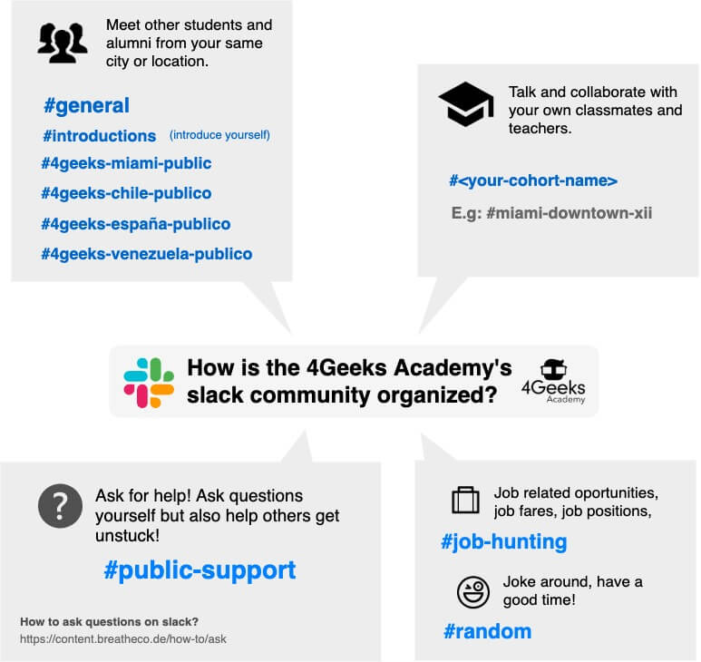

First of all, please ask questions!!!!!! We cannot encourage this enough- asking questions is the best way for all of us to learn and understand. For your programming teacher, student's questions are a great source of information to understand areas of weakness, level of understanding and pace of learning. Questions are also the most powerful way to seek an end to frustration.

## It takes a bit of time (and patience!) to ask the right question

When working remotely, you have to pay lots of attention to the way you communicate your ideas, questions, etc.

Believe me when I tell you that following these steps you will get straight answers in a matter of minutes instead of having to go back and forth. Here is a guide on [how to ask questions by stack overflow](https://stackoverflow.com/help/how-to-ask).

### 1. Prepare your question

Let's compare these two questions:
```md
1. How can I add one item to an array?
2. I'm trying to add an item to an array in JavaScript, this is my code but it's not working (include a screenshot), what am I doing wrong?
```
Do you notice how the second question is much easier to answer? You will probably get an answer in a few minutes since it will be very easy to review your code and give you feedback in a few lines. Who knows? Maybe the coding error is just a typo!

### 2. Take a picture or screenshot to share what you've tried (instead of using copy and paste)

Use screenshots to keep color highlighting and formatting as you see it. Pasting in "text snippets" can cause more confusion for those trying to help you. If you do paste in text through slack, make sure to use "attach file".

You can use some plugin for Google Chrome like [Awesome Screenshot] (https://www.awesomescreenshot.com/).

### 3. Be specific

"How can I START this exercise" or "I tried X approach but it did not work, what am I doing wrong?" (including any error messages!) will give you much better feedback than "how can I SOLVE this exercise?" - the more you break down the process into methodical steps, the easier you will be able to understand the issue as a whole.

### 4. Do your research

Take around 20 minutes to try and solve the problem yourself by using terminal responses, searching online, and developing a strategy for testing within your code. Finding the specific answer will help you during that problem, but creating an effective problem solving strategy will serve you time and time again!

### 5. Use the slack channel instead of email, or anything else

Slack is the perfect tool for this, you can even start an instant video call with the responder. Avoid using traditional less effective methods like phone or sms.

Enter the # public-support channel which is where you will be served more quickly.


