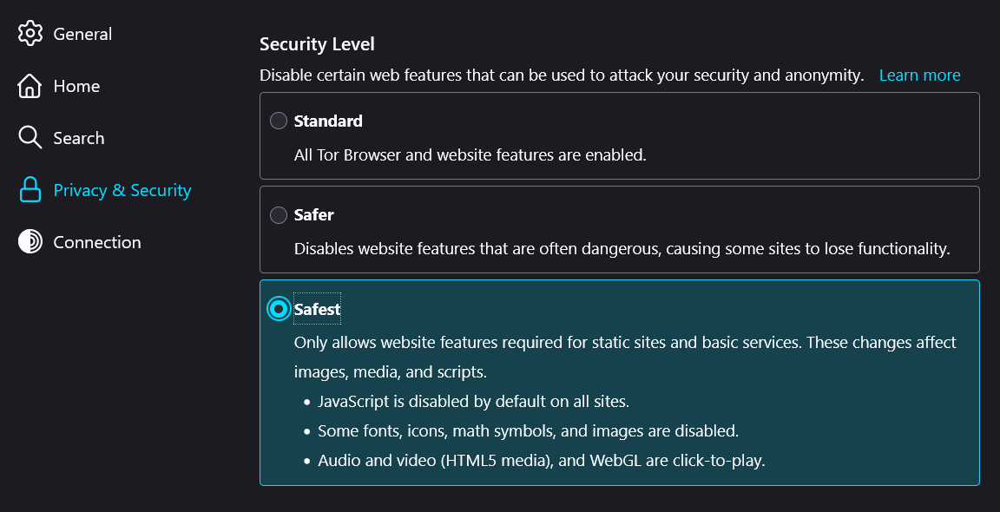
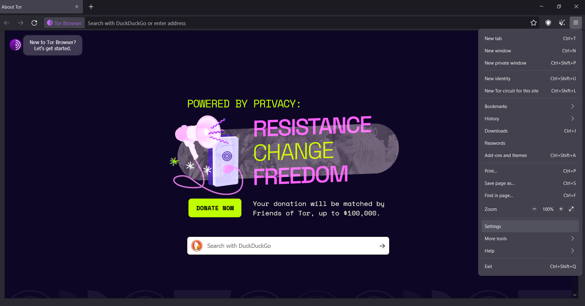
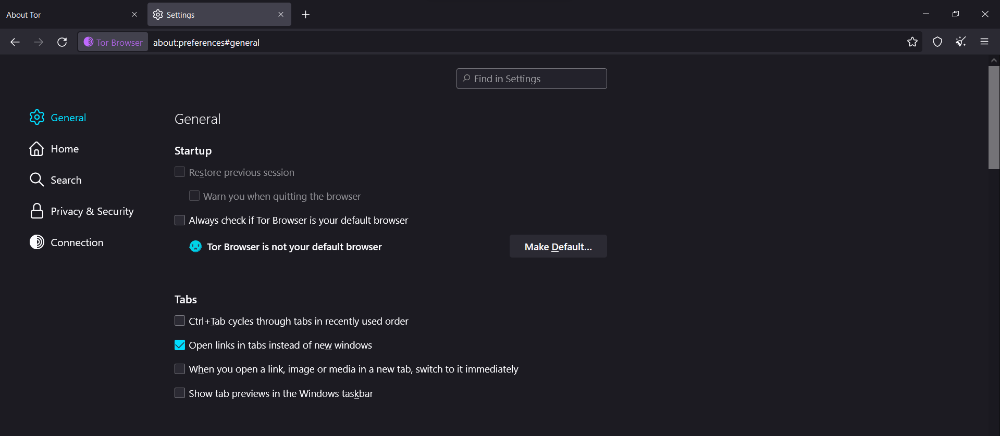
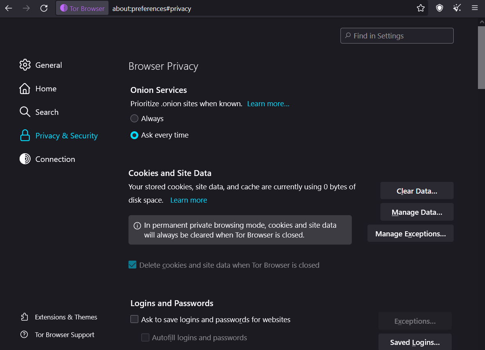

To disable Javascrpt in Tor browser, you´ll have to go to `Settings` -> `Privacy and Security` -> scroll down until `Security level` and select the option you want, each will be most strict than the other.

## What is Tor?

Tor stands for "The Onion Router" and is a free and open-source software for anonymous communications. Tor browser became extremely famous since it hides the users from network surveillance or traffic analysis, making you "invisible" while browsing. 

## How does Tor hides the user?

The Onion Router directs the user internet traffic through a free, complex and global volunteer overlay network that has more than 7000 relays. Making use of these extend network, it conceals all the user sensitive data as location, internet usage and many more giving 

## Disabling javascript in Tor

Since Tor makes it easier to actually keep our personal information safe, it should allow us to disable Javascript and prevent scripts from executing and "stealing" our data. How to disable Javascript in tor?

First things first, we need to download the Tor browser app:

- Direct yourself to: https://www.torproject.org/es/download/ 
- Select your Operating System (OS)
- Once downloaded, run the installer
- Next, next, next...
- Start Tor browser

Tor will boot up and ask to connect to The Onion Router, accept it, wait for it to finish and then, try it out or keep reading and lets dig in in how to desable javascript in Tor.

- Acces to the tor browser `menu`

- Select `Settings`

- Select `Privacy and Security`

- Select the security level:

	- Standard:
	Selecting this option, will allow all websites to behave as intended, will not block javascript, location trackers, etc..

	- Safe:
	It´ll desable Javascript on http requests and block some of the websites features that are often dangerous like fonts and math symbols.

	- Safest:
	 Desable javascript from all websites (http and https), desables images, videos, math symbols and some fonts.

The process for most Browsers will be pretty much alike, so feel free to tickle the privacy options of your preferred one now that you know how to disable javascript.

## Can Tor be used in other browsers?

Yes, Tor has been integrated in other browsers like Brave that follow the same principles as Tor Browser, to protect user privacy while on the world wide web. 

To start Tor in Brave Browser, on the `menu` select `Start a new private window with Tor` an a new window will be displayed and connect to The Onion Router.

We have covered what is Tor, how it works, how to disable javascript on the The Onion Router Browser and that you can use Tor on other browsers as well.

If you are a person who values privacy, then using the Tor browser, or an alternative browser that integrates The Onion Router principles, is a nice option to have.

Hope you enjoy the article and keep on the Geek side!