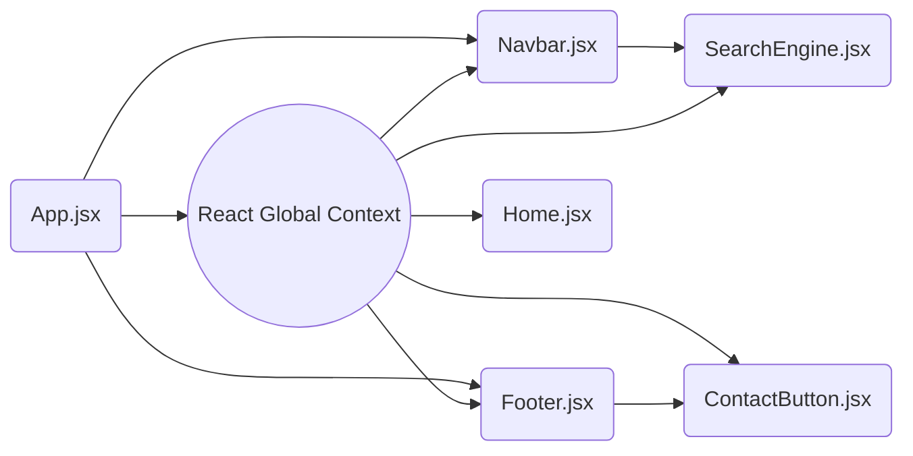

## React Global Context

React global context is a way to pass and consume data between components in a React application without the need to manually pass props at each level. Instead, we use the [Context API](https://4geeks.com/lesson/context-api). In this article, you will learn how to work with the global context in React and how to pass and consume data using the React hook `useContext()`.

If you want to learn more about react, you can check the following [React Js Tutorial](https://4geeks.com/lesson/learn-react-js-tutorial) To initialize a global context in React and share data between components, follow the steps below:

#### 1. Create the Global Context

First, you need to create a global context, for this, use the `createContext()`  method of React and pass as a parameter an initial value `const LanguageContext = createContext("english")`, the initial value can be of any data type, but usually the good practice is to pass a `null` value and after that, you pass as value to the prop `value` the actual data that you want to store globally.

```jsx
import { createContext } from "react";
const NameContext= createContext(InitialValue);
```

#### 2. Provide the Global Context

Once the Global context is created, you need to wrap the whole application with this context in the `Provider` property, and as mentioned before you pass a prop called `value` and in this prop, you pass all the data you want to store globally, this value can be of any data type a **boolean**, a **string**, an **array**, an **array of objects**, etc...

```jsx
export default function App() {
  const [Theme, setTheme] = useState("light")
  return (
    <NameContext.Provider value={Theme, setTheme}>
      <HomePage />
    </NameContext.Provider>
  );
}
```

#### 3. Consume the Global Context

Finally, use the React hook `useContext()` to call the data provided by the global context, you can use the following syntax to do this `const data = useContext(NameContext)`, after calling the data, every time you update or change the data it will be updated globally.

```jsx
import { useContext } from "react";
function HomePage() {
  const [Theme, setTheme] = useContext(NameContext);
  return (
    <section className={Theme === "dark" ? "dark-theme": "dark-theme"}>
    <button onClick={()=> setTheme((prev) => !prev)} > Change Theme</button>
    </section>
  );
}
```

## What Does Global Context Mean in React?



In React, [global context](https://legacy.reactjs.org/docs/context.html) provides a way to share data across the components without having to manually send the data by props at each level of the tree. In the above example, if you want to send data from the `App.jsx`  component to the `SearchEngine.jsx` component by props you first have to pass the data from `App.jsx` to `Navbar.jsx` and then pass the data from `Navbar.jsx` finally to the `SearchEngine.jsx` component, this is very tedious especially when working on a large project. 

With React's global context, on the other hand, you create a global state context with any kind of data you need and then you can access that data from any component using the `useContext()` hook provided by React, no matter if the component is a direct child of the `App.jsx` or not, you can access the data very easily from anywhere on your application.

## How to apply the Global Context of React in a Project?

You can create a global context in a real project very easily, in the next example, we are going to create a fake project step by step and we will use the **Global Context** of React to save and change the theme color of our application. This project has no functionality other than the button to change the theme color from **light** to **dark** and vise-versa.

To create this project we will use **React**, **Vite.js**, and **Tailwind** for the styles. You can also use the `npx create-react-app` command to initialize your project but you should know that this command is getting deprecated by React, instead, I highly recommend you to use **Vite.js** to initialize your project, this compiler is very fast, efficient and is one of the favorites of the community.

> Preview of the project.


First, initialize your project.

- Initialize the project with [vite.js](https://tailwindcss.com/docs/guides/vite)
- Initialize the project using [create-react-app](https://tailwindcss.com/docs/guides/create-react-app)

Once you have initialized the project, we have to create a few components for our application, we will need three components, the first one is `App.jsx`, in this component will create the global context and store the theme of our application, the second one is `Navbar.jsx`, in this component we will have the functionality to change the theme from light to dark and vise-versa, and the third one is the `Cards.jsx` component, this will contain cards with fake products just to better simulate a real application.

#### App.jsx
```jsx
import { useState, createContext } from "react";
import Navbar from "./components/Navbar";
import Cards from "./components/Cards";

export const ThemeContext = createContext("light");

export default function App() {
  const [theme, setTheme] = useState("light");
  return (
    <ThemeContext.Provider value={{ theme, setTheme }}>
      <section className={`${theme === "dark" ? "bg-zinc-950 text-gray-200" : "bg-white text-black"} flex flex-col items-center gap-y-8 min-h-screen w-screen border-2`}>
        <Navbar />
        <Cards />
      </section>
    </ThemeContext.Provider>
  );
}
```

As mentioned before, in this component we will store the theme of our application, to do so, we need to create a global context, you can use the syntax `export const NameContext = createContext(initial value)` this syntax uses the React function `createContext()` to initialize a global context, make sure you also add the `export` so you can import this context in others component when you need.

After creating the context, you have to wrap the whole application with this context, this will give you access to the data stored in the global context in any other component that is inside the application, you can wrap the application with the syntax. 

```jsx
 <NameContext.Provider value={global data}>"Your application..."</NameContext.Provider>
```
 
After this, you have to pass to the prop `value` all the data that you want to store globally, in our case, we pass inside an object the theme of our application as well as the function to update it.


#### Navbar.jsx
```jsx
import { useContext } from "react";
import { ThemeContext } from "../App";

export default function Navbar() {
  const { theme, setTheme } = useContext(ThemeContext);
  return (
    <nav className={`${theme === "dark" ? "shadow-black bg-zinc-900" : "shadow-gray-200"} flex gap-7 relative items-center justify-start h-24 w-3/5 pl-8 pr-8 shadow-md`}>
      <button className="h-full text-xl border-b-4 border-b-transparent cursor-auto tracking-widest"> HOME </button>
      <button className="h-full text-xl border-b-4 border-b-amber-500 text-amber-500 cursor-auto tracking-widest"> STORE </button>
      <button className="h-full text-xl border-b-4 border-b-transparent cursor-auto tracking-widest"> ABOUT </button>
      <button
        onClick={() => setTheme((theme) => (theme === "dark" ? "light" : "dark"))}
        className={`${theme === "dark" ? "bg-gray-200 text-black" : "bg-gray-900 text-gray-200"} h-14 w-28 rounded absolute right-8 font-bold`}
      >
        {theme === "dark" ? "Light Mode" : "Dark Mode"}
      </button>
    </nav>
  );
}
```

Now, in the `Navbar.jsx` component, we can access the data that we store in the Global Context, the theme and the function, to import them inside the component we have to use the React hook `useContext()` and the following syntax:

```jsx
// Import the data from the Global Context.
const { theme, setTheme } = useContext(ThemeContext);

// Function to toggle the color theme of the application.
<button onClick={() => setTheme((theme) => theme === "dark" ? "light" : "dark")}>Light Mode</button>
```

With this syntax, you can access the data stored globally in your application, here we use it to access the theme and also the function that we are going to use to toggle the theme of the application every time the button `Light Mode` or `Dark Mode` is clicked.

Finally, we only have to change the styles of our application in the `Cards.jsx` component depending on the value of the theme of our application, light or dark.

#### Cards.jsx
```jsx
import { useContext, useState } from "react";
import { ThemeContext } from "../App";

export default function Cards() {
  const { theme } = useContext(ThemeContext);
  const products = [
    { id: 0, title: "Duramo Trainer Lea AF6047", price: 47, image: "https://res.cloudinary.com/dleo66u17/image/upload/v1689896404/cld-sample-5.jpg" },
    { id: 1, title: "Komal's Passion Leather", price: 1.6, image: "https://res.cloudinary.com/dleo66u17/image/upload/v1689896386/samples/ecommerce/leather-bag-gray.jpg" },
    { id: 2, title: "Swatch Swiss Watch", price: 1.95, image: "https://res.cloudinary.com/dleo66u17/image/upload/v1689896377/samples/ecommerce/analog-classic.jpg", },
  ];

  return products.length
    ? products.map((product, index) => (
        <div
          key={index}
          className={`${theme === "dark" ? "shadow-black bg-zinc-900" : "shadow-gray-300"} flex gap-8 items-end w-3/5 pl-8 pr-8 p-3 shadow-md rounded`}
        >
          
          <div className="grow flex flex-col gap-2">
            <h2 className="font-bold uppercase text-amber-500">{product.title}</h2>
            <span className="text-sm text-gray-400 mb-4"> ${product.price}.00 USD </span>
            <button className="w-36 h-10 flex-none rounded text-lg text-gray-200 bg-amber-500 cursor-auto"> Visit Product </button>
          </div>
          <button className="w-20 h-20 self-center rounded text-lg text-gray-200 bg-sky-500 cursor-auto"> Buy </button>
        </div>
    ))
  : null;
}
```

To change the style of the application depending on the theme we only have to change the tailwind classes, we can use a **ternary conditional expression** `if true ? to this : or that` to check if the theme has a **light** value or a **dark** value, if it has the **dark** value you put the classes for the dark mode or the classes for the light mode otherwise, to do so, do this with the syntax:

```jsx
<div className={`${theme === "dark" ? "classes for the dark mode" : "classes for the light mode"`}></div>
```

And that's it, now you know how to implement the **Global Context** of React in your own applications, remember to use this hook to store only small amounts of data so it doesn't affect the performance of your application, you can combine this hook with other React hooks like [useReducer](https://react.dev/reference/react/useReducer) to manage your application´s data like an expert.

## Benefits and Drawbacks of Using Global Context

### Benefits
1. **Simplifies data sharing**:  Global context eliminates the need for prop drilling, making it easier to access shared data from anywhere in your project.
2. **Avoids callback chaining**: With global context, you don´t need to pass callback functions through multiple components to reach the desired location.


### Drawbacks
1. **Potential overuse**: Global context can be misused by placing unrelated or excessive data in the global state, leading to performance issues and complexity.
2. **Performance issues**: One disadvantage of using the global context in react is that when the context value changes, all the components that use the same context will re-render. This can be a problem in large applications.

## Conclusion

React's Global Context allows you to share data across the components of an application without the need to pass the data through props at each level, using global context states you can access information from anywhere in your application regardless of whether the component is a direct child of the one that holds that information or not. 

If you want to learn more about React and its features I recommend you to visit the [react exercises tutorial](https://4geeks.com/interactive-exercise/react-js-tutorial-exercises) created by 4Geeks where you will learn much more about React and reinforce your knowledge in this amazing Framework.
