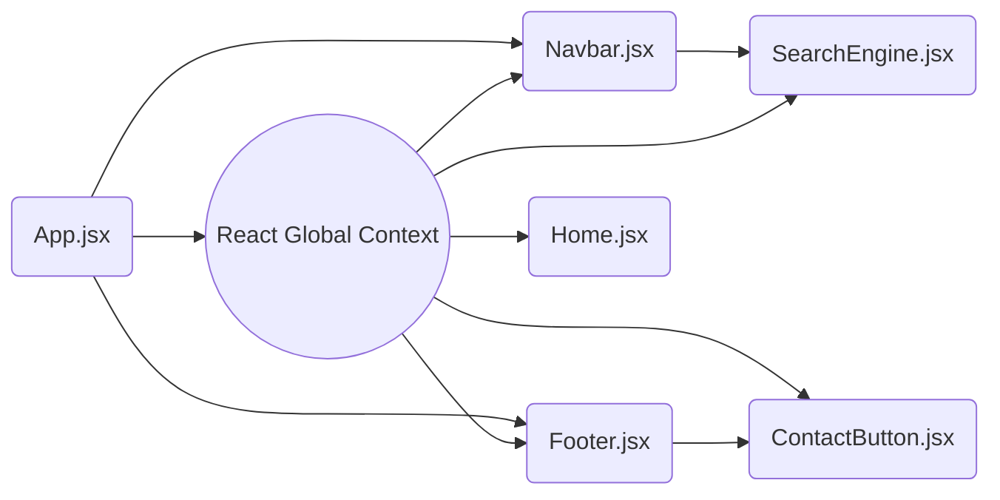

## React Global Context

React global context is a way to pass and consume data between components in a React application without the need to manually pass props at each level, in this article you will learn how to work with the global context in React, and how to pass and consume data using the React hook `useContext()`.

The following is a small example of how to use the global context and how to consume data in the different components of an application.

#### 1. Create the Global Context
```jsx
import { createContext } from "react";
const NameContext= createContext(InitialValue);
```
First, create the global context, to create the global context use the `createContext()`  method of React and pass it as a parameter an initial value.

#### 2. Provide the Global Context
```jsx
export default function App() {
  const [Theme, setTheme] = useState("light")
  return (
    <NameContext.Provider value={{Theme, setTheme}}>
      <HomePage />
    </NameContext.Provider>
  );
}
```

Use the context `Provider` created to wrap the entire application, and pass the values you want to make accessible in the `value` prop.

#### 3. Consume the Global Context
```jsx
import { useContext } from "react";
function HomePage() {
  const {Theme, setTheme} = useContext(NameContext);
  return (
    <section className={Theme === "dark" ? "dark-theme": "dark-theme"}>
    <button onClick={()=> setTheme((prev) => !prev)} > Change Theme</button>
    </section>
  );
}
```

Finally, use the React hook `useContext()` to use the information provided by the global context.

## What Does Global Context Mean in React?



In React, global context provides a way to share data across the components without having to manually send the data by props at each level of the tree. In the above example, if you want to send data from the `App.jsx`  component to the `SearchEngine.jsx` component by props you first have to pass the data from `App.jsx` to `Navbar.jsx` and then pass the data from `Navbar.jsx` finally to the `SearchEngine.jsx` component, this is very tedious especially when working on a large project. 

With React's global context, on the other hand, you create a global state context with any kind of data you need and then you can access that data from any component using the `useContext()` hook provided by React, no matter if the component is a direct child of the `App.jsx` or not, you can access the data very easily from anywhere on your page.

## How to apply the Global Context of React in a Project?

In the following example, we will create a real project using the global context of React so you can see how to apply this concept in your own projects in the future, we will create an application step by step using **React**, **Vite.js**, and the **Tailwind** library for styles. You can also use the `npx create-react-app` command to start your project but you should know that this command is getting deprecated, instead, I highly recommend you to use **Vite.js** to create your project, this compiler is very fast and is one of the favorites of the community.

> Note: this project is a bit large but it is a perfect example of how to use global context in your own React applications.

* Initialize the project with Tailwind and React using Vite.js: [tailwind-react-vite](https://tailwindcss.com/docs/guides/vite)
* Initialize the project using Tailwind and create-react-app: [tailwind-react](https://tailwindcss.com/docs/guides/create-react-app)

Once your project is initialized, Inside the `/src` folder of your project create a `components` folder and inside this folder create the following components.
* Navbar.jsx
* ShoppingCartContainer.jsx
* Products.jsx
* ProductCard.jsx

Create a Global context, normally, the global context is created in its own component, but in this example, we will create the global context in the `App.jsx` component for better understanding.

#### App.jsx
```jsx
import { useState, createContext, useEffect } from "react";
import Navbar from "./components/Navbar";
import Products from "./components/Products";

// Create the global contexts.
export const ProductsContext = createContext(); //Context to store the products from the Fake Platzi API
export const ShoppingCartContext = createContext(); // Context to store the products that we want to buy from the webpage.

// Create the CURRENCY variable with the Intl Javascript library to format the numbers of the product prices with a USD currency syntax.
export const CURRENCY = new Intl.NumberFormat(undefined, { currency: "USD", style: "currency" });

export default function App() {
  const [products, setProducts] = useState([]);
  const [shoppingCart, setShoppingCart] = useState([]);

  // Call to the fake products API.
  useEffect(() => {
    fetch("https://api.escuelajs.co/api/v1/products?offset=0&limit=10")
      .then((response) => response.json())
      .then((data) => setProducts(data))
      .catch((error) => console.error(error));
  }, []);

  return (
    // Wrap the entire application with the global contexts so you can access them from anywhere.
    <ProductsContext.Provider value={products}> 
      <ShoppingCartContext.Provider value={{ shoppingCart, setShoppingCart }}>
        <section className="min-h-screen w-screen flex flex-col items-center gap-y-8">
          <Navbar />
          <Products />
        </section>
      </ShoppingCartContext.Provider>
    </ProductsContext.Provider>
  );
}
```

For this project we need two global contexts, the first one is the `ProductsContext` state that we will use to store all the fake products from the [Platzi Fake Store](https://fakeapi.platzi.com/) API, The second global context is the `ShoppingCartContext` state that we will use to store all the products from the website that we want to buy. After creating the global states, we use the hook `useEffect( => {}, [])` to make the call to the fake API, and finally, we wrap our whole application with the `Providers`  and pass the information in the prop `value` of these contexts. 

#### Navbar.jsx
```jsx
import { useContext, useState } from "react";
import { ShoppingCartContext } from "../App";
import ShoppingCartContainer from "./ShoppingCartContainer";

export default function Navbar() {
  // State to open en close the cart container.
  const [showCarts, setShowCarts] = useState(false);
  const { shoppingCart } = useContext(ShoppingCartContext);
  const totalCartAmount = shoppingCart.reduce((total, cart) => total + cart.quantity, 0);

  const OpenAndCloseCartsContainer = () => setShowCarts((prev) => !prev);

  return (
    <nav className="w-4/5 h-20 shadow-lg shadow-gray-200 flex items-center pl-16 pr-16">
      <h1 className="bg-red grow text-2xl font-bold tracking-widest text-amber-400"> SHOPPING WEBSITE </h1>
      <div className="h-14 w-14 rounded-full flex items-center justify-center cursor-pointer border-2 focus-within:border-amber-400 hover:border-amber-400 relative">
        <button onClick={OpenAndCloseCartsContainer} className="text-xl h-14 w-14 rounded-full"> 🛒 </button>
        {totalCartAmount > 0 ? (
          <div className="h-7 w-7 bg-amber-400 text-gray-200 rounded-full absolute -bottom-2 -right-2 flex items-center justify-center">
            {totalCartAmount}
          </div>
        ) : null}
        {showCarts ? (
          <ShoppingCartContainer  />        
        ) : null}
      </div>
    </nav>
  );
}
```

Once the `App.js` is created, we need to create the navbar of our application, in this component, we will put the name of the website and the button to open and close the `ShoppingCartContainer.jsx` component.

After creating the `Navbar.jsx` component, we need to create the `ShoppingCartContainer.jsx` component where we will show all the products from our cart stored in the `ShoppingCartContext` state that we created.

#### ShoppingCartContainer.jsx
```jsx
import { useContext } from "react";
import { CURRENCY, ShoppingCartContext } from "../App";

export default function ShoppingCartContainer() {
  // Import the products from the ShoppingCartContext using the useContext() React Hook.
  const { shoppingCart, setShoppingCart } = useContext(ShoppingCartContext);
  const TotalPrice = shoppingCart.reduce((total, cart) => total + cart.price * cart.quantity, 0);

  function RemoveCardFromShoppingCart(cart) {
    setShoppingCart((prev) => prev.filter((item) => item.id !== cart.id));
  }

  return (
    <section className="flex flex-col cursor-auto pt-7 pb-7 pl-2 pr-2 gap-4 shadow-lg shadow-gray-500 absolute top-16 rounded-lg right-0 bg-white">
      {shoppingCart.length ? (
        <>
          {shoppingCart.map((cart) => (
            <div key={cart.id} className="h-20 shadow-md shadow-gray-300 rounded-md flex gap-4 items-center relative pl-4 pr-4">
              
              <div className="w-72">
                <h3 className="text-md">{cart.name}</h3>
                <span className="text-sm text-gray-400"> {CURRENCY.format(cart.price * cart.quantity)} </span>
              </div>
              <span className="h-10 text-lg w-10">x {cart.quantity}</span>
              <button onClick={() => RemoveCardFromShoppingCart(cart)} className="h-8 w-10 bg-amber-400 text-gray-200 rounded-md cursor-pointer">
                X
              </button>
            </div>
          ))}
          <div className="flex items-center justify-end gap-4 pl-4 pr-4">
            <div className="font-bold tracking-widest font-mono text-lg text-amber-400"> TOTAL </div>
            <span className="text-sm text-gray-500"> {CURRENCY.format(TotalPrice)} </span>
          </div>
          <button className="h-10 w-44 text-gray-200 bg-gradient-to-r from-sky-500 to-indigo-500 rounded-md self-end"> Conform purchase </button>
        </>
      ) : (
        <div className="flex flex-col items-center gap-8">
          <span className="text-center w-80 ml-16 mr-16 mt-4 pl-4 pr-4"> You haven't yet added products to your shopping cart </span>
          <div className="text-8xl mb-4"> 🥺 </div>
        </div>
      )}
    </section>
  );
}
```

Once the navbar creation is finished, we need to display the products from the fake API inside our application.

#### Products.jsx
```jsx
import { useContext } from "react";
import { ProductsContext } from "../App";
import ProductCard from "./ProductCard";

export default function Products() {
  // Import the product from the fake API stored in the ProductsContext using the useContext() React hook.
  const products = useContext(ProductsContext);

  return (
    <section className="w-4/5 flex flex-wrap gap-x-16 gap-y-8 pb-8">
      {products.length ? (
        products.map((product) => (
          <ProductCard key={product.id} name={product.title} image={product.images[0]} price={product.price} id={product.id} />
        ))
      ) : (
        <h2 className="w-screen text-4xl text-gray-400 text-center"> Loading products... </h2>
      )}
    </section>
  );
}
```

In the `Products.jsx` component we will show all the products coming from the fake API, but to show each product we´re gonna need a card component.

#### ProductCard.jsx
```jsx
import { useContext } from "react";
import { CURRENCY, ShoppingCartContext } from "../App";

export default function ProductCard({ name, image, price, id }) {
  // Import the values of the ShoppingCartContext global context using the useContext() React kook.
  const { shoppingCart, setShoppingCart } = useContext(ShoppingCartContext);
  const currentCart = shoppingCart.find((item) => item.id === id);

  function HandleSelectCard() {
    setShoppingCart((prev) => [ { id, name, quantity: 1, price, image }, ...prev, ]);
  }

  function HandleIncreaseCards() {
    setShoppingCart((prev) => prev.map((item) => item.id === id ? { ...item, quantity: item.quantity + 1 } : item ));
  }

  function HandleRevomeCards() {
    if (currentCart.quantity > 1)
      setShoppingCart((prev) => prev.map((item) => item.id === id ? { ...item, quantity: item.quantity - 1 } : item ));
    else 
      setShoppingCart((prev) => prev.filter((item) => item.id !== id));
  }

  return (
    <div className="h-80 w-80 flex flex-col items-center bg-white gap-4 shadow-lg shadow-gray-200 rounded-md overflow-hidden transition-all hover:shadow-2xl hover:shadow-amber-200">
      
      <div id="card-info" className="w-72 flex flex-row gap-4">
        <h2 className="grow text-gray-800 text-xl">{name}</h2>
        <div className=" h-16 flex flex-col items-start gap-2">
          <span className="text-gray-500 text-sm"> {CURRENCY.format(price)} </span>
          {!currentCart ? (
            <button onClick={HandleSelectCard} className="w-16 h-8 rounded-md text-gray-200 bg-sky-500 shadow-md shadow-sky-500">
              Buy
            </button>
          ) : (
            <div className="flex w-20">
              <button onClick={HandleRevomeCards} className="w-6 h-8 rounded bg-sky-500 text-gray-200 font-bold"> - </button>
              <span className="grow flex items-center justify-center"> {currentCart.quantity} </span>
              <button onClick={HandleIncreaseCards} className="w-6 h-8 rounded bg-sky-500 text-gray-200 font-bold"> + </button>
            </div>
          )}
        </div>
      </div>
    </div>
  );
}
```

In this component, we use the React hook `useContext()` to call the function `setShoppingCart` stored in the global state `ShoppingCartContext`, we will use this function to add, increase or remove the products of the website that we want to buy, these products are stored in the array `shoppingCart` inside our global context.

This project is a good example of how to use React's global context in your own applications.

## Benefits and Drawbacks of Using Global Context

### Benefits
1. **Simplifies data sharing**:  Global context eliminates the need for prop drilling, making it easier to access shared data from anywhere in your project.
2. **Avoids callback chaining**: With global context, you don´t need to pass callback functions through multiple components to reach the desired location.


### Drawbacks
1. **Potential overuse**: Global context can be misused by placing unrelated or excessive data in the global state, leading to performance issues and complexity.
2. **Performance issues**: One disadvantage of using the global context in react is that when the context value changes, all the components that use the same context will re-render. This can be a problem in large applications.

## Conclusion

React´s Global Context allows you to share data across the components of an application without the need to pass the data through props at each level, using global context states you can access information from anywhere in your application regardless of whether the component is a direct child of the one that holds that information or not. It is recommended to use global context to share only small amounts of data because if you store large amounts of data in your global state it can cause performance problems in your application.

If you want to learn more about React and its features I recommend you to visit the [react exercises tutorial](https://4geeks.com/interactive-exercise/react-js-tutorial-exercises) created by 4Geeks Academy where you will learn much more about React and reinforce your knowledge in this amazing Framework.
