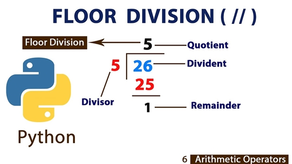

# What Does // Mean in Python?

One of the many operators in Python is the double slash `//` operator, which refers to an integer division (or a division with no remainder/decimals) which is called **Floor Division**. When dividing two numbers using this `//` operator, the result will always be an integer, ignoring the decimal part of the result. 

The double slash `//` has the same function as the Python method math.floor (which we will discuss later), as its name implies, rounds the result down (rounds to its floor) to the closest integer.



In this article, we will review more thoroughly how the **Floor Division** differs from a normal division, how the `//` operator works with different types of numbers (negative numbers and decimal numbers) and some extra methods similar to a Floor Division.

## What Does `//` Mean in Python? Points of Interest

- [Difference Between Floor Division `//` and Regular Division `/`](#versus)
- [Working with Negative Numbers in Floor Divisions](#negative)
- [Working with Floats in Floor Divisions](#floats)
- [Similar Methods of a Floor Division](#similar)
	- [`math.floor()` Function in Python](#math)
	- [`math.ceil()` Function in Python](#ceil)
- [Summary](#summary)


## Difference Between Floor Division `//` and Regular Division `/` <a name="versus"></a>

A normal division `/` in Python will always return a number with its decimal part, that is, a **floating number**, while a floor division will always return an **integer number**.

The result of regular division (using the `/` operator) is `45/6=7.5`, but using `//` has floored `7.5` down to `7`.

We can see another example as follows:

```py
num1 = 19
num2 = 5
result1 = num1 / num2
result2 = num1 // num2

print("normal division of", num1, "by", num2, "=", result1)
print("floor division of", num1, "by", num2, "=", result2)

# Output: 
# normal division of 19 by 5 = 3.8
# floor division of 19 by 5 = 3
```

## Working with Negative Numbers in Floor Divisions <a name="negative"></a>

To understand how to work with negative numbers using floor division, we need to understand that the **floor of a positive number** is different from the **floor of a negative number**. For example, the floor of `3.4` is `3`, but the floor of `-3.4` is `-4`, not `3`. For greater understanding, we could say that the floor of a positive number would be the integer below and that the floor of a negative number would be the integer that is above (maintaining the negative sign).

We can see another example as follows using the same numbers as before:

```py
num1 = 19
num2 = 5
num3 = -19
result1 = num1 / num2
result2 = num1 // num2
result3 = num3 // num2

print("normal division of", num1, "by", num2, "=", result1)
print("floor division of", num1, "by", num2, "=", result2)
print("floor division of", num3, "by", num2, "=", result3)

# Output: 
# normal division of 19 by 5 = 3.8
# floor division of 19 by 5 = 3
# floor division of -19 by 5 = -4
```

## Working with Floats in Floor Divisions <a name="floats"></a>
When we work with float numbers using floor division, the result will always be a float number, and as we already know, the result will be the nearest integer rounded to its floor, but in this case, it will be represented by a float number.

Let's have a look at the following float-based floor division example:

```py
num1 = 17.5
num2 = 3.3
num3 = 10
num4 = 2.5
num5 = 13.4
num6 = 3
result1 = num1 // num2
result2 = num3 // num4
result3 = num5 // num6

print("floor division of", num1, "by", num2, "=", result1)
print("floor division of", num3, "by", num4, "=", result2)
print("floor division of", num5, "by", num6, "=", result3)

# Output: 
# floor division of 17.5 by 3.3 = 5.0
# floor division of 10 by 2.5 = 4.0
# floor division of 13.4 by 3 = 4.0
```

As a result, the floor division operation is carried out using floats, and a float with an integer returns the value rounded down to the nearest integer represented by the floats.


## Similar Methods of a Floor Division <a name="similar"></a>

In Python, there are several methods similar to operations with `//` (floor division). But, how would these other methods be useful to us? It all depends on our use case, in some situations we will find ourselves needing to handle only integers in our projects, and since floor division operations can get both integers and floats, we could use a hand in these cases.

This is where these two additional methods come in, which are `math.floor()` and `math.ceil`, they will allow us to manipulate the result so that it is always an integer.

### `math.floor()` Function in Python <a name="math"></a>
Python comes with a built-in math module that includes a variety of practical calculating tools. The `math.floor()` function is one of the math module's built-in features. This function takes a numeric input and rounds it down to the closest integer to return the floor value.

Therefore, `math.floor()` is an alternative to the `//` operator since they accomplish the same goal in the background, but always returning an integer.

Let's have a look at the following example:

```py
# importing the math library
import math

# using the math.floor() function and printing the values
print(math.floor(2.4)) #Output 2
print(math.floor(9.3)) #Output 9
print(math.floor(-7.3)) #Output -8
print(math.floor(25.7)) #Output 25
print(math.floor(11.0)) #Output 11
```
### `math.ceil()` Function in Python <a name="ceil"></a>
`math.ceil()` is an alternative to `math.floor()` but it will always round **up** to the nearest whole number rather than **down**. 

For instance:

```py
# importing the math library
import math

# using the math.ceil() function and printing the values
print(math.ceil(2.4)) #Output 3
print(math.ceil(9.3)) #Output 10
print(math.ceil(-7.3)) #Output -7
print(math.ceil(25.7)) #Output 26
print(math.ceil(11.0)) #Output 11
```

## Summary <a name="summary"></a>
The next video will be of great help to better understand what was explained in this **What Does // Mean in Python?** article

[](https://www.youtube.com/watch?v=tFdVvNbV9-E "Python Floor Division Tutorial (Double Forward Slash)")
