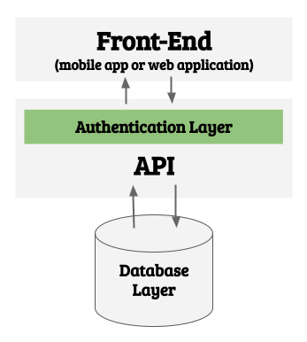

## Why implementing Token Based Authentication

There are several ways to create an authentication layer in web applications but we are going to be focusing today in Token Based Authentication because of several reasons:

- Easy to implement.
- Provides a good level of security (by industry standards).
- Fast and performant.
- The most used in the industry as of today (2021).

## What is API Authentication?

In plan english authentication means being able to identify who is making requests to your API; You normally implement an authentication layer in your application because you want:

- Users to be able to log in and log out.
- Privacy protection: Restrict access to information based on the user role. For example: Only I should be able to update my email and password, only I should review my medical health history.
- Limit user permissions: Restrict access to certain functionalities, for example: A user needs to pay to download a book, or not being able to comment on a forum unles you log in, etc.

To explain in detail "Token Based API Authentication" it's better to start explaining about tokens.

## What is a Security Token?

In a broad way a token is a "number that proves something", for example: When you finish making a bank transfer, the bank sends a confirmation "token" serves as proof to validate that the transaction exists and it's valid. That confirmation number could be also called a **confirmation `token`**.

Other examples for every-day tokens:

- Your social security number (token) proves your credit history.
- Credit Card number proves you have a valid credit card.
- Etc.

### A security token it's more then just a number

Tokens used for authentication need to be more that normal just numbers, they need to be almost impossible to fake, predict or break.

- Non-consecutive, that will make them very predictable, hackers will guess the next one.
- Infinite (almost): What will happen if you run out of tokens? Can you imagine MasterCard running out of credit card numbers?
- Non-reusable: There are cases of re-usable tokens, but in general once a token is generated no one else should every use it but you.
- Validatable: The token must follow some hidden pattern (encripcion?) that allows validating the token without compromising the owner or author.

### Using hashes as tokens

Security tokens need to be random large numbers, that way hackers will have a hard time trying to fake a token.

Proof of 

Tokens are very old but prominent technolgy, they are broadly used in any security implementations all over the industry, the whole Blockchain (and Bitcoin) revolution it's mainly based on the concept of "tokens" and "hashes".

In plan english a token is a "very big number"
