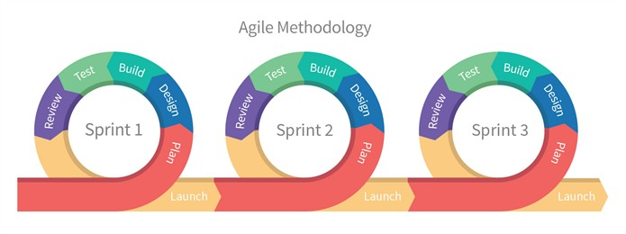
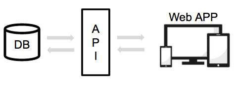

### ¡Es Tiempo de construir cosas impresionantes!

Los programadores junior entienden los trucos básicos de programar (for, while, if..else, function, variables, etc.).  Pero los programadores Senior pueden ver el panorama general y crear una aplicación de principio a fin.  Este curso es un intento de hacerte ver el panorama general y comenzar a crear aplicaciones muy profesionales de inmediato.

> :point_up: Si aún no te sientes cómodo con los bucles, habla con tu profesor para hacer algo al respecto de inmediato.

## Las grandes aplicaciones se hacen con pequeños incrementos.
***

En lugar de desarrollar una gran aplicación, desarrollarás y entregarás una serie de pequeñas aplicaciones que al final se convertirán en una gran aplicación.  Eso es lo que se llama desarrollo ágil.

Cada incremento se llama "sprint" y tiene los siguientes pasos:

+ Comienza en el momento en que escribes **los requisitos de tu aplicación.**
+ Continúa con un plan general aproximado (solo para tener una idea inexacta de la fecha de vencimiento, las tecnologías principales, etc.).
+ Entonces **continúa con el diseño** (interfaces de usuario y arquitectura técnica).
+ Pasamos al desarrollo (escribir código).
+ Terminando con las pruebas y la entrega… y luego empezar de nuevo.

Los programadores junior se sienten cómodos haciendo bucles y usando condicionales (if, else).

## Las aplicaciones web son solo otro tipo de aplicaciones…
***

Borra de tu mente el flujo de trabajo de desarrollo de cualquier sitio web que hayas aprendido por su cuenta.  Crear aplicaciones web requiere de su propio flujo de trabajo desarrollado profesionalmente el cual debe aprenderse y seguirse. Las aplicaciones web no son lo mismo que los sitios web - aunque se crean bajo el mismo lenguaje.  En realidad, las aplicaciones web tienen más en común con las aplicaciones móviles o de escritorio que con los sitios web:

+ Las aplicaciones web se comprimen en un solo archivo ejecutable.
+ Deben ser instaladas o importadas.
+ Algunos de ellas pueden trabajar 100% sin conexión (sin internet).

> :point_up: En realidad, una aplicación web se puede exportar con relativa facilidad a una aplicación móvil, tablet o desktop.

## Nuestro flujo de trabajo desarrollado profesionalmente
***

|1. Comenzaremos a hacer las especificaciones.     |2. Construimos nuestra aplicación web      |3. Finalmente construimos la base de datos y la API.  |
|:------------------|:--------------|:-----------------|
|Codificar sin especificaciones es como intentar atrapar una pelota con los ojos cerrados. Para crear necesitamos: Historia del Usuario, Wireframes (Plantilla o Esqueleto), Documentación de API y un Diagrama de Clases. Todos deben crearse de una manera clara y limpia.     |Usando tres tecnologías principales: HTML / CSS, Webpack y React.js, procederemos a codificar nuestra aplicación y la haremos funcionar sin problemas. Nuestra aplicación, al igual que las aplicaciones móviles, probablemente se conectará a varias APIs. Esta será la única forma de conectarse a cualquier base de datos. |Usando Django, MongoDB y SQL, seguiremos adelante y construiremos una API profesional y tranquila para proporcionar a nuestra aplicación de sitio web una capa de interacción de base de datos.   |     

## En Resumen…
***

En resumen, ser "senior" es tomarse el tiempo para hacer las especificaciones, ser LIMPIO, trabajar por partes (dividir y conquistar), crear aplicaciones web en lugar de sitios web, crear tu propia API y, por último, pero no menos importante: solo usar las mejores prácticas y seguir Los flujos de trabajo recomendados.

¿Suena aburrido? Créeme, no lo es! Construir un producto es increíble. ¡Estarás creando algo desde cero y lo utilizarás de inmediato! ¡Empecemos!

