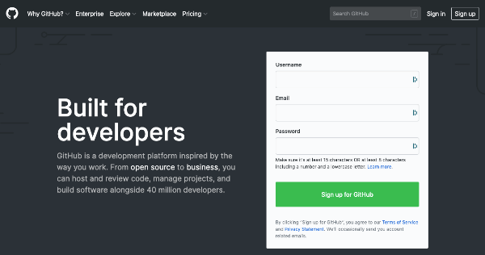
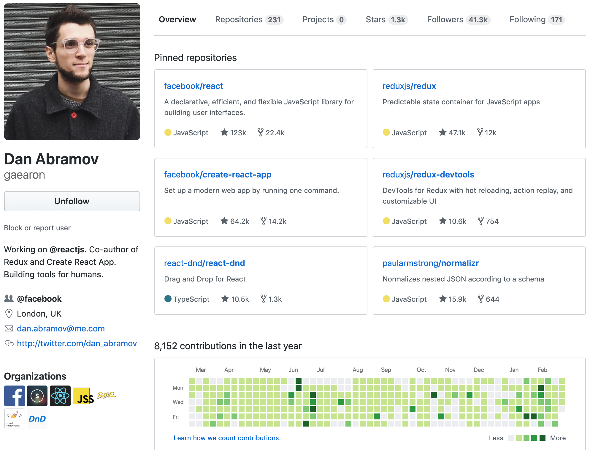

## Introducción a Github (si ya lo conoces, lee la siguiente sección)

Github es una red social para desarrolladores, pero problablemente no del tipo de red social al cual estas acostumbrado/a en el día a día:

- No puedes postear una foto de lo que estés a punto de comer.
- No puedes postear documentos en cualquier formato (txt, html, css, xls, png, jpeg, etc.).
- No puedes postear mensajes en tu status como en Twitter, Instagram, etc.
- Debes usar un programa y protocolo especial llamado [GIT](https://www.youtube.com/watch?v=BCQHnlnPusY).
- Lleva un registro de tu actividad como desarrollador y no se puede hacer trampa.

## Por qué Github es importante para los reclutadores

Github es el portafolio personal #1 para los desarrolladores, la mejor manera de llamar la atención y crear una marca profesional. Hay que hacer un gran esfuerzo para hacerlo:  
    
   1. Fácil de navegar por un potencial empleador.  
   2. Fácil de entender y rápido de leer.
   3. Aspecto increíble (nunca tienes una segunda vez para dar la primera impresión).

### Sacándole provecho a tu perfil

Asegúrate de que tenga tu estilo personal, pero en general puedes concentrarte en tratar de seguir la siguientes directrices:

- [ ] Escribe una breve biografía enfocada principalmente en ti como desarrollador y en tus habilidades especiales.
- [ ] En tu página de perfil, incluye enlaces a tu sitio web personal, perfil de Linkedin, correo electrónico y tus redes sociales, si son relevantes.
- [ ] Añade una foto o avatar.
- [ ] Comienza a hacer "commits" y haz "push" desde el primer día en la academia: Github registra e informa públicamente tu actividad como desarrollador en algo llamado [Gráfico de actividad de Github](https://help.github.com/en/articles/viewing-contributions-on-your-profile#contributions-calendar) que es imposible de falsificar. Es por eso que te recomendamos que empieces a hacer "commit" y a colaborar desde el primer día.
- [ ] Cada repositorio que quieras destacar y publicitar debe incluir:  
    1. Un detallado README.md
    2. Demostración en vivo (github pages), capturas de pantalla y gifs.
    3. Un código muy organizado y limpio y comentarios.
- [ ] Tu proyecto más importante, el que más te enorgullece, debe estar en la primera sección.
- [ ] Contribuye en a lo menos a 5 proyectos externos. Encuentra proyectos open-source que te gusten y haz contribuciones. En los siguientes enlaces encontrarás proyectos e indicaciones sobre cómo contribuir: 
    - https://www.firsttimersonly.com/
    - http://yourfirstpr.github.io/
    - https://www.codetriage.com/
    - https://github.com/MunGell/awesome-for-beginners
- [ ] Necesitas ser un miembro [desarrollador de github](https://developer.github.com/program/). Puedes unirte gratis y obtendrás una insignia en tu perfil.
- [ ] Evita usar los términos "desarrollador nuevo", "desarrollador junior", "recién graduado" o algo similar en tu introducción o biografía.

## Un perfil de ejemplo: Dan Abramov

