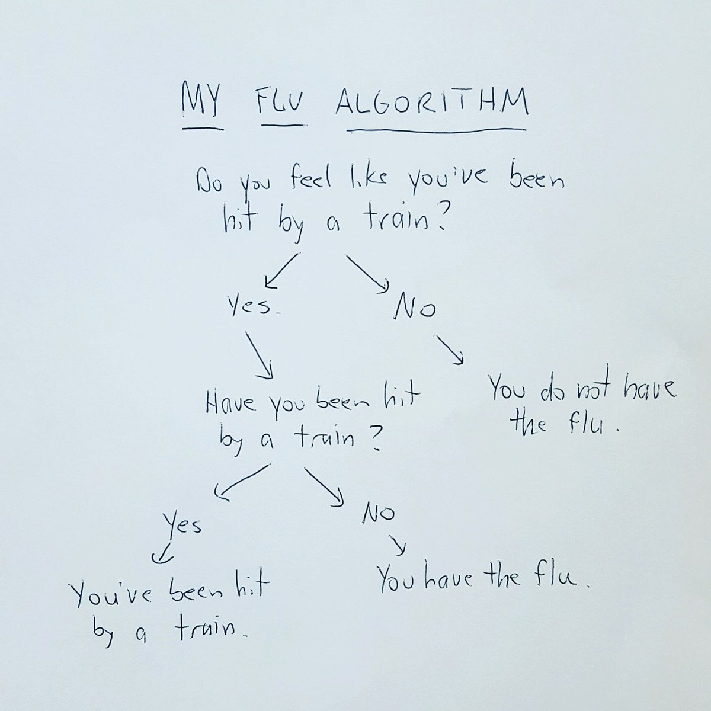

## Introducción a los condicionales en Python 

Dominar el uso de las condiciones es una de las 5 habilidades fundamentales de construir algoritmos:

1. Variables.
2. Condicionales.
3. Arrays(Arreglos).
4. Loops(Bucles).
5. Funciones.

El uso de `condicionales` es la única forma en que los desarrolladores tienen que decirle a la computadora cómo tomar decisiones en tiempo real, muy similar a cómo funcionan los algoritmos.

Digamos que estamos construyendo un programa para ayudarnos a elegir qué almacenar y odiamos el color azul, podemos decirle a la computadora que evite el azul usando una condición como esta:
  
```python
if color == 'blue':
    # haz algo
else:
    # haz otra cosa o no hagas nada

```
  


> :link: El uso de `switch` no esta disponible en python

## Primero veamos ¿qué es una expresión lógica en Python?

La forma más fácil de entender expresiones lógicas (al menos para esta lectura en particular), es pensar en ellas como en preguntas que le puedes hacer al computador sobre nuestras variables, por ejemplo:

1. `if edad_usuario > 21:`
2. `if dia == "martes"`
3. `if modelo_carro == "toyota" y num_de_cauchos == 6:`

Para hacer una pregunta, o excusar condicionalmente un conjunto particular de líneas, primero necesitas tener datos (información) almacenados en variables útiles, arriba teníamos las variables `edad_usuario`, `dia`, `modelo_carro` y `num_de_cauchos`.

Si no tenemos la información prealmacenada en variables no podemos hacer ninguna pregunta, ¡todo es cuestión de estrategia y planificación!

Por ejemplo, si tenemos la edad del usuario almacenada en una variable `edad` entonces, y solo entonces, podremos codificar algo como:

```python
# Se utiliza dos veces igual (==) cuando quieres comparar en lugar de asigner el valor
if edad == 25:
    print("Eres mayor de edad!!")
```

## ¿Qué tipo de condiciones/preguntas podemos usar/hacer?

El ejemplo anterior era una condición simple, pero en la vida real elegir qué ponerse implica una combinación de varias condiciones para tomar la decisión final, por ejemplo: Veamos este algoritmo que te dice si tienes gripe.



Si desea representar este algoritmo en Python, se verá así:

```python
feels_like_hit_by_train = True
you_were_hit_by_train = False

if feels_like_hit_by_train == True:
    if you_were_hit_by_train == True:
        print("No tienes gripe")
    else:
        print("Tienes gripe")
else:
    print("No tienes gripe")
```

Básicamente, este algoritmo tiene dos variables a considerar: `siente_como_atropellado_por_tren` y `usted_fue_atropellado_por_tren`.
Nuestro trabajo como desarrolladores es sentarnos y tratar de preparar una estrategia y llegar a un algoritmo que resuelva un problema.

### Operadores lógicos en Python

Para hacer una pregunta, tenemos las siguientes comparaciones: `==`, `>`, `<`, `!=`, `is None`, `is not None`, `in`:

| Operador      | Ejemplo       | Descripción   |
| ------------  | -----------   | --------------|
| `==`          | `if a == b`   | Si el valor de la variable A es **igual** a B |
| `<`           | `if a < b`    | Si el valor A es **menor** que B |
| `>`           | `if a > b`    | Si el valor A es **mayor** que B |
| `!=`          | `if a != b`   | Si el valor de A es **diferente** B |
| `is not None` | `if a is not None` | Si a es diferente de None |
| `is None`     | `if a is None`| Si el valor de A es igual a None |
| `in`          | `if name in ['bob','maria','nancy']` | Si el valor de `name` esta contenido dentro de la lista de nombres  |

## Operadores `AND` y `OR` en Python

Otra forma de escribir el algoritmo es combinar preguntas en la misma condición utilizando los operadores `AND` y` OR`:

```python
siento_que_me_atropello_un_carro = True
me_atropello_un_carro = False

if siento_que_me_atropello_un_carro and me_atropello_un_carro:
    print("No tienes gripe")
elif siento_que_me_atropello_un_carro:
    print("Tienes gripe")
```

Como puedes ver, usamos `elif` por primera vez, para codificar más rápido. Otro truco que puedes usar es el siguiente:

| Original | Equivalente |
| --- | --- |
| En lugar de `if siento_que_me_atropello_un_carro == true` | escribes `if siento_que_me_atropello_un_carro`  |
| En lugar de `if me_atropello_un_carro == false` | escribes `if !me_atropello_un_carro` |

## If...else en Python

También puedes usar la expresión `else` para referirte a la negación de la primera condición:

```python
if color "azul":
    # Descarta esta prenda de vestir
else:
    # Guárdala en mi armario
  
edad = 12
if (edad < 18):
    print("Es mayor de edad")
else:
    print("No es mayor de edad")

```

También puedes anidar condiciones if...else una sobre la otra, de esta forma:

```python
if edad > 16: 
    # No puedes hacer nada
elif age < 18:
    # A estas alturas, ya sabemos que mayor de 15 por que sino no hubiese ingresado a la primera condición.
elif age < 21:
    # Si el algoritmo ingresa aquí, sabemos que es mayor de 17 
else:
    # Si el algoritmo ingresa aquí, sabemos que es  mayor de 20

```

Aquí hay otro ejemplo que ejecuta un algoritmo para saber si un número tiene centenas:

```python
valor = 14

if valor < 10:
    print("El valor es una unidad")
elif valor < 100:
    print("El valor es una decena")
elif valor < 1000:
    print("El valor es una centena")
elif valor < 10000:
    print("El valor es un millar")
else:
    print("Es un número grande")

```

## La sentencia `switch` en Python

Python no tiene una sentencia `switch`.

## conclusión

Hay que saber qué preguntas hacer. El ejemplo anterior era una condición simple, pero en la vida real, elegir qué hacer implica una combinación de varias condiciones para tomar la decisión final, por ejemplo: 

Veamos este algoritmo que le dice a una computadora cómo decidir qué ponerse durante el día de San Valentín:


```python
if voy_a_salir:
    if puedo_comprar_una_hamburguesa:
        if con_queso:
                # haz algo 
    else:
        if blazers > 3:
            # haz algo 
        else:
            # haz algo 
    elif sus_pantalones:
        # haz algo 
    else:
        # haz algo c
else:
    if desnuda_ante_puerta:
        # haz algo 
    elif blazers > 3:
        # haz algo 
    else:
        # haz algo 
```
