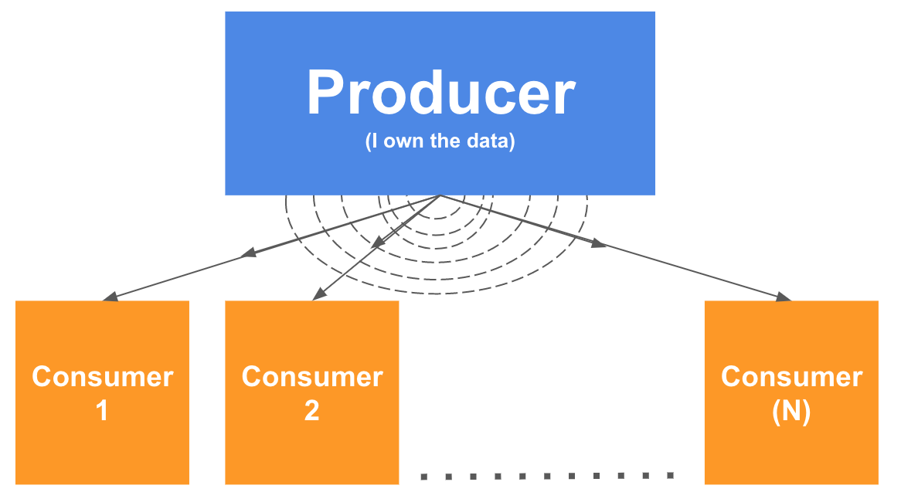

### Por qué la vida antes de la API de contexto era más difícil

La gente dice que React.js hace que las cosas fáciles sean difíciles y que las difíciles sean fáciles. Me encanta ese dicho, es tan cierto: :sweat: Algunos ejemplos de ello:

1. ¿Por qué es tan difícil compartir algunos datos en toda la aplicación?

2. ¿Por qué es tan difícil pasar datos entre componentes? También conocidas props. Las props o propiedades se usan cuando quieres pasar datos entre un padre y un hijo ¿Pero que pasa si tenemos que ir más lejos? Es un infierno.

3. ¿¿Redux (https://redux.js.org/)?? Es demasiado.

La context API está aquí para resolver algunos de esos enigmas:

1.  Tener una aplicación global centralizada: en lugar de limitarte a los estados locales en las vistas, ahora puede compartir datos en un componente principal y sus componentes relativos ( hijos, nietos y así). El estado centralizado se llama **store** y podemos extenderlo/propagarlo utilizando el **Context.Provider** y el **Context.Consumer**

2. Propagación y re-renderizado de datos: cuando este estado centralizado llamado *estado global* (**store**) cambia, gatilla una re-renderización de todos los componentes hijos (tu aplicación completa) lo que genera nuevo datos para mostrar en la UI. Un **setState** pero central.

3. Evita el "infierno de propiedades": si ya has trabajado con react, probablemente hayas sentido la frustración de pasar propiedades en toda tu aplicación: "infierno de propiedades".

## ¿Cómo funciona la API de contexto?

El concepto detrás es muy simple: **hay un sólo y gran proveedor** que provee información para muchos **consumidores**, no hay límites en la cantidad de consumidores.

Cada vez que los datos del **proveedor** cambian, todos los **consumidores** reciben una notificación. Es muy similar a cómo funcionan la señal de la TV. Un canal de TV emite una señal de datos y todas las antenas de TV consumen esa señal, reciben el nuevo contenido y renderizan la imagen en los televisores.

> Todo el mundo tiene acceso al contexto global ahora.



## Flujo de datos unidireccional

El **store** es ahora la pieza más delicada de información de nuestra aplicación, y es muy suceptible a malos usos, es decir un cambio malo y toda la aplicación se vendrá abajo. Para evitar este posible escenario debemos asegurarnos que la información de nuestro store sea read-only para los consumidores, y que sólo pueda *actualizarse* nuevamente con un conjunto limitado de funciones. Como un state normal, no *cambiamos* el state, establecemos uno nuevo. Este paradigma aequitectónico se llama Flux.


![Profundizando en la arquitectura de Flux]
(https://facebook.github.io/flux/docs/in-depth-overview)

Debemos separar el **store** de las **actions** y las **views** (componentes) y asegurárnos de que todas las views o vistas llaman a acciones para actualizar el store. *Nunca cambiaremos el store directamente desde una vista".  Estoy siendo redudante, lo sé... lo hago a propósito...


## Ahora todo junto

+ Vamos a implementar *un sólo punto de verdad* en toda la aplicación: el ***global state***.
+ Este estado contendrá la *información* y las *funciones* para establecer un nuevo state: ***```store```*** y ***```actions```*** .
+ Vamos a propagarlo en toda nuestra aplicación utilizando el *contexto*: ***Context.Provider*** y ***Context.Consumer***


### Una implementación sencilla 

Después de un par de horas para hacer la implementación de la API de contexto más simple sin usar enlaces y esto es lo que obtuve en 5 pasos simples:

- **Paso 1 (Crear el contexto)**: Este paso casi no tiene lógica, simplemente llama a la función `createContext` desde React. Ese objeto se compartirá con todos los consumidores durante el tiempo de vida de la aplicación, contendrá l aplicación del **store** y **actions**.

*AppContext.js*

```js
// Paso 1: define un contexto que se compartirá dentro de toda la aplicación.

const AppContext = React.createContext(null);

```

- **Paso 2 (Store y actions)**: Crea un componente `ContextWrapper` que utilizaremos para pasarle el context (paso 1) a los consumidores. En el estado del `ContextWrapper` declaramos nuestro *global state* inicial, que incluye la información/store ```store``` y las funciones ```actions```. 
Nota: Debemos importar tanto el ```AppContext``` como el ```ContextWrapper```.

```js
// Paso 2: Crea un componente ContextWrapper que debe ser el padre de cada consumidor.

import React from 'react';

export const AppContext = React.createContext(null);

export const ContextWrapper = (props) => {
	const [ store, setStore ] = useState({
		todos: ["Make the bed", "Take out the trash"]
	});
	const [ actions, setActions ] = useState({
		addTask: title => setStore({ ...store, todos: store.todos.concat(title) })
	});
	
	return (
		<AppContext.Provider value={{ store, actions }}>
			{props.children}
		</AppContext.Provider>
	);
}
```

- **Paso 3 (Vistas)**: Ahora podemos contener al componente principal dentro del `ContextWrapper` para que todos sus componentes hijos tengan accceso al `Context.Consumer`. En este breve ejemplo usaremos el componente `<TodoList />` como componente principal (la declaración está en el último paso).

``js
// Step 3: Ubica tu comoponente principal dentro del contenedor ContextWrapper,

import React from 'react';

import { ContextWrapper } from 'path/to/AppContext.js';

const MyView = () => (
	<ContextWrapper>
		<TodoList />
	</ContextWrapper>
	);

ReactDOM.render(<MyView />, document.querySelector("#app"));

``
- **Paso 4**: Ahora podemos crear el componente ```TodoList``` sabiendo que podemos usar el ```Context.Consumer``` para leer el store desde el **global state** (no se necesitan props). En este caso el componente renderizará los to-dos y también podrá añadir nuevas tareas a lista.

```js
// Step 4: Add the Context.Consumer tag to any component

import React from 'react';
import { AppContext } from 'path/to/AppContext.js';

export const TodoList = () => {
	const context = useContext(AppContext)
	return <div>
		{context.store.todos.map((task, i) => (<li>{task}</li>))}
		<button onClick={() => context.actions.addTask("I am the task " + context.todos.length)}> + add </button>
	</div>
}
```


## Prueba el código en vivo

<iframe src="https://codesandbox.io/embed/w75wq6v01k?hidenavigation=1" style="width:100%; height:500px; border:0; border-radius: 4px; overflow:hidden;" sandbox="allow-modals allow-forms allow-popups allow-scripts allow-same-origin"></iframe>
