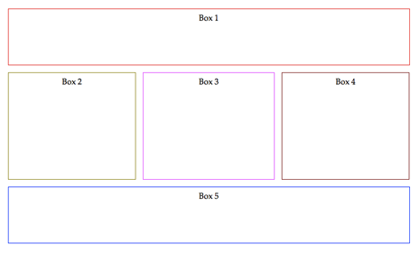
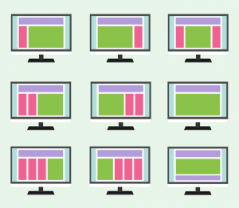
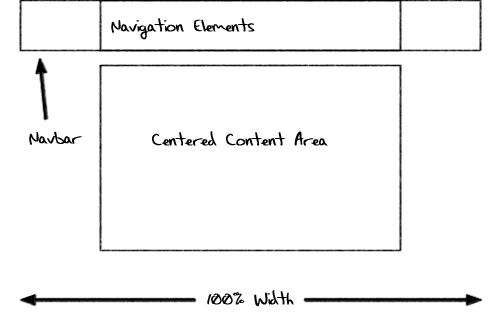
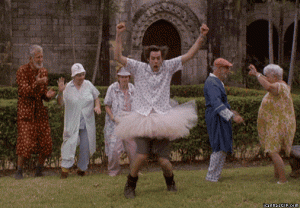

## El Modelo de Cajas

Probablemente, el concepto más difícil de entender de CSS es la diagramación y posicionamiento de los elementos de una página web. Esto pasa porque CSS no fue hecho para visualizar documentos tan avanzados e interactivos como los que vemos en la actualidad.

   

#### Diagramación

Volvamos a HTML:  ¿Cómo puede crear un documento con dos columnas? Sabemos que los documentos científicos tienen varias columnas, las páginas web deberían tenerlas ¿No crees?

Necesitamos usar boxes (cajas) para eso. Una caja es un contenedor con un ancho y una altura específica. Las cajas tienden a ser contenedores rígidos que ponen orden en el mundo HTML/CSS. El tag más utilizada para una caja es `
`.

Todo el contenido del sitio web debe estar envuelto dentro de una caja (div, header, footer, etc). Las cajas son invisibles por defecto, por lo tanto para hacerlas visibles, debes establecer un color de fondo o un borde. La siguiente imagen muestra cuántas cajas invisibles tiene un sitio web normal:

<BeforeAfter width="500px"
    before="../../assets/images/40818d0d-60c6-4ef3-a488-834f21ddebf1.png" after="../../assets/images/0c89a48e-d488-4e5c-807a-fd6b9a9179f6.png" />

#### Atributos de una caja

Todas las cajas/contenedores deben tener los siguientes atributos:

|**Atributo**   |**Descripción**   |
|:--------------|:-----------------|
|Contenido (Content)	    |Cualesquiera que sean los elementos contenidos en el tag (las palabras de un párrafo, una imagen, el texto de una lista de elementos, etc.)     |
|Relleno (Padding)   |Este es un espacio vacío o margen opcional que se puede agregar entre el contenido y el borde del cuadro.   |
|Borde (Border)	   |Línea que encierra completamente la caja y su contenido.   |
|Imagen de Fondo (Background image)   |Imagen que se muestra detrás del contenido de la caja.   |
|Color de Fondo (Background color)   |Además de la imagen de fondo, puede tener un color de fondo detrás del contenido y de la imagen de fondo.   |
|Margen (Margin)   |Separación opcional existente entre la caja y el resto de los elementos a su alrededor.   |

 

En el siguiente ejemplo puedes ver como dividir en dos el contenido de una página web. El lado izquierdo será **El menú** y el lado derecho tendrá **El contenido** del sitio web. Colocamos color rojo al **#div1** del menú, y color azul al **#div2** del contenido para que el ejemplo sea más fácil de entender.

<iframe width="100%" height="300" src="//jsfiddle.net/BreatheCode/kevomsyq/2/embedded/html,css,result/" allowfullscreen="allowfullscreen" allowpaymentrequest frameborder="0"></iframe>

<small><a href="//jsfiddle.net/BreatheCode/kevomsyq/2/embedded/html,css,result/">Haz clic aquí para abrir la demo en una nueva ventana</a></small>

## Propiedad box-sizing 

Esta importante propiedad está relacionada con el modelo de cajas y define la manera en que se calcula la altura (height) y el ancho (width) del elemento: debiese incluir el `border`, `padding` y puede incluir (o no) el `margin`.

+ Si el valor es **content-box**, ancho y altura solo aplican al contenido (`content`) del elemento.

+ Si el valor es **border-box**, ancho y altura aplican a todas las partes del elemento: `content`, `padding` and `borders`. 

<iframe width="100%" height="300" src="//jsfiddle.net/BreatheCode/zvL6aet3/embedded/html,css,result/" allowfullscreen="allowfullscreen" allowpaymentrequest frameborder="0"></iframe>

<small><a href="https://jsfiddle.net/BreatheCode/zvL6aet3/">Hax clic aquí para abrir el demo en una nueva ventana página</a></small>

# Ancho y Altura de las Cajas

Todas las cajas tienen dos atributos que definen su tamaño: `width` (ancho) y `height` (altura). En algunos casos se ajustan automáticamente, pero en otros debemos asignarlos manualmente o colocarlos porcentualmente (relativo al contenido padre por ejemplo).

## Atributo: Posición

El navegador es el responsable de asignar posiciones a todos los elementos de una página. Pero, como ya sabemos, las posiciones que poseen los elementos son bastante limitadas y hacen que los documentos se vean feos y anticuados.

Para que un sitio web se vea como los sitios web de la actualidad, tenemos que rediseñar todo el posicionamiento de la página. Esto se logra utilizando la propiedad "`position`" y "`display`" (que veremos más adelante) para poder replicar la diagramación que se le ocurra al más ávido diseñador.

<iframe src="https://www.youtube.com/embed/hFvOgu3bcOk" frameborder="0" allowfullscreen ></iframe>

<small><a href="https://www.youtube.com/embed/hFvOgu3bcOk">Haz clic aquí para abrir el video en una nueva ventana</a></small>

|**Nombre**   |**Descripción**   |
|:----------|:-----------------|
|Static     |No provoca ningún posicionamiento especial de los elementos. Por consecuencia, los atributos **top**, **left**, **right** y **bottom** no se tendrán en cuenta.    |
|Absolute    |Cuando le dices a una caja que su posición es absolute (o absoluta), igualmente debes definir las reglas  **top**, **bottom**, **left** y **right**.  Aquí le estás pidiendo a la caja que ignore su posición dentro del documento HTML. Su nueva posición se basará en las reglas (**top**, **left**, **right** y **bottom** que especificaste en el CSS).    |
|Relative    |Similar a un absoluto. La principal diferencia es que no se ignora su posición en el documento HTML. La caja a la que le apliques este atributo se va a ubicar de acuerdo a los atributos **top**, **left**, **right** y **bottom**,  en relación con su elemento principal (boss/principal/father) como punto de partida.    |
|Fixed     |Si fijas un elemento, significa que siempre permanecerá en la misma posición. Cuando el usuario se desplaza en cualquier dirección, el elemento permanecerá en la misma posición. "Fixed" podría usarse en ventanas modales (PopUps), menú, etc.    |

¡¡Espera!! Si no entendiste bien lo que acabamos de decir, bueno... realmente no importa (en este punto).  Esta es una de las cosas que necesitamos que practiques mucho para entenderla. No hay otra opción. 🙁

## Atributo: Display

Las valores de la propiedad `display` son mucho más avanzados que simplemente mostrar o ocultar elementos.  En realidad, la propiedad `display` modifica la forma en la que se visualiza un documento.

Es común encontrar este atributo en los menús de navegación, para los activity feeds de las redes sociales, etc.

<iframe src="https://www.youtube.com/embed/pgCLHD4FNjg" frameborder="0" allowfullscreen></iframe>

<small><a href="https://www.youtube.com/embed/pgCLHD4FNjg">Haz click aqui para abrir demo en una nueva ventana</a></small>

|**Nombre**   |**Descripción**   |
|:----------|:-----------------|
|Inline   |Es el valor por defecto de `<strong>`, `<i>`, `<a>`, ``, y otros tags comunes. Los elementos se comportarán como un texto y no tendrán límites definidos (ni width, ni heigh).    |
|Block   |Es el valor por defecto que tienen los tags `
`, `
`, `<h>`, etc.  El elemento ocupará toda la línea de la página, desplazando a los demás elementos por encima o por debajo de él.    |
|Inline-Block    |Lo mejor de ambos mundos. Sirve para tener varios contenedores en una misma línea, pero cada uno respetando sus límites (width y heigh). Gracias a él existen páginas como Pinterest que permiten ver el diseño masonery.   |
|Flex    |Presentada hace poco años atrás, viene a arreglar los mayores problemas con display. Flex se utiliza para que las cajas sean flexibles. Cuando aplicas `display:flex` a un div, todos sus hijos podrán compartir una misma fila. |
|None    |Hace que el elemento se oculte (sea invisible) y no ocupe ningún espacio dentro del documento.   |

Para entender display a cabalidad lo mejor es… ¡que nos pongamos a practicar!.

## Atributo: Float

Float es un atributo sencillo pero muy útil.  Sirve para decirle a una caja que se desplace lo máximo posible hacia algún lado: izquierda o derecha. Una vez que le asignes la propiedad float a algún elemento, este buscará el mejor espacio para acomodarse, intentando convivir con los elementos que lo rodean.

Float es muy utilizado en blogs cuando quieres agregar imágenes a tus artículos. Es muy bueno en estos casos, porque una vez que la foto se desplaza hacia un lado, el texto del artículo rodea a la imagen de una manera muy natural.

<iframe src="https://www.youtube.com/embed/htdLSAZ2ZH8" frameborder="0" allowfullscreen ></iframe>

<small><a href="https://www.youtube.com/embed/htdLSAZ2ZH8">Haz click aqui para abrir demo en una nueva ventana</a></small>

|**Nombre**   |**Descripción**   |
|:----------|:-----------------|
|left	    |Desplaza el elemento lo más a la izquierda posible.   |
|right   |Desplaza el elemento lo más a la derecha posible.   |

## Pensemos en UI/UX por un momento

¡Es tiempo de hacer yoga! Dejemos de programar y comencemos a pensar sobre la especie humana, ¿Cómo actúan los seres humanos? ¿Cómo se comportan? ¿Qué les gusta? ¿Dónde hacen click?

Este curso no es sobre la interfaz (UI) y la experiencia (UX)de los usuarios. Los desarrolladores web tendemos a subestimar este tema. Es importante tomarse el tiempo necesario para diseñar el flujo de navegación del sitio web, la posición del menú, los elementos UI, etc. Aquí tenemos algunos ejemplos de diseños:

Algunos sitios web tienen un excelente contenido pero un mal diseño que limita su potencial para el éxito. Estos son los principales criterios que debes considerar antes de elegir un diseño:

+ **Sensibilidad:** ¿El website se adapta a los diferentes tipos de pantallas? Podemos crear páginas web separadas para cada dispositivo, o aplicaciones móviles + páginas web, pero siempre se recomienda que la página web sea sensible. No quisiéramos perder tráfico en la página porque no carga de forma apropiada.
+ **Tamaño de la pantalla del dispositivo:** Algunas pantallas son muy pequeñas y no pueden tener la misma cantidad de columnas que las más grandes, puede que las imágenes deban ser un poco más pequeñas, etc. Ej: Un iPhone SE tiene una pantalla muy pequeña en comparación a la que tiene la mayoría de las personas que utilizan iPhone. Las barras laterales no son una buena idea en estos dispositivos.
+ **Orientación:** Si estás usando una tablet o un teléfono móvil, puedes rotar la pantalla y eso requiere que el ancho de la página web se ajuste y se agrande (para un paisaje) o se haga más pequeña (tamaño retrato).
+ **Sentido Común:** Este es el más complicado, pero nunca sabrás que funciona mejor hasta que lo pruebas. Quizás mover el menú de la parte de arriba a la izquierda incrementará la interacción de los usuarios. Debes estar en una constante búsqueda de “la verdad” respecto al comportamiento del usuario.
  
## Ejemplos de Layouts:

Los siguientes ejemplos reúnen un gran porcentaje de los diseños más usados en la web. Entiéndelos bien ya que seguro los vas a usar durante el resto de tu vida como desarrollador. A veces usarás diferentes enfoques para lograr varias cosas a la vez.

### Contenido Centrado

Facebook es así: un sitio web con su contenido centrado con un ancho máximo para el contenido. Esto quiere decir que no importa si la computadora del usuario tiene 4000px de ancho, el ancho del sitio web se detendrá al llegar a su "ancho máximo" y el resto de la página será blanca.

Este es el código exacto que se necesita para que el contenido del sitio web esté siempre centrado:

<iframe width="100%" height="300" src="//jsfiddle.net/BreatheCode/Lwop5kdc/3/embedded/html,css,result/" allowfullscreen="allowfullscreen" allowpaymentrequest frameborder="0"></iframe>

<small><a href="//jsfiddle.net/BreatheCode/Lwop5kdc/3/embedded/html,css,result/">Click aqui para abrir demo en una nueva ventana</a></small>

### Left Sidebar fija.

Las barras laterales a la izquierda fijas son geniales cuando tienes una pantalla ancha (landscape). Puedes tener un menú, publicidad, hoja informativa invitándote a participar y a inscribirte, formulario de registro, etc.  Pero aun queda suficiente espacio para el contenido. En la actualidad, casi todas las páginas web usan barras laterales a la izquierda fijas, algunas también tienen barras a la derecha fijas.

De hecho, en este pre-work la barra está a la izquierda.  Es la mejor opción para nosotros porque queremos tener el contenido siempre disponible para ti.

<iframe width="100%" height="300" src="//jsfiddle.net/BreatheCode/0jxvfwad/embedded/html,css,result/" allowfullscreen="allowfullscreen" allowpaymentrequest frameborder="0"></iframe>

<small><a href="//jsfiddle.net/BreatheCode/0jxvfwad/embedded/html,css,result/">Click aqui para abrir demo en una nueva ventana</a></small>

### Menú superior con barra lateral izquierda

Es casi lo mismo, pero en vez de tener barras laterales a la izquierda como el menú principal, vamos a utilizarlas para contenido complementario. El menú principal debe estar en la caja de arriba porque es lo primero que los usuarios ven cuando entran a la página web.

<iframe width="100%" height="300" src="//jsfiddle.net/BreatheCode/aLndw6e7/5/embedded/html,css,result/" allowfullscreen="allowfullscreen" allowpaymentrequest frameborder="0"></iframe>

<small><a href="//jsfiddle.net/BreatheCode/aLndw6e7/5/embedded/html,css,result/">Click aqui para abrir demo en una nueva ventana</a></small>

### Responsive Masonry

Pinterest hizo este layout universalmente conocido. Mediante el uso de esta “innovador” UI, se convirtieron en uno de los sitios webs más visitados en el mundo.  Masonry distribuye las cajas de un manera óptima, primero trata de cubrir toda la fila añadiendo cajas a la derecha (añadiéndolas al final), y después salta a la fila siguiente cuando ya no hay espacio suficiente disponible.

Otra genialidad sobre Masonry es que cada caja puede tener su propia altura, cosa que es muy difícil en CSS porque los navegadores antiguos no soportan esas características y tendrás que usar JavaScript para arreglarlo.

<iframe width="100%" height="300" src="//jsfiddle.net/BreatheCode/ovp1nj3s/5/embedded/html,css,result/" allowfullscreen="allowfullscreen" allowpaymentrequest frameborder="0"></iframe>

<small><a href="//jsfiddle.net/BreatheCode/ovp1nj3s/5/embedded/html,css,result/">Click aqui para abrir demo en una nueva ventana</a></small>

### Popups / Ventanas Modales / Alertas

La alerta predeterminada de JavaScript es fea y limitada [(H azclic aquí para verla)](https://www.w3schools.com/js/js_popup.asp). A nadie le gusta usarla, eso es porque los desarrolladores siempre quieren construir sus propios modales.

Para replicar el comportamiento de esta alerta tienes que:

+ Crear un div con posición absoluta.
+ Ponerlo en el centro de la pantalla (utiliza los márgenes automáticos para eso).
+ Ponerlo frente al contenido del sitio web (usa la regla z-index para esto).
+ Agrega un botón de cierre para que el div sea invisible cuando los usuarios hagan clic en “cerrar” [(debes usar JavaScript para capturar los clicks que hacen los usuarios)](https://stackoverflow.com/questions/3177582/how-to-hide-div-by-onclick-using-javascript).

<iframe width="100%" height="300" src="//jsfiddle.net/BreatheCode/8co2hnj1/1/embedded/html,css,result/" allowfullscreen="allowfullscreen" allowpaymentrequest frameborder="0"></iframe>

<small><a href="//jsfiddle.net/BreatheCode/8co2hnj1/1/embedded/html,css,result/">Haz click aqui para abrir demo en una nueva ventana</a></small>

## Demostración en vivo: Juega con la Caja

Utiliza los sliders de la barra de herramientas izquierda para modificar el margin (margen), padding (relleno), border radius (radio del borde) o cualquier otra regla de CSS que este disponible en el demo:

<iframe src="https://assets.breatheco.de/live-demos/css/box-model/" width="100%" height="465" frameborder="0" scrolling="no" style="border:0px; overflow: hidden;"></iframe>

## Hay Mucho Más que Aprender sobre Diseños

Tendrás que ir aprendiendo “en el camino”, porque hay una infinidad de combinaciones que puedes crear para el diseño de una página web. Lo que realmente importa, es que entiendas completamente el display, absolute, float y las reglas del overflow.

No te preocupes, amigo mio. Hay un recurso llamado `Bootstrap` que está hecho para facilitar el diseño.  Aprenderás esto en la próxima lección.

  

