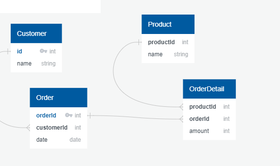

## Basic Concepts

When we talk about relational databases, the main advantage that comes to mind is data integrity. These databases allow to distribute the information in different tables to group information according to its relevance and to create relationships between tables to associate data. However, to maintain integrity it is necessary to meet certain standards when designing our tables. We need the structure to be relevant to the data we want to store and to guarantee the integrity of the information as well as its consistency and avoid having unnecessary redundant information.

For this there is the database normalization, it is about five normal forms that if you comply with them your database will guarantee the integrity of the information and the optimization when making queries. Forms four and five are generally contemplated for more advanced and complex scenarios, for most of the cases it will be enough to comply with the first three normal forms that we will cover next in this article.

Before talking about the normal forms we must handle some fundamental concepts.

The first concept is entity, it is an abstraction of an object of reality, or of a process of the organization, whose information must be stored in the database in a grouped and correlated way.

The second concept is key or primary key, it is an attribute or column that serves to unequivocally identify an entity within a table.

## First Normal Form - 1NF

For a table to comply with the first normal form it must meet the following parameters:

* Each cell must have a single value
* There must be a primary key to identify each entity.
* There must be no duplicate rows or columns

If for example we have a product order table of the following form:

<table>
  <tr>
   <td>OrderId</td>
   <td>Date</td>
   <td>Details</td>
   <td>Customer</td>
  </tr>
  <tr>
   <td>1</td>
   <td>01-01-23</td>
   <td>2 Shoes</td>
   <td>Pedro</td>
  </tr>
  <tr>
   <td>1</td>
   <td>01-01-23</td>
   <td>3 Pants</td>
   <td>Pedro</td>
  </tr>
  <tr>
   <td>2</td>
   <td>03-02-23</td>
   <td>1 Bag</td>
   <td>Jane</td>
  </tr>
  <tr>
   <td>3</td>
   <td>02-03-23</td>
   <td>1 Shirt</td>
   <td>Ana</td>
  </tr>
</table>

We can notice that the "Detail" column contains two important pieces of information for the order: the quantity and the product name. In the same way we can notice how although we can identify the order with the OrderId" the same does not happen in the case of the products and the customer since we only have a name that is not necessarily unique for each one and can be repeated. Let's correct that:

<table>
  <tr>
   <td>OrderId</td>
   <td>Date</td>
   <td>ProductId</td>
   <td>ProductName</td>
   <td>Amount</td>
   <td>CustomerId</td>
   <td>Customer</td>
  </tr>
  <tr>
   <td>1</td>
   <td>01-01-23</td>
   <td>1</td>
   <td>Shoes</td>
   <td>2</td>
   <td>1</td>
   <td>Pedro</td>
  </tr>
  <tr>
   <td>1</td>
   <td>01-01-23</td>
   <td>2</td>
   <td>Pants</td>
   <td>6</td>
   <td>1</td>
   <td>Pedro</td>
  </tr>
  <tr>
   <td>2</td>
   <td>03-02-23</td>
   <td>3</td>
   <td>Bolso</td>
   <td>4</td>
   <td>2</td>
   <td>Jane</td>
  </tr>
  <tr>
   <td>3</td>
   <td>02-03-23</td>
   <td>1</td>
   <td>Shoes</td>
   <td>1</td>
   <td>3</td>
   <td>Ana</td>
  </tr>
</table>

Now we can see how not only the order can be identified with its ID but we also have ids for the product and the customer so that each of these entities can be identified. We also separated the quantity and the product name to separate columns to comply with the first normal form.

## Second normal form - 2NF

For the second normal form the objective is to eliminate repetitive groups so the following criteria must be met:

* comply with the first normal form

* All attributes must be directly dependent on the primary key.

In other words, all those attributes that correspond to different primary keys must be separated in different Tables with their own primary keys and related attributes. Following the example of the order table would be as follows:

<table>
  <tr>
   <td colspan="2" >Orders</td>
   <td></td>
  </tr>
  <tr>
   <td>Id</td>
   <td>Date</td>
   <td>Customer</td>
  </tr>
  <tr>
   <td>1</td>
   <td>01-01-23</td>
   <td>1</td>
  </tr>
  <tr>
   <td>2</td>
   <td>03-02-23</td>
   <td>2</td>
  </tr>
  <tr>
   <td>3</td>
   <td>02-03-23</td>
   <td>3</td>
  </tr>
</table>

---

<table>
  <tr>
   <td colspan="2" >Customer</td>
  </tr>
  <tr>
   <td>Id</td>
   <td>Name</td>
  </tr>
  <tr>
   <td>1</td>
   <td>Pedro</td>
  </tr>
  <tr>
   <td>2</td>
   <td>Jane</td>
  </tr>
  <tr>
   <td>3</td>
   <td>Ana</td>
  </tr>
</table>

---

<table>
  <tr>
   <td colspan="5" >Product</td>
  </tr>
  <tr>
   <td>OrderId</td>
   <td>Date</td>
   <td>ProductId</td>
   <td>Name</td>
   <td>Amount</td>
  </tr>
  <tr>
   <td>1</td>
   <td>01-01-23</td>
   <td>1</td>
   <td>Shoes</td>
   <td>2</td>
  </tr>
  <tr>
   <td>1</td>
   <td>01-01-23</td>
   <td>2</td>
   <td>Pants</td>
   <td>3</td>
  </tr>
  <tr>
   <td>2</td>
   <td>03-02-23</td>
   <td>3</td>
   <td>Bag</td>
   <td>1</td>
  </tr>
  <tr>
   <td>3</td>
   <td>02-03-23</td>
   <td>1</td>
   <td>Shoes</td>
   <td>1</td>
  </tr>
</table>

By separating the attributes in their respective tables with their own primary keys we can see a reduction of repeated rows as this redundancy becomes unnecessary when the different tables can be related through their primary and foreign keys. For example, I only need one row to record the customer which can appear several times in the order table, instead of placing the customer information several times for each order.

Even so we can notice some redundancy in the products table since we need to repeat the products for each of the orders, this is where it comes the...

## Third normal form - 3NF

For the third normal form what we want is that absolutely all the attributes of a table depend only on its primary key and not on another non-primary key. This is what is known as a transitive dependency, i.e. when an attribute depends indirectly on the primary key of another. For example: Shoes have their own key "id", but they must also be associated with another key, the OrderId", to know which products must be included in the order.

To resolve these dependencies we create tables with each of the entities separately, and create transitional tables that relate the primary keys of both. With this we eliminate any redundancy of data and achieve greater reliability of the information.

In the case of the product table in the example, it would be solved as follows:

<table>
  <tr>
   <td colspan="2" >Orders</td>
  </tr>
  <tr>
   <td>OrderId</td>
   <td>Date</td>
  </tr>
  <tr>
   <td>1</td>
   <td>01-01-23</td>
  </tr>
  <tr>
   <td>2</td>
   <td>03-02-23</td>
  </tr>
  <tr>
   <td>3</td>
   <td>02-03-23</td>
  </tr>
</table>

---

<table>
  <tr>
   <td colspan="2" >Products</td>
  </tr>
  <tr>
   <td>ProductId</td>
   <td>Name</td>
  </tr>
  <tr>
   <td>1</td>
   <td>Shoes</td>
  </tr>
  <tr>
   <td>2</td>
   <td>Pants</td>
  </tr>
  <tr>
   <td>3</td>
   <td>Bag</td>
  </tr>
</table>

---

<table>
  <tr>
   <td colspan="3" >Order details</td>
  </tr>
  <tr>
   <td>OrderId</td>
   <td>ProductId</td>
   <td>Amount</td>
  </tr>
  <tr>
   <td>1</td>
   <td>1</td>
   <td>2</td>
  </tr>
  <tr>
   <td>1</td>
   <td>2</td>
   <td>3</td>
  </tr>
  <tr>
   <td>2</td>
   <td>3</td>
   <td>1</td>
  </tr>
  <tr>
   <td>3</td>
   <td>1</td>
   <td>1</td>
  </tr>
</table>

---

Now you can see how the products in each order are related, along with the quantity of that product for the corresponding order. Here you can see the final model of the database

[Open FullSize](../../assets/svg/databaseModel.svg)

The cost of this is that we now have to make queries by cross-referencing information from several tables, but in return you have a database without redundancy and with more consistent and reliable data. If, for example, a customer changes his information, all previously placed orders are related only to the customer's updated record, generating greater reliability for system users.
