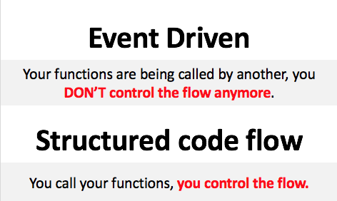
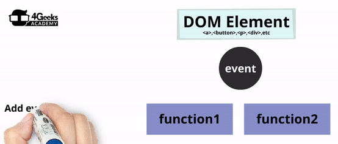

## Programación Dirigida por Eventos
***

Trabajar con eventos es una forma totalmente nueva de **controlar el flujo de una aplicación.** Es la primera vez que su código no se ejecutará en un flujo lineal. En su lugar, se ejecutará de forma asíncrona. ¿Quién sabe qué es lo primero?

¿Qué es un evento?

Un evento es algo que sucede! Como **hacer clic** en un botón, **presionar** una tecla en el teclado, **pasar** un div con el mouse, etc.

Tu trabajo como desarrollador es prepararte para esos eventos y **definir las funciones** que van a manejar esos eventos.



### ¿Pero quién desencadena estos eventos?

A veces es el usuario del sitio web, a veces es el navegador, a veces es otra aplicación que le permite saber algo, a veces el desarrollador desencadena eventos relacionados con la lógica empresarial, etc.

Hay docenas de eventos que se activan cada minuto, pero no tienes que hacer nada al respecto (no si no quieres). Están disponibles para usted según el tipo de aplicación que desee hacer.

## Tipos de Eventos
***

Estos son algunos de los tipos de eventos que se activan constantemente (y usted puede escucharlos):

### MOUSE – Eventos

|**Tipo de Datos**    |**Descripción**    |
|:----------------|:-----------------|
|Click            |Cuando el usuario hace clic con el mouse o el dedo en cualquier elemento HTML.   |
|Mouseover,<br>Mouseout    |El evento ocurre cuando el puntero se mueve hacia dentro (para el mouseover) o hacia afuera (para el mouseout) un elemento, o uno de sus hijos.    |
|contextmenu    |Cuando el usuario hace clic derecho en el mouse.    |
|Mousemove     |Si el usuario mueve el mouse.   |
|Mousedown or Mouseup     |Si el usuario presiona o suelta el mouse.    |

[[demo]]
| :point_up: Juega con esta demo aquí

<iframe width="100%" height="300" frameborder="1" src="https://4geeksacademy.github.io/code-projects/uncategorized/event-listener/mouse.html" allowfullscreen="allowfullscreen" allowpaymentrequest frameborder="0"></iframe>

<div align="right"><small><a href="https://4geeksacademy.github.io/code-projects/uncategorized/event-listener/mouse.html">Haga clic aquí para abrir la demostración en una nueva ventana.</a></small></div>

### FRAME – Eventos

|**Tipo de Datos**    |**Descripción**    |
|:----------------|:-----------------|
|Load	           |El navegador ha terminado de cargar el sitio web.  |
|Error            |El evento ocurre cuando se produce un error al cargar un archivo externo (como un CSS o un JavaScript).
|Scroll         |El evento ocurre cuando se produce un error al cargar un archivo externo (como un CSS o un JavaScript). |
|PageHide<br>PageShow    |Wcuando el usuario se enfoca en una ventana / pestaña diferente; o cuando el usuario vuelve de una ventana / pestaña diferente.  |
|Resize    |Cuando la ventana se redimensiona.     |

[[demo]]
| :point_up: Juega con esta demo aquí

<iframe width="100%" height="300" frameborder="1" src="https://4geeksacademy.github.io/code-projects/uncategorized/event-listener/frame.html" allowfullscreen="allowfullscreen" allowpaymentrequest frameborder="0"></iframe>

<div align="right"><small><a href="https://4geeksacademy.github.io/code-projects/uncategorized/event-listener/frame.html" allowfullscreen="allowfullscreen">Haga clic aquí para abrir la demostración en una nueva ventana.</a></small></div>

### FORMS – Eventos 

|**Tipo de Datos**    |**Descripción**    |
|:----------------|:-----------------|
|Submit	    |El evento ocurre cuando se envía un formulario.    |
|Focusin and Focusout     |El evento ocurre cuando el puntero se mueve a un elemento o a uno de los elementos secundarios del elemento.   |
|Input       |El evento ocurre cuando un elemento obtiene la entrada del usuario.    |
|Change       |El evento ocurre cuando el contenido de un elemento del formulario, la selección o el estado previamente establecido han cambiado (para `<input>`, `<keygen>`, `<select>`, y `<textarea>`)
     |

[[demo]]
| :point_up: Juega con esta demo aquí 

<iframe width="100%" height="300"  frameborder="1" src="https://4geeksacademy.github.io/code-projects/uncategorized/event-listener/forms.html" allowfullscreen="allowfullscreen" allowpaymentrequest frameborder="0"></iframe>

<div align="right"><small><a href="https://4geeksacademy.github.io/code-projects/uncategorized/event-listener/forms.html">Haga clic aquí para abrir la demostración en una nueva ventana.</a></small></div>

### TECLADO – Events

|**Tipo de Datos**    |**Descripción**    |
|:----------------|:-----------------|
|Keyup           |Cuando el usuario suelta la tecla del teclado.    |
|Keydown	     |Cuando el usuario presiona la tecla del teclado.    |
|Keypress       |Cuando el usuario presiona y suelta la tecla del teclado. La diferencia de keydown / up es que Keypress solo funciona con teclas de caracteres. Por ejemplo, no funciona en las flechas arriba | abajo | izquierda | derecha. |

[[demo]]
| :point_up:Juega con esta demo aquí

<iframe width="100%" height="300"  frameborder="1"src="https://4geeksacademy.github.io/code-projects/uncategorized/event-listener/keyboard.html" allowfullscreen="allowfullscreen" allowpaymentrequest frameborder="0"></iframe>

<div align="right"><small><a href="https://4geeksacademy.github.io/code-projects/uncategorized/event-listener/keyboard.html">Haga clic aquí para abrir la demostración en una nueva ventana.</a></small></div>


[[info]]
|:link: Aquí [puedes encontrar una lista con todos los otros eventos menos comunes](https://www.w3schools.com/jsref/dom_obj_event.asp) que tiene a su disposición.  Léalos rápidamente y sé consciente de ellos para futuras referencias durante tu vida como desarrollador.

## Escuchando los Eventos
***

Ahora que sabes qué eventos hay, puedes comenzar a escucharlos cuando lo desees durante el tiempo de ejecución.  La única forma de reaccionar ante cualquier evento es escuchar ese evento y asignar una función que maneje el evento como lo necesite.

Repitamos: Para **reaccionar** necesitas **escuchar…** Y para escuchar necesitas especificar una función **controladora**.



Puedes agregar un detector de eventos de 2 maneras diferentes:

## Añadiendo Listeners desde el HTML
***

Por ejemplo, si desea empezar a escuchar cuando el usuario hace clic en un botón en particular todo lo que tiene que hacer es especificar el atributo "onclick" para esa etiqueta HTML específica `< button>`, así:

```html
<!– myClickHandler is a javascript function that will handle the event –>
<button onclick="myClickHandler();">Click me</button>
 
<script>
function myClickHandler(){
    alert(‘hello’);
}
</script>
```

<iframe width="100%" height="300" src="//jsfiddle.net/BreatheCode/b7c6gmnd/1/embedded/js,html,result/" allowfullscreen="allowfullscreen" allowpaymentrequest frameborder="0"></iframe>

<div align="right"><small><a href="//jsfiddle.net/BreatheCode/b7c6gmnd/1/embedded/js,html,result/" allowfullscreen="allowfullscreen">Haga clic aquí para abrir la demostración en una nueva ventana.</a></small></div>

## Añadiendo Listeners desde JavaScript (durante el tiempo de ejecución)
***

A veces el elemento DOM no existe desde el principio. Tal vez se crean después de una llamada a la base de datos o después de que el usuario haya hecho algo. Para resolver ese problema, debe comenzar a escuchar después de crear los nuevos elementos.

La función .addEventListener es perfecta para esto porque se puede usar en cualquier elemento DOM durante el tiempo de ejecución.

Al usar la función .addEventListener, debe especificar qué **evento** quiere escuchar, y **la función controladora** que se llamará cada vez que ese evento se active en ese elemento DOM.

Por ejemplo, este código está creando una lista de nombres, y cada ancla de eliminación en cada fila está escuchando el  evento "click" solo para esa fila.

<iframe width="100%" height="300" src="//jsfiddle.net/BreatheCode/1nhjc4t0/1/embedded/js,html,result/" allowfullscreen="allowfullscreen" allowpaymentrequest frameborder="0"></iframe>

<div align="right"><small><a href="//jsfiddle.net/BreatheCode/1nhjc4t0/1/embedded/js,html,result/">Haga clic aquí para abrir la demostración en una nueva ventana.</a></small></div>

## El Objeto del Evento
***

Los controladores de eventos pueden tener un parámetro opcional en la declaración de la función.  Este parámetro siempre se llena con un objeto "Evento" que contiene mucha información sobre el evento que se activó para obtener esta función llamada.

No importa qué tipo de evento (eventos relacionados con el mouse, evento de teclado, marco, etc.), el objeto de evento siempre tendrá al menos las siguientes propiedades:

```javascript
function myEventHandler(eventObj)
{
    console.log(eventObj.target);
     //imprimirá en la consola del objeto DOM que ha activado el evento
    console.log(eventObj.type);
     //Imprimirá en la consola el tipo de evento. 
    console.log(eventObj.cancelable);
     //Imprimiremos en la consola verdadero o falso si podemos detener la propagación de este evento.
}
```

### Cada Objeto de Evento tiene las siguientes Propiedades:

|**Propiedades**    |**Descripción**    |
|:---------------|:------------------|
|Objetivo           |Devuelve el objeto DOM que ha activado el evento.     |
|Tipo             | 	El tipo de evento: haga clic en, al pasar el ratón, carga, etc .     |
|Cancelable       |Si puede detener la propagación del evento o no.    |

Dependiendo del tipo de evento, tendrá propiedades adicionales que le darán información muy útil sobre lo que sucedió cuando se activó el evento.

### Información Adicional para ** Eventos del Mouse **

|**Propiedades**    |**Descripción**    |
|:---------------|:------------------|
|clientX, clientY    |Devuelve la horizontal o vertical de coordenadas del puntero del ratón, con relación a la ventana actual, cuando el evento de ratón fue provocada.    |
|pageX, pageY       |Devuelve la horizontal o vertical de coordenadas del puntero del ratón - en relación con el documento - cuando el evento de ratón fue provocado.     |
|which      |Devuelve qué botón del ratón cuando se presiona el evento de ratón se desencadenó      |

### Información Adicional para **Eventos de Teclado**

|**Propiedades**    |**Descripción**    |
|:---------------|:------------------|
|keyCode        |Devuelve el código de caracteres Unicode de la tecla que activa el evento.    |
|shiftKey, altKey or ctrlKey     |Devuelve si el `shift`,`alt` o `ctrl` se pulsan con el evento clave fue provocada.    |


### Información adicional para **eventos de rueda**

|**Propiedades**    |**Descripción**    |
|:---------------|:------------------|
|deltaX, deltaY   |Devuelve la cantidad de desplazamiento vertical u horizontal de una rueda del ratón ( eje y) o (eje x)   |
|deltaMode       |Devuelve un número que representa la unidad de mediciones de valores delta (píxeles, líneas o páginas)    |

[[info]]
| :link: Hay mucha más información que puede obtener del objeto de evento, pero nos estamos enfocando en las propiedades más utilizadas. Para una lista más grande de propiedades por favor lea [this guide.](https://www.w3schools.com/jsref/dom_obj_event.asp)

## Remover los Listeners (receptores)
***

Qué pasa si no quiero seguir escuchando? Todos los navegadores modernos eliminan los oyentes de eventos cuando se elimina el elemento DOM en el que se aplicaron. Pero si no desea eliminar el elemento DOM, puede eliminar el oyente de forma manual utilizando la función .removeEventListener.

```javascript
element.removeEventListener(type, eventHandlerFunction);
```

Tienes que utilizar los mismos parámetros exactos en la función removeEventListener de que los que utilizan en la función addEventListener.

He aquí un ejemplo:

En este código, se añade un detector de eventos para el evento click, pero luego, la primera vez que el detector de click se llama a la función de controlador, elimina el detector de eventos desde el botón. Es por eso que la segunda vez que se hace clic en el botón, no pasa nada.

<iframe width="100%" height="300" src="//jsfiddle.net/BreatheCode/vcbkgn4o/embedded/js,html,result/" allowfullscreen="allowfullscreen" allowpaymentrequest frameborder="0"></iframe>

<div align="right"><small><a href="//jsfiddle.net/BreatheCode/vcbkgn4o/embedded/js,html,result/">Haga clic aquí para abrir la demostración en una nueva ventana.</p></small></div>


