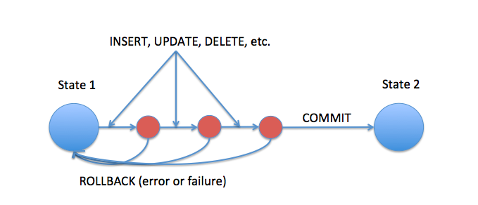
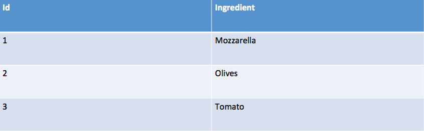
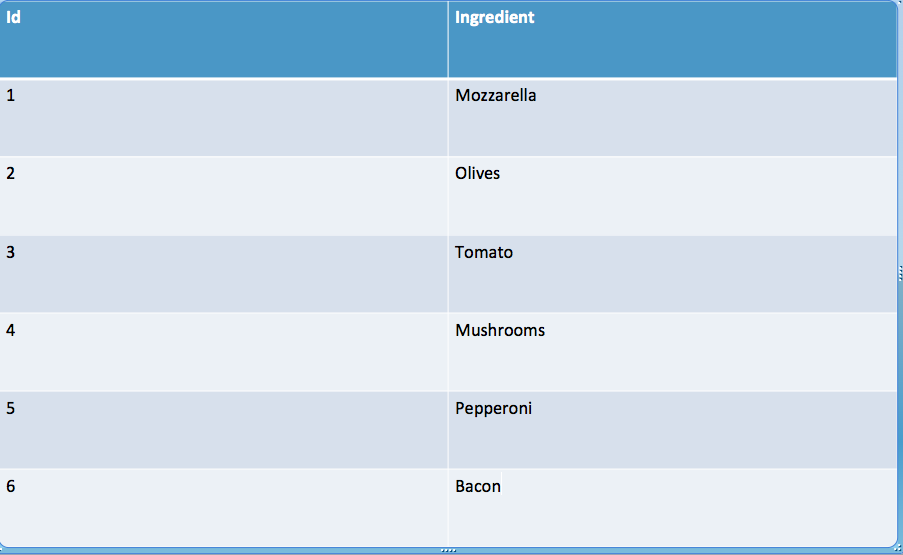
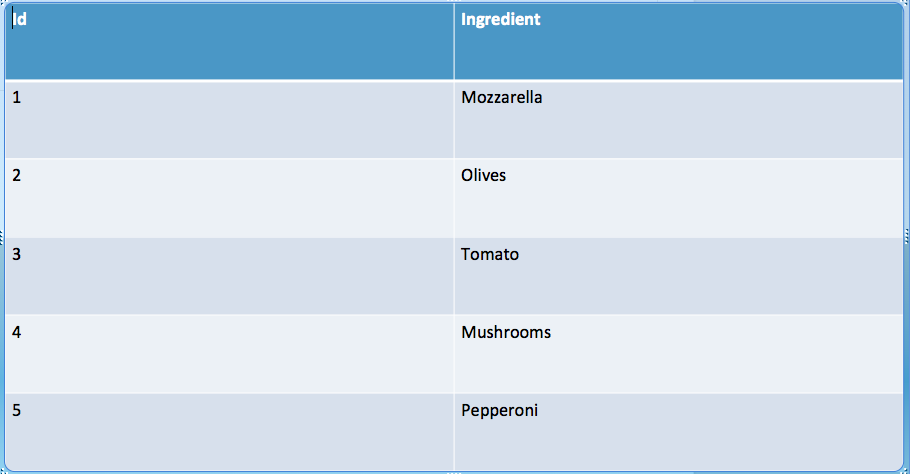

## ¿Qué es SQL Alchemy?

SQLAlchemy es un [Object-Relational Mapper / Mapping-tool](https://en.wikipedia.org/wiki/Object-relational_mapping), o un ORM, es decir, una librería que los desarrolladores utilizan para crear bases de datos y manipular sus datos sin la necesidad de conocer / usar SQL.

Existen otras alternativas como SQL Alchemy o Peewee, y otros lenguajes tienen sus propios ORMs como PHP Eloquent o Java Hibernate.

## ¿Por qué usar un ORM?

Los ORM han ganado popularidad debido a que lidiar con el lenguaje SQL directamente requiere de mucho esfuerzo en la mayoría de los casos. El objetivo del ORM entonces es simplificar la mantención de tus datos.
Esto se hace creando ***objetos*** para tratar con las interacciones de la base de datos.

Básicamente, con ORM no tendrás que escribir SQL otra vez (95% del tiempo) y podrás trabajar con objetos.

### Por ejemplo:

Para insertar un usuario con SQL tienes que escribir:

```sql
INSERT INTO user (name, last_name) VALUES ('Juan', 'McDonals');
```

Con un ORM tu código sigue siendo un código familiar como este:

```py
user = User()
user.name = 'Juan'
user.last_name = 'McDonals'

# agrega el user a la base de datos
db.session.add(user)

# parecido al commit de GIT lo que hace es guardar todos los cambios que hayas hecho
db.session.commit()
```

Basta con que digas: `db.session.commit()` y todo lo que hayas hecho con tu código se traducirá a código de lenguaje SQL.

## Revisemos la operación de base de datos más típica

### Creando nuestra base de datos

El primer paso sería definir nuestro modelo

```py
class Person(Base):
    __tablename__ = 'person'
    # Aquí definimos el nombre de la tabla person.
    # Ten en cuenta que cada columna es también un atributo normal de primera instancia de Python.
    id = Column(Integer, primary_key=True)
    name = Column(String(250), nullable=False)

    # el metodo serialize convierte el objeto en un diccionario
    def serialize(self):
        return {
            "id": self.id,
            "name": self.name
        }
  ```

### INSERT: Insertando un registro en la base de datos

¡Todo lo que tiene que hacer es crear un nuevo objeto Person, agregarlo a la sesión de la base de datos y commit!
Simplemente reemplaza `<username_value>` y `<email_value>` con los valores reales que deseaa agregar, a continuación.

```py
person = Person(username=<username_value>, email=<email_value>)
db.session.add(person)
db.session.commit()
  ```

### SELECT: Buscando o recuperando registros

Hay 3 formas para devolver data de la base de datos:
    1. Obten todos los registros de una tabla/modelo en particular usando `MyModel.query.all()`
    2. Obten un único registro en función de su clave principal mediante `MyModel.query.get(id)`
    3. Obten un grupo de registros en función de una consulta `Person.query.filter_by(arg1=value, arg2=value, ...)`

```py
# aquí es como se buscan todas las personas
all_people = Person.query.all()
all_people = list(map(lambda x: x.serialize(), all_people))

# aquí es como se busca un grupo de personas con name = alex
all_people = Person.query.filter_by(name='alex')
all_people = list(map(lambda x: x.serialize(), all_people))

# aquí es cómo se busca a una persona con id = 3 (solo funciona con las primary key)
person = Person.query.get(3)
```

### DELETE: Eliminando un registro de la base de datos.

Todo lo que tienes que hacer es seleccionar la instancia de una Persona que te gustaría eliminar (es decir, por su id) y eliminarla escribiendo `db.session.delete(person)`.

```py
person = Person.query.get(3)
db.session.delete(person)
db.session.commit()
```

### UDPATE: Actualizar un registro.

Para actualizar, primero necesitas devolver/seleccionar el registro de la base de datos, luego puedes actualizar la propiedad que desees y hacer commit nuevamente.

```py
person = Person.query.get(3)
person.name = "Bob"
db.session.commit()
```

## Transacciones

Una transacción es una secuencia de operaciones (como INSERT, UPDATE, SELECT) realizadas en tu base de datos. Para que una transacción esté completa una cierta cantidad de operaciones dentro de un grupo deben ser exitosas. Si una operación falla, toda la transacción falla.

Las transacciones tienen las siguientes 4 propiedades estándar (conocidas como propiedades ACID: español significa Atomicidad, Consistencia, Aislamiento y Durabilidad )


Una transacción termina con COMMIT o ROLLBACK. 

### COMMIT: session.commit()

El comando COMMIT se usa para guardar de manera permanente los cambios realizados en una transacción dentro de la base de datos. 

Cuando usas INSERT, UPDATE o DELETE, los cambios realizados con estos comandos no son permanentes, los cambios hechos pueden desahacerse o "podemos volver atrás".

Pero cuando usas el comando COMMIT los cambios en tu base de datos serán permanentes.  

### Comando ROLLBACK 

Restaura tu base de datos hasta tu último COMMIT. También puedes usarlo con el comando SAVEPOINT para saltar a un punto que hayas guardado durante una transacción en curso.

Del mismo modo, si usas UPDATE para hacer cambios en tu base de datos, puedes deshacerlos usando el comando ROLLBACK pero sólo si aún no has usado el comando COMMIT de esta forma:

```jsx
db.session.rollback()
```

### Comando SAVEPOINT 

Este comando se usa para guardar temporalmente una transacción para así poder volver a cierto punto utilizando el comando ROLLBACK si así lo necesitas, puedes usarlo así:

```jsx
db.session.begin_nested()
```

Este comando se puede llamar muchas veces y emitirá un nuevo PUNTO DE CONTROL con una ID.



Digamos que vamos a comer pizza y nuestra pizza tiene tres ingredientes de base:
mozzarella, tomate y aceitunas.  Nuestra tabla se llamaría 'PIZZA' y se vería de la siguiente manera:



Pero tenemos una lista de ingredientes extra que podemos añadirle: escogemos carne pero luego cambiamos de parecer y queremos champiñones. También nos gustaría añadirle pepperoni y tocino. Veamos como se vería nuestra transacción:

```jsx
# we insert a new ingredient into out pizza
ingredient = Ingredient()
ingredient.name = 'meat'
ingredient.id = 4
db.session.add(ingredient)

# now we COMMIT the transaction and save it into the database
db.session.commit()

ingredient = Ingredient.query.get(4)
ingredient.name = mushrooms

# save a checkpoint
checkpoint_a = db.session.begin_nested()

# add pepperoni
ingredient = Ingredient()
ingredient.name = 'pepperoni'
db.session.add(ingredient)

# one last checkpoint before adding bacon ingredient
checkpoint_b = db.session.begin_nested()

# add bacon
ingredient = Ingredient()
ingredient.name = 'bacon'
db.session.add(ingredient)
```

Ahora nuestra 'Pizza' tiene los siguientes ingredientes:



Ahora acabamos de decir que ya no queremos tocino, asi que usamos ROLLBACK:

```jsx
ROLLBACK TO B;
```
y nuestra 'PIZZA' se ve así:



.... me ha dado hambre luego de leer esta lección ¿¿tú no tienes hambre??


  

