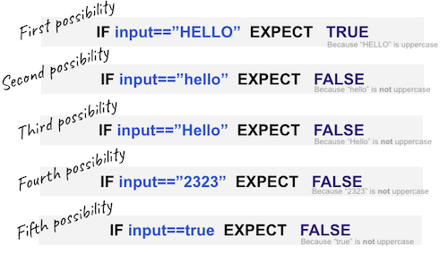

Los seres humanos cometen errores, todo el tiempo. A medida que avances en tu carrera de desarrollo te sentirás más cómodo con eso.

Los desarrolladores Senior entienden que su código tendrá errores (no importa cuan inteligente seas) y que la única forma de que tenga calidad es escribiendo código adicional, a eso le llamamos "Pruebas unitarias", aquí aprenderás por qué y cómo hacerlo.

Hay varias maneras de probar tus aplicaciones, pero las pruebas unitarias son la herramienta más poderosa que tiene un desarrollador para asegurar un código de alta calidad.


 
## ¿Qué son las pruebas unitarias?

Las pruebas unitarias son el proceso de dividir tu código en pequeñas funciones y probar cada una de esas funciones por separado. Por ejemplo:

Supongamos que estás construyendo una función `sum` que suma dos números:

```js

function sum(number1, number2){
    return number1 + number2;
}
```
Una prueba unitaria para esta función solo se preocupa de la entrada y de la salida, **Con una entrada determinada, debería haber una salida esperada**: Si le pasa `12`y `5` como entradas a la función, debería salir (devolver) el número `17`.

El framework de pruebas Jest de Javascript introduce una función especial llamada `expect` para permitirnos realizar las pruebas unitarias, aquí hay un ejemplo de cómo usar `expect` para crear nuestras pruebas unitarias.

```js
test('12 and 5 should return 17', () => {
    let result = sum(12,5);
    expect(result).toBe(17);
})
```
Nota: Las pruebas unitarias no se preocupan por el contenido de la función `sum`, sólo se preocupan por la SALIDA de la función con una ENTRADA determinada.


## Beneficios de utilizar las pruebas unitarias:

+ **Puedes encontrar y prevenir errores fácilmente** Si hay un problema en el futuro podrás identificar la causa mucho más rápido que si tuvieras que revisar todo el código. También tu usuario final estará muy contento de no tener un producto con errores.

+ **Las pruebas unitarias ahorran tiempo...y dinero** Al escribir pruebas unitarias puedes identificar muchos posibles errores y solucionarlos de inmediato, en lugar de solucionarlos en diferentes etapas de tu producto.

+ **Tu código es más confiable y reutilizable** Cuando tu código se divide en unidades o componentes donde cada uno tiene su responsabilidad o función, tu código se vuelve más confiable y te da más seguridad y como ya has hecho pruebas puedes reutilizarlo: es limpio y eficiente y puedes migrar tu código y pruebas a un nuevo proyecto.

+ Unas buenas pruebas unitarias sirven como **documentación y definen** lo que se supone que debe hacer tu código.

+ **Las pruebas unitarias mejoran el trabajo en equipo**. Podrán seguir la lógica detrás de tu código y tu equipo será capaz de coordinar su código en consecuencia. Al revisar los códigos de los demás, el trabajo en equipo es más ágil.


## Escribiendo tu primera prueba unitaria con Jest

Jest es el framework de pruebas unitarias más popular en javascript, utilizado por grandes empresas como airbnb, twitter, spotify y cuenta con plugins que se integran increíblemente con frameworks de front-end como React, Vue, Angular, etc.

Requiere de casi 0 configuración para empezar a usarlo, es extremadamente rápido y los mensajes de error o de feedback son muy claros.

### Ejemplo de Sintaxis

La siguiente función devuelve `true` si el string de entrada dado está en mayúscula, en caso contrario devuelve `false`:

```js
function isUpperCase(sentence){
     return (sentence == sentence.toUpperCase());
}
```

El código para probar esta función sería algo así:

```js
test('The string HELLO should return true', () => {
     const result = isUpperCase('HELLO');
     expect(result).toBe(true);
})
```
Aquí estamos probando la función para la entrada `HELLO`, pero hacer sólo una prueba no es suficiente, tienes que probar todos los escenarios posibles.

## Probando fallas

Es mejor encontrar todas las fallas ahora que después (en producción), por eso tienes que construir tus pruebas intentando **romper tus funciones**.
En lugar de probar el escenario ideal, intenta pensar en posibles entradas extrañas que puedas pasar a tu función.

## Planificando tus pruebas

La única manera de asegurarte de que tu función `isUpperCase` funciona es probar todas las entradas posibles:

1. ¿Qué ocurre si le pasas una palabra en mayúscula?
2. ¿Qué ocurre si le pasas una palabra en minúscula?
3. ¿Qué ocurre si le pasas una palabra mixta (mayúscula y minúscula)?
4. ¿Qué ocurre si le pasas un número en lugar de un string?
5. ¿Qué ocurre si le pasas un booleano en lugar de un string?




Aquí está el código para cada prueba que debemos construir:

```js
// Primera prueba posible
test('The string HELLO should return true', () => {
     const result = isUpperCase('HELLO');
     expect(result).toBe(true);
})
// Segunda prueba posible
test('Testing for Hello (mixed)', () => {
     const result = isUpperCase('Hello');
     expect(result).toBe(false);
})
// Tercera prueba posible
test('Testing for hello (lower)', () => {
     const result = isUpperCase('Hello');
     expect(result).toBe(false);
})
// Cuarta prueba posible
test('Boolean shoud return false', () => {
     const result = isUpperCase(true);
     expect(result).toBe(false);
})
// Quinta prueba posible
test('Number shoud return false', () => {
     const result = isUpperCase(12341234);
     expect(result).toBe(false);
})
```

Aquí hay un ejemplo funcionando:

<iframe height="400px" width="100%" src="https://repl.it/@4GeeksAcademy/Unit-Testing-Example?lite=true" scrolling="no" frameborder="no" allowtransparency="true" allowfullscreen="true" sandbox="allow-forms allow-pointer-lock allow-popups allow-same-origin allow-scripts allow-modals"></iframe>

## Todas las posibles preguntas (aserciones) que puedes hacer

Hemos estado usando `expect(something).toBe(something)` pero Jest tiene muchas funciones `expect` posibles que te ayudarán con tus pruebas, por ejemplo: 

| Descripción | Sintaxis |
| ----------- | ------ |
| Espera lo contrario| expect(false).not.toBe(true) |
| Espera un string que contiene otro string | expect("hello world").stringContaining("world) |
| Espera que se defina una variable | expect(variable_name).toBeDefined() |
| Espera que un array contenga otro | expect(['a','b','c','e']).toEqual(expect.arrayContaining(['b','c'])) |

Nota: [Aquí puedes encontrar todas las posibles funciones `expect` que puedes utilizar](https://jestjs.io/docs/en/expect)
