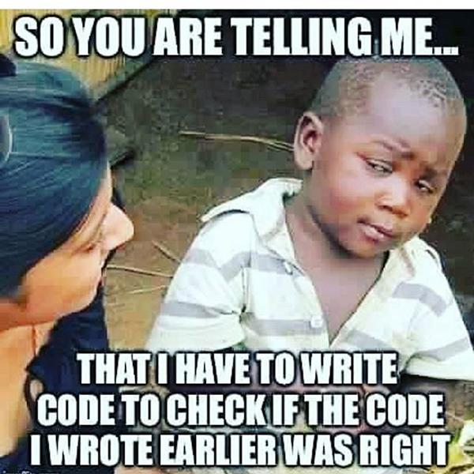
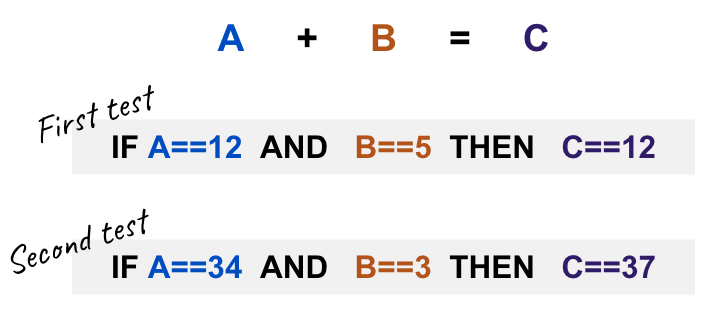

Humans make mistakes, all the time. As you progress in your development career you will be more in peace with that.

Senior developers understand that their code will have hundreds of bugs and they only way to overcome human nature is by coding code that tests their code.

~

There are several ways to test you applications, but unit tests are the most powerful tool a developer has to ensure high quality code.
 
## What is Unit Testing?

Unit testing is the process of dividing your code in small functions and testing each of those functions separatly. For example:

Asuming you are building a function that `sums` two numbers like this:

```js

function sum(number1, number2){
    // here goes the implementation fo your function
}
```

A great unit test for that funcion only cares that the input matches the expected output: If you pass `12` and `5` to the sum function, it should return `17`.

```
// this is an example syntax for that test in Javascript

let result = sum(12,5);
expect(result).toBe(17)
```

Note: Unit tests don't care about how the function being tested was build, they only care about the OUTPUT of the function with a give INPUT.




## Benefits of using Unit Testing:

+ **you can find and prevent bugs easily** If there is a problem in the future you'll be to identify the cause a lot faster than having to trough all the code. Also your end-user will be very happy not have a buggy product.

+ **Unit Testing saves time....and money** When writing Uni tests you may identify many possible bugs and fix them right away, instead of fixing them in different stages of the product.

+ **Your code is more reliable and reusable** When your code is divided in units or components where each one has their reponsability or function, your code becomes more reliable and it gives you more confidence. 
Since you have already tested you can reuse it: is clean and effcient and you can migrate your and tests to a new project.

+ Good Unit tests serves as **documentation and defines** what your code is suppose to do.

+ **Unit Testing improves teamwork**. Your will able to follow the logic behind your code and your team will be able coordinate their code accodingly. By reviewing each other's codes teamwork is more agile.

## Writing your first unit test with Jest

Jest is the most popular unit testing framework in javascript, used by the biggest companies in the world and it has plugins that integrate amazing with front-end frameworks like React, Vue, Angular, etc.

### Example Syntax

The following function returns `true` if the give input string is uppercase, otherwise it returns `false`:

```js
function isUpperCase(sentence){
     return (sentence == sentence.toUpperCase());
}
```

The code to test that function will look something like this:

```
test('The string HELLO should return true', () => {
     const result = isUpperCase('HELLO');
     expect(result).toBe(true);
})
```
Here we are testing the function for the input `HELLO`, But doing only one test will not be enough, you have to test all the possible scenarios.

## Testing for failure

It's better to find all the bugs now instead of later (in production), that's why you have to build your tests trying to **break you functions**.
Instead of testing the ideal scenario try thinking about weird possible inputs you can pass to you function.

## Planning your tests

The only way to make sure your `isUpperCase` function works is to try every possible input:

1. What happens if you pass a uppercase word?
2. What happens if you pass a lowercase word?
3. What happens if you pass a mixed (uppercase and lowercase) word?
4. What happens if you pass a number instead of string?
5. What happens if you pass a boolean instead of string?


```js
// First test possibility
test('The string HELLO should return true', () => {
     const result = isUpperCase('HELLO');
     expect(result).toBe(true);
})
// Second test possibility
test('Testing for Hello (mixed)', () => {
     const result = isUpperCase('Hello');
     expect(result).toBe(false);
})
// Third test possibility
test('Testing for hello (lower)', () => {
     const result = isUpperCase('Hello');
     expect(result).toBe(false);
})
// Forth test possibility
test('Boolean shoud return false', () => {
     const result = isUpperCase(true);
     expect(result).toBe(false);
})
// Fifth test possibility
test('Number shoud return false', () => {
     const result = isUpperCase(12341234);
     expect(result).toBe(false);
})
```
