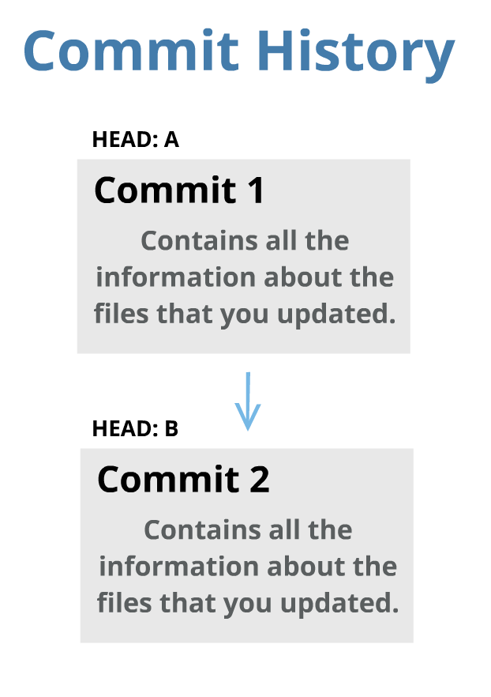
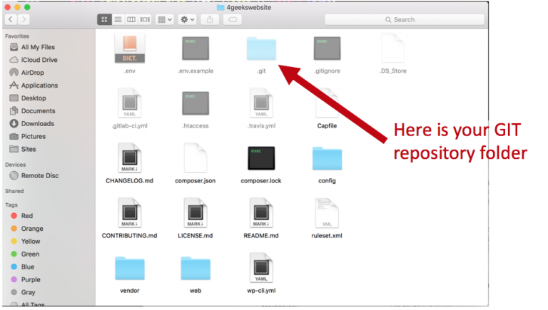
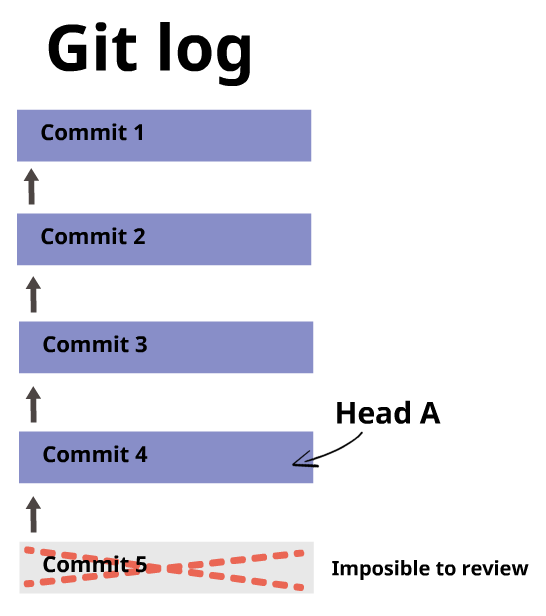
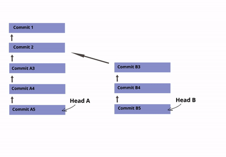
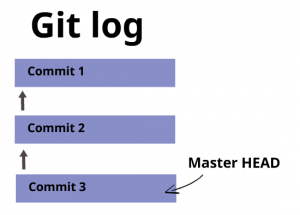
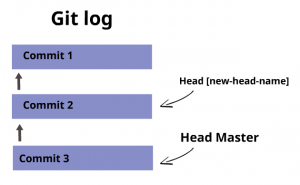
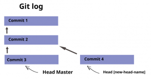
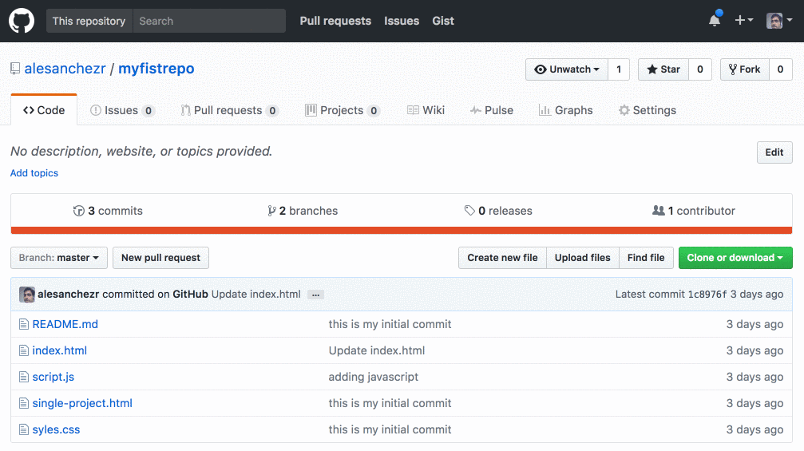

> :point_up: We have also prepared an interactive tutorial about GIT [click here to take it!](https://4geeksacademy.github.io/git-interactive-tutorial/)

> 📹 This is [an amazing video explaining git and github](https://www.youtube.com/watch?v=BCQHnlnPusY)

## GIT is a MUST!

GIT is a great technology, please take the time to learn it. DON’T procrastinate because you cannot avoid it. You will be using it every day, several times a day. So you’d better learn and be comfortable with it.

GIT is more than just a "set of commands" that you have to learn. Throughout the years, we have learned that the best way to teach GIT is by understanding the concepts and meaning of the technology first, rather than just giving you a list of commands to use.

## Why Bother to use GIT?

Being the only developer in a project is a [utopia](http://www.thefreedictionary.com/Utopic). Normally, you collaborate with other developers, and, without GIT, that becomes a big problem. That’s why we need a *repository* of information to centralize and manage changes. With a *repository* we are addressing the following:

+ If two developers work on **the same page (file)**, GIT will compare both versions and will *(try to)* merge them into a new one.
+ Downloading and integrating someone else’s code (or any code) into your project without much hassle and doing so automatically.
+ If both developers updated the exact same code, GIT will ask **the last** editing developer to solve any possible conflict.
+ The code is backed-up all the time with the latest version as the principal.
+ Each developer has their own version of the project locally for as long as they want.
+ Working with remote teams.

The purpose of GIT is to interact with the repository of a project (a set of files) as they change over time.

## Architecture of a Repository

A GIT **repository** comprises the following:

+ A set of **commit objects**.
+ A set of references to commit objects, called **heads**.

<p>
 
</p>

The GIT repository is stored in the same directory as the project itself in a -hidden- subdirectory called .git:

+ There is only one .git directory, located in the root directory of the project.
+ The repository is stored within the project.

<p>
 
 </p>

## Commit Objects

A **commit object** contains three things:

+ A set of **files**, reflecting the state of a project at a given point in time.
+ References to **parent commit objects.**
+ A **SHA1 name:** a 40-character string that uniquely identifies the commit object.  The name is composed of a hash of relevant aspects of the commit; this way, identical commits will always have the same name.


The parent commit objects are those commits that came first. Generally, a commit object will have one parent commit. One generally takes a project in a given state (commit), makes a few changes, and saves the new state (commit) of the project.

At the beginning, a project always has one commit object with no parents. This is the first commit that is made to the project repository.

## A Head Object is a List of Commits

The heads of the repository are like the "revision history of the project." A revision history is a list of commit objects that altogether contains all the changes that you and your other team members have made to the project files.

Every time you make a new commit, the head will move to that new commit. This way, you are able to have access to the entire project history of commits.

You can **move the head** if you want.  It does not necessarily have to always be the last commit, but you must remember that you can only review commits that came before the commit to which the head is pointing at. **Commits made after the commit to which the head is pointing at are not possible to be reviewed.**



## You can have Several Heads (Branches)

Heads mark the beginning of a revision history. In GIT, we call the "revision history" a "branch," and it is possible to have several revision histories.

By default, every repository has one branch called Master, with its corresponding HEAD that points to the last commit of that branch.

For example: Let’s say that you are starting to develop the "Login" feature/functionality of a website. You can create a new "branch" of the repository called "login" so that your commits are not part of the main revision history of the project. Once you are comfortable with your code, you can then *merge* your branch and delete your head. This will reset the main HEAD of the master branch to the last commit you made and add your new code to the main branch (master) of the repository.



> :point_up: **Note on Terminology:** The terms "branch" and "head" are nearly synonyms in GIT. Every branch is represented by one head, and every head represents one branch. Sometimes, "branch" will be used to refer to a head and the entire history of commits preceding that head, whereas "head" will be used to refer exclusively to a single commit object (the most recent commit in the branch).

 ## Starting a New Repo** `git init`

You can create a new repository whenever you want during the project, it does not have to be at the beginning! The only essential thing to do is that the project has no other repository that has already been created.

To create a repository, navigate in your command line to the root directory of the project and run the command `git init`. Remember that the directory does not need to be empty.

```bash
git init
```

This will create a .git directory in the \[project\] directory. Make sure that the folder was successfully created (you can run the command `ls -l` to read the directory content in the command line).

## Committing Changes into the Repository

After you have made some changes to the files of the project, you may want to save/submit those changes into the repository. This is called a "commit."

To create a commit, you will need to do two things:

+ **Tell GIT which files to include in the commit**, with `git add .` If a file has **not** changed since the previous commit (the "parent" commit), GIT will automatically include it in the commit you are about to perform. You will only need to ***explicitly*** add files that you have newly created or modified.  Note that it adds directories recursively, so `git add .` will add everything that has changed (the ` . ` signifies everything in the current folder).

+ **Call `git commit` to create the commit object.** The new commit object will have the current HEAD as its parent (after the commit is completed, HEAD will point to the new commit object).
  
Say you create three commits this way… your repository will look like this:



Other commands that are useful at this point:

+ `git log` shows a log of all commits starting from *HEAD* back to the initial commit. It can do more than that, of course.
+ `git status` shows which files have changed between the current project state and *HEAD*.  Files are put in one of three categories: (1) New files that haven’t been added (with git add), (2) Modified files that haven’t been added, and (3) Files that have been added.
+ `git diff` shows the difference between HEAD and the current project state.  With the --cached option, it compares added files against HEAD; otherwise, it compares files not yet added.*
+ `git mv` and `git rm` mark files to be moved (renamed) and removed, respectively, much like `git add`.

My personal workflow usually looks like this: I first do some programming, and, afterward, I end up updating some files, then I run the following commands:

```bash
git status //to see what files I changed.
git diff [file] //to see exactly what I modified.
git commit -a -m [message] //to commit.
```

## Referring to a Commit

Now that you’ve created commits, how do you refer to a specific commit? GIT provides many ways to do so. Here are a few:

+ By its SHA1 name (which you can get from `git log`).
+ By the first few characters of its SHA1 name.
+ By a head. For example, `HEAD` refers to the commit object referenced by *HEAD*. You can also use the name (such as master).
+ Relative to a commit. Putting a caret (^) after a commit name retrieves the parent of that commit. For example, *HEAD^* is the parent of the current head commit.

## Creating a Branch

To create a branch, let’s say your repository looks like this:


Let's jump back to commit (2) and start new work from there. You will first need to know how to reference the commit. You can use `git log` to get the SHA1 name of (2)

```bash
 git log
commit df73f34fac344778e1f5a836fb88a897e0b8d491
Author: Alejandro Sanchez <a@stcsolutions.com.ve>
Date: Wed Mar 8 13:18:37 2017 -0500
```

In my case, the hash SHA1 name of the branch was: df73f34fac344778e1f5a836fb88a897e0b8d491

Now, we can use the `git branch` command to start a new branch from that particular commit on:

```bash
git branch [new-head-name] df73f34fac344778e1f5a836fb88a897e0b8d491
```

This command will create a new head with the given name, and point that head at the requested commit object. If the commit object is left out, it will point to *HEAD*.

Now our commit tree looks like this:



## Switching Between Branches

In order to start working on that new branch, you need to set the current head to the head we just created. This is done with git checkout:

```bash
git checkout [head-name]
```

This command does the following:

+ Points *HEAD* to the commit object specified by *\[head-name\]*.
+ Rewrites all the files in the directory to match the files stored in the new *HEAD* commit.
  
> :point_up: **Important note:** If there are any uncommitted changes when you run git checkout, GIT will behave very strangely. The strangeness is predictable and sometimes useful, but it is best to avoid it. All you need to do, of course, is commit all the new changes before checking out the new head.

After checking out the *\[new-head\]* head, you will fix the headers. Now you can add and commit the changes as above. The resulting repository looks like this:



## Merging 

After you have finished implementing a new feature in a branch, you will want to bring that new feature into the main branch, so that everyone can use it. You can do so with the `git merge` or `git pull` command.

The syntax for the command is as follows:

```bash
git merge [head]
git pull . [head]
```

These commands perform the following operations. Let the current head be called *current*, and the head to be merged called *merge*:

+ Identify the common ancestor of *current* and *merge*. Call it *ancestor-commit*.
+ Deal with the easy cases. If the *ancestor-commit* equals merge, then do nothing. If *ancestor-commit* equals current, then do a **fast forward merge.**
+ Otherwise, determine the changes between the *ancestor-commit* and *merge*.
+ Attempt to merge those changes into the files in *current*.
+ If there were no conflicts, create a new commit with two parents: *current* and *merge.*  Set current (and *HEAD*) to point to this new commit, and update the working files for the project accordingly.
+ If there was a conflict, insert appropriate conflict markers and inform the user. No commit is created.

> :point_up: GIT can get very confused if there are uncommitted changes in the files when you ask it to perform a merge. So, make sure to commit whatever changes you have made so far before you merge.

## Resolving Conflicts

A conflict arises if the commit to be merged into has a change in one specific place, and the current commit has a change in the exact same specific place. GIT has no way of telling which change should take precedence.

To resolve the conflict, edit the files to fix the conflicting changes. Then run `git add` to add the resolved files. Next, run `git commit` to commit the repaired merge. GIT remembers that you were in the middle of a merge, so it sets the parents of the commit correctly.

## GIT Collaboration

GIT can function without needing to connect to an external server because all the git files are located inside the .git folder.

However, this means that, in order to manipulate the repository, you need to also have access to the working files. This means that two GIT developers cannot, by default, share a repository.

To share work among developers, GIT uses a **distributed model** of version control. **It assumes no central repository**. It is possible, of course, to use one repository as the "central" one, but it is important to understand the distributed model first.

## Distributed Version Control

Say you and your friend want to work on the same project. Your friend has already done some work on it. There are three tasks you need to perform to figure out how to do so:

1. Get a copy of your friend’s up-to-date repository (git clone).
2. Get the changes your friend makes into your own repository (git pull).
3. Let your friend know about changes you made (git push).

## Remote Specification

GIT provides a number of transport protocols for sharing repository information, such as SSH and HTTP. We will be using only HTTP, because SSH is more advanced and requires extra setup.

To start working in collaboration with remote projects, we will need to know the remote URL of the project. When using HTTP, the remote will look like this:

```bash
https://github.com/<github-username>/repository-name.git
``` 

### Github.com

For example, when using a repository from github.com, you can find the remote on the repository home page:



## Adding a Remote

If you are working on a local repository, and you want to connect it to a remote repository, you can add a remote.  First, look for the remote URL in the remote repository.

Once you know the remote URL, you can add it to your project.  

You have to pick an alias for the remote – we normally use `origin`, but it is just an arbitrary word, and you can use anything. 

:warning:
In our boilerplates, you will already have an origin set-up from the boilerplate's repository. In those cases you should not remove the original origin, but would need to use another term (e.g. `new` or `new-origin`, etc.) to add your new remote. 

Add the remote by executing the following command:

```bash
git remote add origin [the-remote-url]
//to make sure the remote has been properly set we can get the url value
git remote get-url origin
```

## Pushing (uploading) to the Remote

Let's say you have a branch in your local repository called "new-branch." That branch can be uploaded by doing the following:

```bash
git push origin [new-branch]
```

If someone else has ALSO pushed some changes to that branch, GIT will reject the push and will tell you to first download those changes to your local repository before continuing.

You will have to (1) download the files, (2) merge them into your code, and (3) resolve any conflicts that may have appeared.

After you solve any and all conflicts, you can go ahead and try to *git push* again.

## Pulling (downloading) from the Remote

Let’s say that there is a branch in the remote repository called "development." You can download this branch into your own repository by performing the following command:

```bash
git pull origin development
```

The `git pull` command will try to merge all the incoming files into your local branch. If it finds any conflicting code, it will give you an error and ask you to resolve those conflicts.

After you fix the conflicts, you can `git add` the files and `git commit` everything to keep a clean, error-free copy of your code in the repository.

## Cloning the Repository (git clone)

To make a copy of a remote repository for your own use, run git clone [remote-specification].

For example, if the remote repository is located in `git@github.com:alesanchezr/myfirstrepo.git`, you would run:

```bash
git clone git@github.com:alesanchezr/myfirstrepo.git
```

This would do the following:

+ Create a directory `myfirstrepo` and initialize a repository in it.
+ Copy all the commit objects from the project into the new repository.
+ **Add a remote repository** reference named `origin` to the new repository, and associate *origin* with `git@github.com:alesanchezr/myfirstrepo.git` as described below. (Like *master*, *origin* is a default name used by Git).
+ **Add remote heads** named `origin/\[head-name\]` that correspond to the heads in the remote repository.
+ Set up one head in the repository to **track** the corresponding `origin/\[current-head-name\]` head, namely the one that was currently active in the repository being cloned.
  
A **remote repository reference** is an alias GIT uses to refer to the remote repository.  Generally it will be *origin*. Among other things, GIT internally associates the *remote-specification* with the remote repository reference, so you will never need to refer to the original repository again. 

From now on, you will be able to say `origin` instead of `git@github.com:alesanchezr/myfirstrepo.git`.

A branch that **tracks** a remote branch retains an internal reference to the remote branch. This is a convenience that allows you to avoid typing the name of the remote branch in many situations, as will be described below.

The important thing to note is that you now have a complete copy of your friend’s entire repository. When you branch, commit, merge, or otherwise operate on the repository, you operate only on your own repository. GIT only interacts with your friend’s repository when you specifically ask it to do so.

> :link: Say your friend’s repository looks like this:<br>Here is a list of other great resources to learn GIT: http://sixrevisions.com/resources/git-tutorials-beginners/<br> You should especially try these two:<br>• https://try.github.io<br>• http://learngitbranching.js.org/ .
