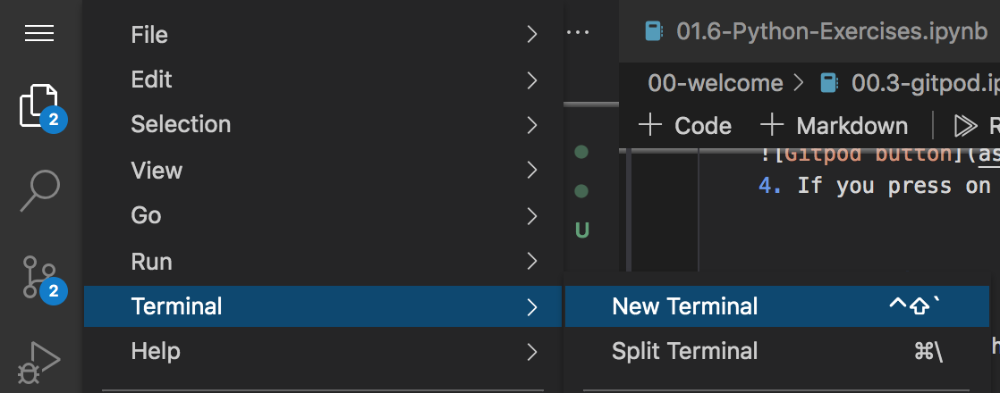
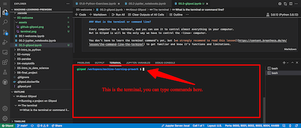

## ¿Qué es Gitpod?

Gitpod es un servicio que proporciona computadoras virtuales en línea para la codificación.

Lo utilizamos para proveer computadoras similares a todos nuestros estudiantes; estas computadoras vienen pre-instaladas con herramientas necesarias para empezar a aprender, practicar y trabajar en proyectos.

Piensa en Gitpod como una **maquina virtual** que circula en la internet; cuando creas un archivo en Gitpod, no se guarda localmente en tu computadora; quedará guardado en línea, y vas a necesitar de internet para recuperarlo de nuevo al día siguiente.

__Computadoras bajo demanda, con VSCode ya instalado__

## ¿Por qué Gitpod?

No necesitas instalar nada: el obstáculo mas frecuente para aprender a codificar es la configuración: para completar este curso, deberás instalar: Git, node, nvm, python, MySQL, Postgress, c++, VSCode, Learnpack, Vercel, Heroku, etc.

No mas problemas de compatibilidad: ¿Has intentado instalar Python en tu computadora? Hay 100 maneras de hacerlo. Dependiendo de tu sistema operativo y otros factores, vas a encontrar problemas durante su instalación, porque vas a seguir un procedimiento escrito por alguien con una computadora diferente.

Aprendizaje mejorado: En 4Geeks tenemos una profunda integración con Gitpod; nos ayuda a medir la actividad y progreso del estudiante, hacer nuestros cursos interactivos, con calificación automática y muchas otras características que no seríamos capaces de ejecutar localmente en tu computadora.

Integración de Github: Es esencial aprender como utilizar Github hoy en día; los desarrolladores lo utilizan diariamente y sus empleadores esperan que ellos sean fluidos en Git y Github. Gitpod está creado en torno a Github, forzándote a aprenderlo y empezar a usarlo inmediatamente. Ayudándote a convertirte bueno en ello.

## ¿ Cuáles son las desventajas de Gitpod?

Es mas lento que local: Codificar localmente es más rápido porque no vas a tener que esperar un par de minutos para que la computadora virtual sea creada.

Necesitas tener un internet confiable: Caso contrario, te puedes desconectar mientras estés codificando (y tendrás que esperar hasta que vuelvas a estar en línea).

Reconocemos las trabas, pero nuestros estudiantes y la academia adquiere tanto valor de Gitpod, que estamos contentos de lidiar con las desventajas.

## ¿Cómo funciona Gitpod?

+ Luego de registrarte en Gitpod, vas a encontar tus [your workspaces](https://gitpod.io/workspaces) (espacios de trabajo) vacíos.  
+ Cada espacio de trabajo es una computadora -virtual-.
+ La única manera de crear un nuevo espacio de trabajo es especificar una carpeta de un repositorio de Github. (Si no sabes que es Github, piensa en ello como un disco duro en línea de código, donde cada carpeta es un proyecto que estás codificando).
+ Una vez que se abra el espacio de trabajo, creará una computadora vacía para ti, pero también va a descargar a esta nueva computadora los archivos de la carpeta del repositorio de Github que especificaste (tu código).
+ Finalmente, se abrirá un editor de código (probablemente VSCode, el IDE de codificación mas utilizado en el mundo) y un terminal para empezar a codificar como si en principio, tu espacio de trabajo estuviese en tu computador local.
+ Si vuelves a [your workspaces](https://gitpod.io/workspaces), vas a encontar todas las computadoras que has creado y podrás `re-abrirlas`. Los cambios que hiciste a los archivos perduraran por siempre, no vas a perder ninguna data mientras que hayas re-abierto, en principio, el mismo espacio de trabajo donde estabas trabajando. 
  

#### ¿Qué es un espacio de trabajo?

Es una computadora; todas las actualizaciones que le hagas a tu código permanecerán en ese mismo espacio de trabajo por siempre. Puedes volver a tu lista de espacios de trabajo en cualquier momento y eliminar, renombrar o fijar cada uno de ellos.

> Cuando abres un repositorio de Github en Gitpod, vas a estar "rentando" una computadora con acceso a uno de los editores de código mas populares en el mundo: VSCode.

### Corriendo un proyecto en Gitpod

Nosotros altamente recomendamos bajar la [extensión de Gitpod en Chrome](https://www.gitpod.io/docs/browser-extension/). Hará que tu flujo de trabajo sea más fácil y rápido.

Una vez que bajes e instales la extensión, vas a encontar un botón verde llamado "Gitpod" en todos los repositorios de Github.

Presionando en este botón se abrirán los archivos del repositorio en un nuevo espacio de trabajo y vas a poder comenzar a codificar en VSCode.

Una vez que finalices por el día, puedes abandonar tu computadora. Sin embargo, si quieres seguir trabajando en el mismo código al día siguiente, deberás encontrar ese espacio de trabajo dentro de tus ["Workspaces"](https://gitpod.io/workspaces) y abrirlo de nuevo desde allí.

## El terminal

Como programador, necesitarás usar el terminal de la computadora algunas veces; siempre puedes encontrar o abrir el terminal, dándole clic al menú tipo hamburguesa en la parte superior izquierda y seleccionando la opción "terminal" => "new terminal" 

### ¿Qué es un terminal o línea de comando? 

Cada computadora tiene un terminal, y lo utilizas para hacer prácticamente todo lo que quieras: abrir una aplicación, crear un archivo, carpeta, etc. Sin embargo, en Gitpod, el terminal solo controlará la computadora virtual. 

Aún no requieres aprender los comandos del terminal, pero [te recomendamos leer esta lección](https://content.breatheco.de/en/lesson/the-command-line-the-terminal), para que te familiarices y conozcas sus funciones y limitantes.

¡Eso es todo! ¡Es hora de que comiences a usar Gitpod!

