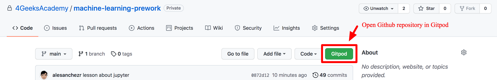

# About Gitpod

__Computers on demand, with VSCode already installed__

Gitpod is a service that provides the same computer to all of our students, avoiding installation and compatibility problems that normally happen when every student has a differet computers.

When you open a Github repository using Gitpod, you will be "renting" a computer with access to the most popular coding editor in the world: VSCode.

## Running a project on Gitpod

1. Github does not work on its own, it needs to start from a coding repository.
2. We strongly recomend you download the [Gitpod Chrome Extension](https://www.gitpod.io/docs/browser-extension/) it will make your workflow easier and faster.
3. Once you download and install the extension, you will find a green button called "Gitpod" on every github repository.

4. If you press on this button, it will open the repository files on Gitpod's VSCode coding editor.

## The terminal

We will be using the terminal sometimes, you can always find or open the terminal by clicking on the hamburger menu on the top left, and looking to the "terminal" => "new terminal" option.

### What is the terminal or command line?

Every computer has a terminal, and you can use it to control almost everything in your computer.
But in Gitpod is will be the only way we have to control the -linux- computer.

You don't have to learn the terminal command's yet, but [we strongly recomend to read this lesson](https://content.breatheco.de/en/lesson/the-command-line-the-terminal) to get familiar and know it's functions and limitations.

