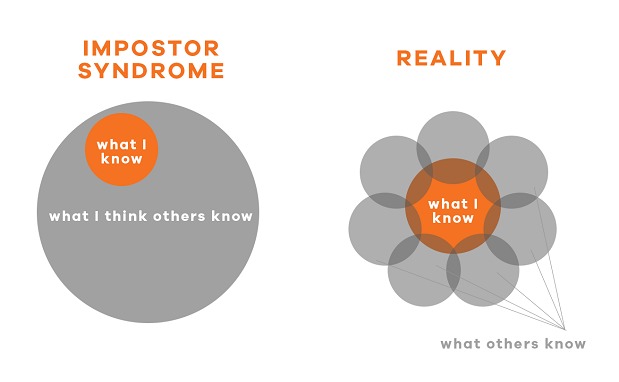
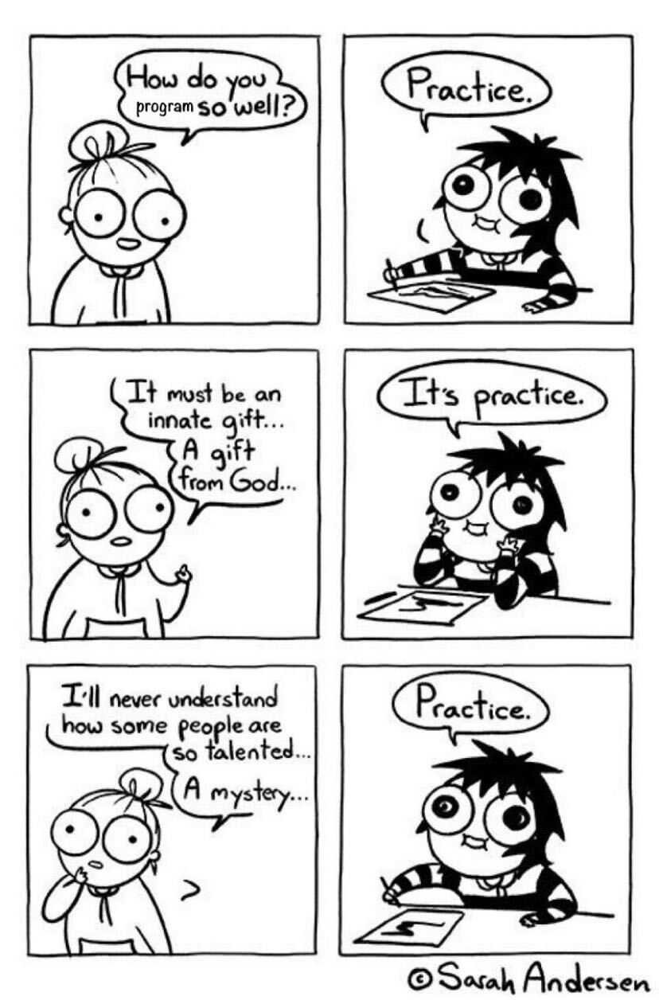
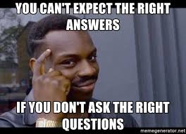

Welcome!! 🤩👏 My name is Alejandro and I'm writing these words after years of teaching code and changing lives. Please I beg you to read until the end, I will try my best not to bore you!

## What you already know?

You are here to develop your coding skills to a point were you can be useful to society in order to: 1️⃣ Get a job, 2️⃣ Create your own company or/and 3️⃣ Adapt better to the now world.

## What you did not know?

You are also here because you need help, not only technical help but also spiritual help, and I say this in the most pragmatic way possible.

> The biggest wall to become a developer is not in the syllabus or content but in your mind.

We are about to change the way you learn, the way you approach life, the way you sell yourself (therefore see yourself), we are tearing down old misconceptions about yourself, others and your professional life.

### We are here to tear down the 💻 3 Walls Towards Code 

During the past years we have identified specific reasons that cause students to stop trying to be a developer or fail to complete the course or get a job. 

#### Wall #1: Confidence ❓ (Impostor syndrome)

At some point in our lives (some more than others) we all have thought we are the most stupid person in a room, if we keep thinking that for a long time and we don't get comfortable on any discipline we may even think that we are not that smart. BULLSHIT! You are a part of this school, we do not accept people that we don't think are smart enough to make a living as a developer, and you need to believe that, especially on tough times!

> If a particular exercise or project is hard, instead of thinking you are not good at this, look for new ways of absorbing the content. Talk to a mentor and we'll give you exactly what you need.

Every average person can learn to code to a point of being useful, coding gets more complicated when you specialize further in your career (Like A.I., Robotics, etc.), but you can make good money without having to study Math, without being good at numbers or without learning as fast as others (we may be able to fix that, by the way).

##### 📝 Recipe to avoid losing confidence

1. **Avoid being stuck too long:** Coding is tricky because you may be very close to solving a problem but you are stuck and you don't realize it. Or maybe you don't know how to start a problem but a quick 5 min talk with a mentor will clear the way. You need to ask for help no longer than 15 minutes after trying on your own.

2. **Talk to other students:** You may think you are the only one that does not understand, but if you talk to a couple of class-mates you'll see they are just like you, it will give you the confidence to ask questions.

3. **Talk to the mentors:** A voice of experience is always effective, you have alumni and teachers that struggled before and are also struggling right now! They can help you during dark times, we are not only talking about giving you coding solutions, but giving you strategies to succeed in your (coding?) life.

#### Wall #2: Trust ✝

During all your life you've learned the same way, the educational system has put you in a box and trained you to learn slowly, limiting you ability to adapt to the new world of skilled fast-learning and self-learning professionals.

We know how to train you: we have done it over and over again, but we'll train in such a different way that you may not like it at first, it's only normal that your mind will want to go back to learning "slow but safe", without having to be uncomfortable or constantly challenged by our system.

##### 📝 Recipe to avoid loosing trust in our methods

1. **Follow the method!** How can you know if it works if you don't try it properly? Do the homework BEFORE coming to class (flipped classroom), follow the syllabus in the recommended order, do the small exercises before jumping to the projects, come to every class, don't read books that will slow you down, etc.

2. **Ask Why?** There is only so much we can say, we need you raise your concerns in a private way immediately the moment you start double guessing our methods, we do everything for a reason and I'm confident that we are going to be able to explain "the why".

3. **Humble yourself:** There are lots of smart students that have successfully completed the course following the method, some of them work at Google, Amazon and other big all around the world companies. Please be humble enough to try and follow the course as it is. And discuss any ways of improvement with us, we are also humble enough to be open to try things that may work.

#### Wall #3: Inactivity 😴 

This is a boot-camp, it does not matter if you do it on a full-time or part-time way, you need to set the boot-camp mindset and work every day like it's the last. The Human brain absorbs 80% more we it feels challenged and scared, if you idle for a day the brain relaxes and [it's proven](https://www.youtube.com/watch?v=h5PLO4XAXhs) that you usually forget 60% of recently acquired information in just 1 day unless you use it again and again for a sequence of 7 days (at least).  

These are not small numbers, 60% in a day and 90% if you don't practice for a week. You are waisting your time and money if you don't take the course serious! 

##### 📝 Recipe to avoid inactivity

1. **Talk to your spouse, partner and family:** You need a break from almost everything, we know life it's challenging enough already to be adding more responsibilities, but this is only for a short period of your time. Rewards are endless. Everyone needs to fall inline! Try opening up the most time you can, having a private desk to work without distraction, etc. Your home has to be in sync with this moment of your life.

2. **Talk to your boss:** You may need a few extra hours, weekend time, etc. Be smart about it or he/she could sabotage it because he is afraid of loosing you.

3. **Don't miss class:** Missing classes is our biggest concern, we are very concerned about attendancy because it has show that is the #1 deterrent to your motivation, missing two classes in a row is the perfect storm. You will need to have 1-on-1 mentoring and double the hours thru that week to avoid staying behind.

4. **Get involved:** Just coming to class will not be enough, humans are beautiful emotional creatures, information attaches better to your brain when you are engaged, emotional, coming to events and study groups, publicly speaking about it, etc. 

## What next?

Please make sure you understand how the academy works:

1. **Platform:** BreatheCode, The Syllabus (learn how to follow it), GeekPal, GeekForce, the lessons, exercises, projects and assets.
2. **The people:** We are more than one thousand people now! Leaders, Mentors, the [Alumni and Students](http://sep.4geeksacademy.com/), we are here to help and we are here to stay. Network, make friends, take advantage!
3. **The community:** Communities are not one way, they just don't work like that to the events, support other students, give first and you will receive later. Slack, GeekTalks, Workshops, Group Studies.

## Best Practices while starting to learn code

| **Don't read (much):** Coding is like sport, the best what to get better is thru practice. Learn by doing |     |
| ---   | ----      |
| **Sleep:** Having a good sleep is as important as coming to class, coding is 100% intellectual, having a sharp mind is everything. |  |
| **Learn how to ask:** The biggest challenge you have to address at first is learning [how to ask a question](https://content.breatheco.de/how-to/ask), picking the right works, know exactly want you want to know is the best skill for any developer. |  |
| **Ask questions:** Its a win-win, preparing the question will teach you, we get feedback from your understanding, it the biggest boost for your learning process. It's what you are paying for. |  |
