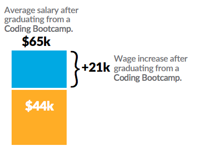
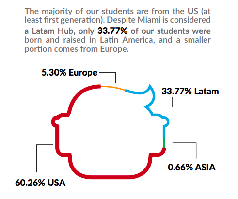
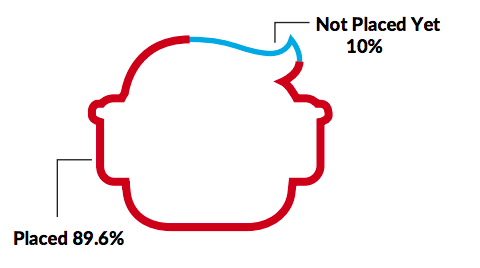

## About Coding 

We all know the importance, growth and impact of the tech industry nowadays. More and more developers are needed everywhere. Just in the US, the Bureau of Labor Statistics projects to have more than a million open jobs by 2024, for software developers. 

A web developer makes around $65k per year in the US. In Florida, numbers are a little bit lower since the cost of living and payroll standards. In 2020 a web developer makes around $56k, and a junior one is around $50k per year in Florida. According to recent reports, a Bootcamp graduate make $20k more than before joining the coding Bootcamp: 

    

## About 4Geeks Academy

4Geeks Academy is a Miami based Coding School. We started in 2015 and now we have more than 650 graduates, 6 open campuses across USA, Latinamerica and now Europe. We are Licensed by the Floruda Department of Education and we were named as one of the best 10 coding Schools in the US by Newsweek. 

    

Around 90% of our students find a job after graduation. It normally takes 100 days to land your first job, and we will not rest until we make that happen. 

    

4Geeks stands out because of several reasons: 1. Our memberships: GeekPAL (You always have a Mentor available to support your learning process 24/7 and customized), and GeekFORCE (we will make sure that you land a job, that you have a strong profile and that you make a career out of the Bootcamp); 2. Our passion for teaching Coding. 3. Our outcomes: here is a report (from  April 2019) to check it out: https://www.4geeksacademy.co/wp-content/uploads/2020/03/4Geeks-Outcomes-Report-.pdf. 

If you want to know more, get in contact with us or apply, please send us an email at: Info@4geeksacademy.com

## Flipped Around

There are a lot coding courses out there... some are even free. If you joined 4Geeks Academy, it’s because you are just like us. You truly believe that hard-to-learn skills like coding require much more than just online articles/videos or tutorials that make coding look extremely easy.

Coding is hard because it can only be learned by large amounts of practice, face-to-face mentoring, and real life challenges.

So, we here at 4Geeks came up with this online platform.  This content we have designed for you will guide you throughout our program.  There will be many, many exercises and projects yet this class will focus on enabling you to become a better coder.  

We will present you with one challenge after another, but a trusty senior developer will always be looking at your process to assist you and help you out.  BreatheCode is the place to read, learn and practice code until you permanently affix everything into to your brain.

## But you don't want to read everything right!?!?

You basically want to learn everything about the beautiful art of coding, but you don’t want to read that much... Yeah, we get it. As a result, we have made a huge effort in summing our lessons up. Everything you’ll find here will be the basis of your skills.  There is nothing to "skip over."

Your journey has already begun and you should know that we are following every step of your learning. The Pre-Work is probably the most important phase to becoming a web developer as it serves as a root to all of your skills in the future.  Here you will understand the foundation of your skills and you will learn to love coding like we do!

## But what if you already know? 

There are some of you who already have some coding experience (mostly with HTML and CSS), and some of you with no experience at all.  That’s the main reason why this stage of the program is known as the **Pre-Work**.  We need to assess the level of experience of each member of the program.  The Pre-Work also enables us to to get to know you, your learning process, and your learning curve better, allowing us to help guide you towards achieving the best possible results.

And this is all because we need to be sure that you have what it takes to complete the program.  It’s going to be intense, and you will feel exhausted, but don’t fret on it.  We have been doing this for a while and we feel you!

    

## This course works, but you have to trust us

The human brain requires a lot of energy to make any decision, especially when lots of variables are taking part in the equation.  This course will be hard because we are re-designing the way you make these decisions. You will have to think similar to the way computers think. Do not worry though, a time will come when everything you do will become an acquired behavior.

If you feel overwhelmed and confused, **ask for help!!** And, **keep up the hard work –** you will make it!  All the lessons are cumulative – meaning every exercise will require you to use all your skills you have learned in the past.

### Please Ask for Help!!

Have you heard of Einstein?  Really smart people are always the ones who ask more questions. They are not afraid of not knowing or making mistakes. The only way we can really help you is if you accept our mentorship by asking for help. To be able to do this, when you are stuck and have tried to solve on your own for a few minutes, ask on our Slack channel [#Public_Support] (https://4geeksacademy.slack.com/archives/CAZ9W99U4), but first read these tips about [ How to ask programming questions?] (Https://content.breatheco.de/en/how-to/ask).

    

## Coding Tools

When we started the academy, each student had the freedom to install their own set of coding tools and programs. However, we soon discovered that students waste too much time installing and setting up each program.  They invested more time doing that than actually learning to program.

So instead of that approach, we have made a list of what programs you need. Some of them are mandatory to use/download during the program, while others are just optional.  Don’t worry, you’ll be happy with us!!

Yeah, yeah, we know some of you already have your own tools, but let’s keep that conversation for another time. For now, closely follow our suggestions and give us the opportunity to tell you how to go about it all. 

    

    Shuhari is a Japanese martial art concept, and describes the stages of learning to mastery, [click here to read more](https://google.co.ve)

| MANDATORY TOOLS                                           | OTHER LEARNING RESOURCES  |
| --------------------------------------------------------  | ------------------------  |
| [Your Email (desktop/mobile)](#)                          | [StackOverflow](https://stackoverflow.com) |
| [Breatheco.de](https://breatheco.de/en/my-courses/)       | [w3Schools.com](https://w3schools.com) |
| [Github.com](https://github.com)                          | [Net Ninja JS Tutorial](https://www.youtube.com/watch?v=qoSksQ4s_hg) |
| [Slack.com (desktop & mobile)](4geeksacademy.slack.com)   |   |
| [Gitpod](https://gitpod.io/)           |  |

