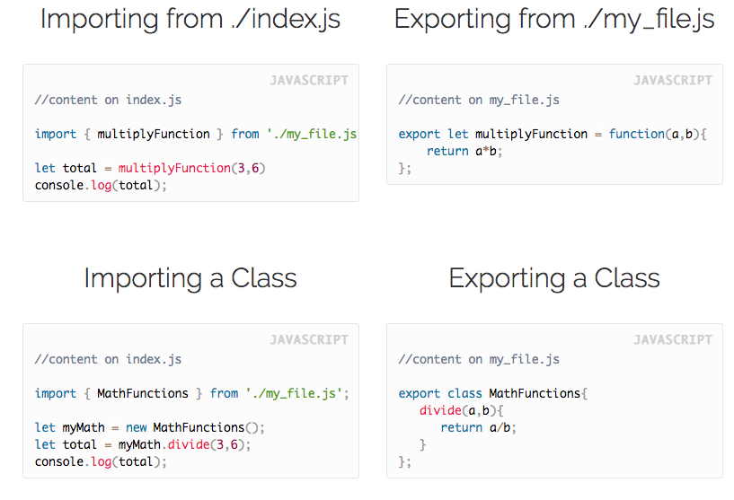
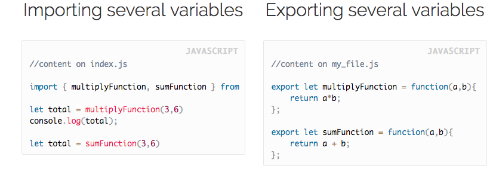

[[info]]
| :point_up: This lesson is for users of WebPack and [ECMAScript Modules (ESM) syntax;](https://nodejs.org/api/esm.html). There is another way to work with modules using the [CommonJS syntax] (https://requirejs.org/docs/commonjs.html) that we will not cover.

All of our JS code cannot be on the same file; that will make it hard to read and almost impossible to maintain.

Thanks to Webpack, we can split our code in small files however we want and then we are able to reference other files from our current one.

We have actually been doing that already when we import our styles, bootstrap or jQuery from the index.js.

## This is how "import" and "export" works:
***

+ You use the word **import** to bring variables, classes or functions from other files.
+ You use the word **export** to expose variables, classes or functions to be used by other files.

For example, here we are importing a function from another file:







## Exporting by default
***

There is one small variation that you can find over the internet that is called **"export default"** – this is just a way of exporting one thing by default onto your file.

You can only export **ONE** variable by default, and you don’t have to use the curly brackets while importing.

### Importing the default

```javascript
//content on index.js 

import multiplyFunction from './my_file.js';

let total = multiplyFunction(3,6)
console.log(total);
```

### Exporting by default

```javascript
//content on my_file.js 

let multiplyFunction = function(a,b){
    return a*b;
};
export default multiplyFunction;
```


## Final Example:
***

Here is a small demonstration of all the import/export types working on the same project.

<iframe src="https://codesandbox.io/embed/218y1prppj?hidenavigation=1" style="width:100%; height:500px; border:0; border-radius: 4px; overflow:hidden;" sandbox="allow-modals allow-forms allow-popups allow-scripts allow-same-origin"></iframe>

<div align="right"><small><a href="https://codesandbox.io/embed/218y1prppj?hidenavigation=1">Click to open demo in a new window</a></small></div>


