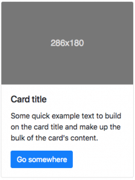
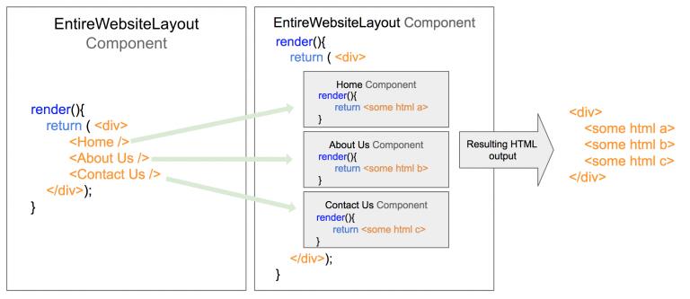

Think about it: what is the most annoying thing about working with Javascript?  All the programming languages have loops, conditionals, variables, and logical operations; some have events, but only Javascript has The DOM.  Yes, that is the most annoying part of coding for the web, it’s not only very slow in terms of performance, but also makes your code redundant, cumbersome, and huge.

Just look at this example of all the lines of code we need just to create a simple HTML element into our DOM:

```javascript
var divElem = document.getElementById("myFirstDiv"); //Select a parent element
var myNewHOne = document.createElement("H1"); //Create a new element in the DOM
var t = document.createTextNode("Hello World"); //Create the content of the new element
myNewHOne.appendChild(t);    //Add the text content to the new element
divElem.appendChild(myNewHOne); //Add the new element inside the parent element
```
We all can agree that this is A LOT, right!?

**React’s main goal is to fix that!**
<br>
<br>

## So.. what is React?


React JS defines itself as a front-end library for building interactive user interfaces (UIs). As such, it proposes a new way of building websites by redesigning the entire coding workflow as well as making websites faster.

#### No More DOM

From now on React JS will take care of the DOM; your job is to create your own `<Tags>` and define how they should display (render).

#### Everything is a component

You'll divide your app into small pieces of code (components) and all together they make up the website as a whole.

#### No more website refresh

All of your new `<Components>` are individual integral parts of your layout, but some are hidden at the beginning. You will have to show and hide them based on the user behavior.   

#### No more HTML string concatenation

Until now, we had to concatenate strings to create the HTML we wanted to place in the `innerHTML` of any DOM element, for example:
```js
document.querySelector('body').innerHTML = '<h1>'+person.name+'</h1>';
```

But React JS comes with `JSX`, a special "language" (a syntax extension to JS) that lets you write plain HTML within your React/Javascript code, without having to wrap it in quotes (making it a string). So that eliminates the need for annoying HTML string concatenation. 

If you need to use regular JS code within your HTML blocks, you would simply have to wrap the former in curly braces like seen in the example below, similarly to using the construct `${dynamic_code}` that you have seen in our projects before.  


```jsx
return <h1 id="name"> {person.name} </h1>;
```
Something to remember is that in JSX/React, dynamic JS code within the HTML code (like above) has to always evaluate as an expression. For that reason we cannot use JS statements within the curly braces, like if-else statement for example. Instead, we need to use a ternary expression that achieves the same effect.  

```jsx
return <h1 id="name"> {if(person.name == "John") "John"; else "Tom" } </h1>; //does not work in JSX

return <h1 id="name"> {person.name == "John" ? "John" : "Tom" } </h1>; //works in JSX and will evaluate to <h1 id="name"> John </h1> or <h1 id="name"> Tom </h1> depending on the value of person.name 
```


> :point_up: Familiarize yourself with ternary conditional operations :link:[HERE](https://developer.mozilla.org/en-US/docs/Web/JavaScript/Reference/Operators/Conditional_Operator)

> :point_up: Review the differences between expressions and statements :link:[HERE](https://medium.com/launch-school/javascript-expressions-and-statements-4d32ac9c0e74)


## Everything Is Now a Component


Remember the Bootstap components?  

React takes that concept further by dividing and encapsulating your entire website into smaller components. These components can be based on using the familiar JS structures of `function` or `class`. 

Here is how we declare a React component as a function, which is what we will stick to during this course:


```jsx 
import React from 'react';

function MyComponent(){
    return (
        //Some html code should go here
    );
}

```

Now let's say that we want this component to return a **Bootstrap card:** every time we call it. 



Here is a how we do that in a React app.

```jsx 
import React from 'react';

//we renamed the component to MyCard 

function MyCard(){
    return (
        <div className="card" style={{width: "18rem"}}> //Notice some html attributes change their names or values in order to work in React
           //We should now take care to always close self-closing tags
          <div className="card-body">
            <h5 className="card-title">Card title</h5>
            <p className="card-text">Some quick example text to build on the card title and make up the bulk of the card's content.</p>
            <a href="#" className="btn btn-primary">Go somewhere</a>
          </div>
        </div>
    );
}

```

> :point_up: Each component in React needs to have a render method that returns a block of HTML code


Each component can be rendered by calling its `<tag>` which looks just like the HTML tags but always starting with a capital letter.  The difference is that now the name of the `<tag>` is the name of the React component (*e.g. <MyCard />*) that **you** have created, and using the tag gives you access to the look and behavior that you have programmed in your own component.  

The above component will now **render** (display on the page) a Bootstrap card anywhere where you call <MyCard /> like this:

```jsx 
    <MyCard />
```

Usually we call components within the return section of another component:

```jsx 
import React from 'react';

function MyComponent(){
    return (
        <MyCard />
    );
}

```

### React Components can be **Functions** or **Classes**

The most simple React component is just a function that returns some HTML.  You can also declare any React.Component as a class.  The new class that you declare **needs to have** a render method that specifies how the component should display.

Here is an example of the same `<MyCard />` component, but now declared as a class:


```jsx 
import React from 'react';

//here we created the component MyCard as a class 
export class MyCard extends React.Component{
    
    render(){
        return (
        <div class="card" style="width: 18rem;">
          
          <div class="card-body">
            <h5 class="card-title">Card title</h5>
            <p class="card-text">Some quick example text to build on the card title and make up the bulk of the card's content.</p>
            <a href="#" class="btn btn-primary">Go somewhere</a>
          </div>
        </div>
        );
    }
}
```
> :point_up:  This is a class component. We strongly recommend you to use functional components and hooks instead because class components are legacy.


## The MAIN Component


With React the entire application is considered one component.

The first thing you will do when building big React applications is to define one big component, which we call **primary** or **main**. It will hold your entire application.

Then, you need to inject this main component into the website DOM with the method ReactDOM.render(), like so:

```jsx 
import React from 'react'; //mandatory import of the react package
import ReactDOM from 'react-dom'; //mandatory import of the react-dom package

//creating our React component
function MyMainComponent (){ 
    return <div>Hello World<div>;
}

  
ReactDOM.render(<MyMainComponent />, document.querySelector('#app'));
// Implied is that there is a container div with the id 'app' in your original website's HTML body
// Through <MyMainComponent /> your entire react application will be inserted into that location of the DOM
```

Because `<MyMainComponent />` in this example is the main component, all other components of your application will need to be called inside this main component or in its descendants (children, grandchildren, etc). Any components not being called in the main component or in its descendants will never appear in the DOM and consequently - not shown on your webpage.


```jsx 
function GrandchildComponent (){ 
    return " Hello, I'm the Grandchild ";
}

function ChildComponent (){ 
    return (
        <p>
            <h3>Hello I'm the Child, and below is the Grandchild</h3>
            <GrandchildComponent />
        </p>
    );
}

function RandomComponent (){ 
    return " Hello, I'm just a random component that will not be rendered =( ";
}

function MyMainComponent (){ 
    return <ChildComponent />;
}

  
ReactDOM.render(<MyMainComponent />, document.querySelector('#app'));

```

In this example, `<ChildComponent />` and `<GrandchildComponent />` will end up in the DOM and will render because they are called within the main component or a descendant. `<RandomComponent />` on the other hand, will never be shown on the page because it is not being called in that way. 
 


## Doing Website Layouts with React

A "Layout" in React is basically the combination of two or more components (referred to as **components** proper) into a parent component (referred to as a **view**).  

**For example:**  

Let's say you have a [one page website](https://onepagelove.com/what-is-a-one-page-website) with three sections: `Home`, `About Us` and `Contact Us`.  The "React" way of doing that will be by creating a bigger **view** component that contains each component (section), like this:

```jsx 

export function EntireWebsiteLayout (){
    
    render(){
        return (
            <div>
                <Home />
                <AboutUs />
                <ContactUs />
            </div>
        );
    }
}
//It is implied that the Home, AboutUs and ContactUs components have already been defined.
```

> :point_up:  This is a class component. We strongly recommend you to use functional components and hooks instead because class components are legacy.

Those components which serve to hold the layout of each of your web pages, and are not re-used for anything else is what we will call "Views", and the typical components that we can re-use multiple times with different input (like a card or a button component) we will call "Components" in the organization of our application's folders.

**This is how React will render your layout:**

Each component will have render method.  The final resulting HTML document will be comprised with the merge of all the outputs that all the components have on their render methods.  Checkout the following illustration to get an idea.



## The YouTube.com Example


On your application wireframe, you can grab a highlighter and start marking all the components your application is going to have.  The easy ones are the typical Bootstrap components: Navbar, Card, etc.  You should also define your own components.

In this case, we have decided to create the following components based on the YouTube website:

+ `<VideoPlayer />`: Will render the entire video player with all the `<VideoControls />` inside.
+ `<Description />`: Will render the video description.
+ `<Comments />`: Will display all the comments and it will have a bunch of <CommentCard /> components inside.
+ `<VideoCard />`: Will display a video thumbnail on the left with the small description on the right and will take people to that video page when clicked.
+ `<VideoTitle />`: Will render the video title.
+ etc.
After you finish identifying your components, it is time to start coding.  Create a new Javascript class in a separate file for each of those components.

Each class needs to have a function called **render.**  This will return the HTML code that the component will output into the website document.

<before-after width="400px"
    before="../../assets/images/e590a615-2c9d-4671-8483-99dbdd90cd41.png" after="../../assets/images/78aedd23-b5dd-4d1e-b693-b3268f4734fa.png" />

## Essential aspects of a React component

#### The Component Props

Any component can have properties (props), just like in HTML.  For example, in HTML we could define the src property of an image like this:

```html

```

In React, we can set properties the same way and our components will be able to read them and display different output based on the props that are being passed to them.

```jsx
// here we can invent a new 'textColor' property, but we will have to make sure to code its behavior 
<ClockComponent textColor="red" />
```

In the code above, we have invented a new property to the ClockComponent example.  We will now have to determine and code how that new property will work inside our component.  In this particular case, we would have to assign a red color style to the text output of the clock, like this:

<iframe width="100%" height="300" src="//jsfiddle.net/BreatheCode/r80q431L/8/embedded/js,html,result/" allowfullscreen="allowfullscreen" allowpaymentrequest frameborder="0"></iframe>

<p align="right"><small><a href="//jsfiddle.net/BreatheCode/r80q431L/8/embedded/js,html,result/">Click to open demo in a new window</a></small></p>

A real high quality component must communicate with other components only throughout its properties.  This way we will be able to re-use that component a lot of times in the future (similar to the way functions and parameters work).


### Life-Cycle of a Component

Every component works like a mini-application.  You are able to control and define your component workflow based on a series of available methods that you can declare and code according to your needs.


> :link:[Here you will find](https://reactjs.org/docs/react-component.html#the-component-lifecycle) a more detailed explanation of each available life-cycle method.

> :tv:[Here is an interactive chart](http://projects.wojtekmaj.pl/react-lifecycle-methods-diagram/)

