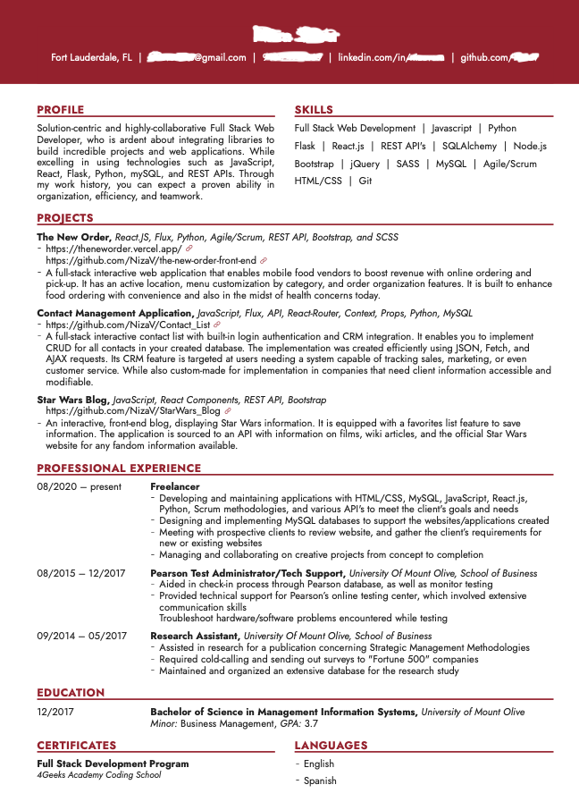

Below is an example of a great resume for you first coding job, during this article we go over each part of the document with explanations and examples:



## Employment History

- [ ] Do not add more than three past work experiences, unless they are really relevant or related to coding.
- [ ] You need software development experience.
- [ ] If you dont have coding experience: Start an internship (paid or unpaid) at coding job in a great company or start/join a freelance project.

### Why starting an intership or freelance project?

Previous experience makes everything, you need to be able some into your resumé to look better, this is an example of how your freelance job could look like:

```
Title: 
Freelance Web Developer at MyCompany Media

Description:
Responsible for designing, coding and modifying React applications and Python APIs from layout/mockups/wireframes to functional and according to a client's specifications. Strive to create visually appealing sites that feature user-friendly design and clear navigation.
```

[[warning]]
| :point_up: DO NOT COPY AND PASTE, please customize it, use different words, different technologies and programming languages that you like, you can talk about eCommerce apps, edTech, you can mention particular industries that you like.

If your final project was a game, you can say you are specialized in building games with HTML/CSS/Javascript/Python.
If it was a social network than you are specialized in building "social apps", etc.
If it was a tutoring site, you can say you are focused on edTech.

## Education

- [ ] If you have a master's degree or bachelor its very good, you can also add the 4Geeks Academy education.
- [ ] Do not add your other small certificates (if any) in this section, that would be a different `certifications` section of the Resume.

## Certificate

- [ ] Add any marketing or design certificates (because those are relevant to coding), do not add irrelevant certificates like Bartender or Event Planner.
- [ ] If you are certified on relevant software apps design or business apps like Photoshop, SAP, Microsoft Dynamics, etc.

## Projects 

- [ ] The projects you publish must be good quality, **do not publish**: A simple todo list, a random card generator, tic-tac-toe, etc. None of that is impressive.

### Enhance previous projects:

Enhanced versions of some of the projects you built at the academy, for example:

- Starwars Reading List: You can make this a social reading club, everyone has a password and shares they favorites.
- Contact List: Make the contact list a CRM, basically you add a "status" to each contact and then the sale people can change the contact status based on the sale process.
- Todo List: Todos don't need to have just two status: Done or Not done, you can make them have several like: Not doing, Doing, Done, Approved, Rejected, etc. That will make your todo list a project management tool with stages.

Each of your projects must have:
- Live link
- Readme description with screenshots.
- Organized code.

[[warning]]
| :point_up: Quality is more important than quantity, just two or three projects in enough if they are really good.

## The Skills

These are the most important most wanted technologies:

```
HTML5/CSS3, Bootstrap, Javascript ECMAScript 2020, Node.js, GIT/Github, Python, Flask, API's, React.js, Flux, SCRUM, SQL, SQLAlchemy, MySQL, Postgress API's
```

You also learned these secondary technologies that my be use-full depending on what company you are applying to:

```
Heroku, Markdown, Use Stories, Data-Structures, Data-Modeling, REST, MVC, Event oriented programing, The DOM.
```

Additionally these are good technologies that we don't teach during the 16 weeks but will be easy to learn and add a lot of value to your resume:

```
Unit testing, jQuery, Gatsby.js, SSR, AWS, Firbase, WordPress, React Native.
```
