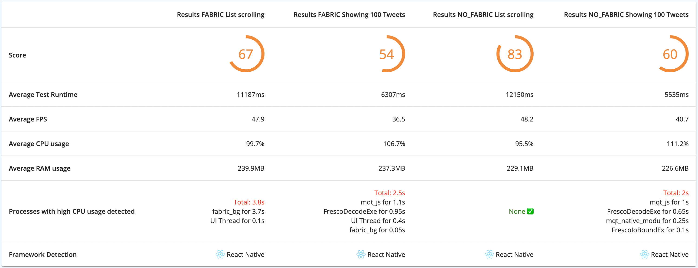

# Performance & Profiling in Practice en React Native

Tu app funciona perfectamente en tu MacBook con un iPhone 14 Pro conectado. Pero en producción, los usuarios se quejan de lag, scroll entrecortado y pantallas que tardan segundos en cargar. El problema con la performance es que es invisible hasta que se vuelve un problema serio, y para entonces ya tienes reviews de una estrella y usuarios abandonando tu app.

La performance en React Native no se trata de aplicar todas las optimizaciones que conoces y esperar lo mejor. Se trata de medir científicamente dónde está el problema real, aplicar el fix específico, y validar que funcionó. Sin herramientas de profiling, estás optimizando a ciegas. Con ellas, conviertes el debugging de performance en un proceso sistemático y predecible.

## Hermes: Tu Microscopio de Código

Hermes es el motor de JavaScript diseñado por Meta específicamente para React Native. Su profiler integrado te muestra exactamente qué funciones de tu código consumen tiempo de CPU, con precisión de milisegundos.

### Configuración Inicial

Primero verifica que Hermes esté habilitado. En proyectos recientes de React Native CLI viene activado por default, pero siempre confirma. Para Android, revisa tu archivo `android/app/build.gradle` y busca `enableHermes: true`. Para iOS, en tu `Podfile` debe estar `hermes_enabled => true` en la configuración de `use_react_native`.

Puedes verificar en runtime si Hermes está activo con este código simple en cualquier componente.

```typescript
const isHermesEnabled = (): boolean => {
  return !!global.HermesInternal;
};

// Usar en desarrollo para confirmar
useEffect(() => {
  if (__DEV__) {
    console.log('Hermes enabled:', isHermesEnabled());
  }
}, []);
```

Si ves `true`, estás listo. Si ves `false`, necesitas habilitar Hermes en la configuración y hacer rebuild completo de la app.

### Capturando un Profile

Hay dos formas de capturar profiles de Hermes. La primera es manual usando el menú de desarrollo. Sacude tu dispositivo o presiona Cmd+D en iOS, Cmd+M en Android. Verás opciones para "Enable Sampling Profiler". Actívalo, usa tu app reproduciendo el flujo que quieres analizar durante 10-30 segundos, luego vuelve al menú y selecciona "Disable Sampling Profiler". Esto genera un archivo que puedes descargar.

La segunda forma es programática, útil cuando quieres capturar profiles de flujos específicos automáticamente.

```typescript
import { Platform } from 'react-native';

interface ProfileCapture {
  start: () => void;
  stop: () => Promise<string | null>;
}

const useHermesProfiler = (): ProfileCapture => {
  const start = () => {
    if (!__DEV__ || !global.HermesInternal) return;
    
    console.log('Starting Hermes profiler...');
  };

  const stop = async (): Promise<string | null> => {
    if (!global.HermesInternal) {
      console.warn('Hermes not available');
      return null;
    }

    try {
      const path = await global.HermesInternal.getProfile?.();
      console.log('Profile saved at:', path);
      return path;
    } catch (error) {
      console.error('Failed to capture profile:', error);
      return null;
    }
  };

  return { start, stop };
};

// Usar en una pantalla de debug
const DebugScreen: React.FC = () => {
  const profiler = useHermesProfiler();

  return (
    <View>
      <Button title="Start Profile" onPress={profiler.start} />
      <Button title="Stop Profile" onPress={profiler.stop} />
    </View>
  );
};
```

En Android, el archivo se guarda en `/data/data/com.yourapp/cache/`. Extráelo con `adb pull /data/data/com.yourapp/cache/profile.cpuprofile`. En iOS, Xcode te permite descargar archivos del container de la app.

### Analizando el Profile

El archivo `.cpuprofile` se abre en Chrome DevTools. Ve a `chrome://inspect`, luego en la pestaña Profiler carga el archivo. Chrome te mostrará tres vistas diferentes del mismo profile.

La vista de Chart es una flame graph donde cada barra horizontal representa una función. El ancho de la barra es proporcional al tiempo que consumió. Las funciones más anchas son tus candidatos principales de optimización. Puedes hacer click en cualquier barra para ver el código fuente exacto y el call stack completo.

La vista Heavy agrupa todas las llamadas a funciones por nombre, mostrándote las más costosas primero sin importar desde dónde se llamaron. Esto es perfecto para encontrar funciones problemáticas que se llaman desde múltiples lugares. Si ves que `formatPrice` aparece consumiendo 600ms total, sabes que necesitas optimizarla o cachear sus resultados.

La vista Tree muestra el call stack jerárquico completo. Útil cuando quieres entender el contexto de por qué una función es lenta. Puedes ver toda la cadena de llamadas que llevó a ejecutar código costoso.


## Flipper: Visibilidad Total de Tu App

Flipper es mucho más que un debugger, es un ecosistema de plugins que te dan visibilidad completa del comportamiento interno de tu app en tiempo real.



### Instalación Profesional

En proyectos recientes de React Native CLI, Flipper ya debería estar configurado. Pero para acceder a todos los plugins necesitas algunos pasos adicionales.

Descarga Flipper Desktop desde el sitio oficial. Una vez instalado, asegúrate que tu proyecto tenga las dependencias necesarias.

```bash
npm install --save-dev react-native-flipper
```

Para iOS, tu Podfile debe incluir la configuración de Flipper. Debería verse similar a esto, aunque la versión específica puede variar.

```ruby
use_flipper!()

post_install do |installer|
  flipper_post_install(installer)
end
```

Ejecuta `pod install` en la carpeta ios. Para Android, la integración debería ser automática en versiones recientes.

Ahora inicia tu app en modo debug. Abre Flipper Desktop y deberías ver tu app aparecer en la lista de dispositivos conectados. Si no aparece, verifica que el dispositivo y tu computadora estén en la misma red, o usa conexión USB con `adb reverse` configurado.

### React DevTools: Cazando Re-renders

El plugin de React en Flipper es tu arma principal contra componentes que renderizan innecesariamente. Cuando tu app se siente lenta pero no ves funciones costosas en Hermes, el problema probablemente son re-renders excesivos.

Conecta Flipper y selecciona el plugin React DevTools. Verás tu árbol completo de componentes. Ahora activa la opción "Highlight Updates" en los settings del plugin. Esta es la feature killer.

Usa tu app normalmente. Verás que los componentes que renderizan se iluminan brevemente en diferentes colores en tu dispositivo. Si toda la pantalla se ilumina cuando cambias un input de texto, tienes un problema arquitectural serio. Probablemente el estado está muy arriba en el árbol y causa cascadas de re-renders.

```typescript
// Problema común identificado con Highlight Updates
interface UserProfileProps {
  userId: string;
}

const UserProfile: React.FC<UserProfileProps> = ({ userId }) => {
  const [searchQuery, setSearchQuery] = useState('');
  const [userPosts, setUserPosts] = useState<Post[]>([]);
  const [userData, setUserData] = useState<User | null>(null);

  return (
    <View>
      <Header />
      <SearchBar value={searchQuery} onChange={setSearchQuery} />
      <UserInfo user={userData} />
      <PostList posts={userPosts} />
      <Footer />
    </View>
  );
};
```

Con Highlight Updates activo, escribir en el SearchBar ilumina Header, UserInfo, PostList y Footer innecesariamente. Todos esos componentes se re-renderizan aunque no dependan de searchQuery. La solución es aislar el estado lo más cerca posible de donde se usa.

```typescript
const UserProfile: React.FC<UserProfileProps> = ({ userId }) => {
  const [userPosts, setUserPosts] = useState<Post[]>([]);
  const [userData, setUserData] = useState<User | null>(null);

  return (
    <View>
      <Header />
      <SearchSection />
      <UserInfo user={userData} />
      <PostList posts={userPosts} />
      <Footer />
    </View>
  );
};

const SearchSection: React.FC = () => {
  const [searchQuery, setSearchQuery] = useState('');

  return (
    <SearchBar value={searchQuery} onChange={setSearchQuery} />
  );
};
```

Ahora solo SearchSection se ilumina cuando escribes. El resto de la pantalla permanece estático. El plugin también muestra un contador de renders por componente. Haz click en cualquier componente del árbol para ver cuántas veces ha renderizado. Si un componente simple renderizó 200 veces en 30 segundos, encontraste tu problema.

### Performance Monitor: Los Números Críticos

El Performance Monitor muestra dos métricas en tiempo real que debes vigilar constantemente durante el desarrollo.

JavaScript FPS indica qué tan bien está funcionando tu código React. Debe mantenerse cerca de 60 (o 120 en dispositivos con high refresh rate). Si baja a 40-50 durante interacciones normales, tu código está haciendo demasiado trabajo. Las causas típicas son cálculos costosos en render, funciones que no están memoizadas, o Context propagando cambios a demasiados componentes.

UI FPS indica qué tan bien está funcionando el renderizado nativo. También debe estar en 60. Si baja pero JS FPS está bien, el problema está en animaciones mal implementadas, layouts complejos con muchas vistas anidadas, o imágenes sin optimizar. La clave está en observar cuándo exactamente bajan los FPS. Reproduce acciones específicas mientras vigilas el monitor. Haz scroll por una lista, navega entre pantallas, abre un modal con animación, carga imágenes. Cuando veas el drop de FPS, sabes exactamente qué acción causa el problema.

### Network Inspector: Optimizando Tiempos de Espera

Los usuarios no perciben tu app como lenta porque tu JavaScript sea lento. La perciben lenta porque pasan segundos mirando spinners esperando datos del servidor. El Network Inspector muestra cada request HTTP con timing detallado. Haz click en cualquier request para ver un breakdown completo del tiempo en fases específicas.

DNS lookup muestra cuánto tardó resolver el dominio a una IP. Connection muestra el tiempo de establecer la conexión TCP. Si usas HTTPS, verás también TLS handshake. TTFB es Time To First Byte, cuánto tardó el servidor en empezar a enviar la respuesta. Download es cuánto tardó transferir todos los datos.

Si TTFB es alto, el problema está en el servidor, no en tu app. Si Download es lento pero TTFB es rápido, el problema es el tamaño de la response. Si ves múltiples requests al mismo endpoint en pocos segundos, necesitas deduplicación.

```typescript
// Problema visible en Network Inspector
const ProductScreen: React.FC<{ productId: string }> = ({ productId }) => {
  const [product, setProduct] = useState<Product | null>(null);
  const [reviews, setReviews] = useState<Review[]>([]);
  const [relatedProducts, setRelatedProducts] = useState<Product[]>([]);

  useEffect(() => {
    fetch(`http://example/api/products/${productId}`).then(r => r.json()).then(setProduct);
    fetch(`http://example/api/products/${productId}/reviews`).then(r => r.json()).then(setReviews);
    fetch(`http://example/api/products/${productId}/related`).then(r => r.json()).then(setRelatedProducts);
  }, [productId]);

  if (!product) return <Loading />;

  return <ProductDetails product={product} reviews={reviews} related={relatedProducts} />;
};
```

En Flipper verás tres requests secuenciales. El total puede ser 2-3 segundos. Pero estos tres requests pueden hacerse en paralelo, o mejor aún, el servidor puede tener un endpoint que devuelva todo junto.

### Images Plugin: El Asesino de Memoria

Las imágenes son la causa número uno de crashes por falta de memoria en apps React Native. El plugin de Images te muestra todas las imágenes actualmente cargadas en RAM, su tamaño en memoria versus tamaño en pantalla, y te permite inspeccionarlas visualmente.

Activa el plugin Images y usa tu app navegando por pantallas con fotos. Verás una galería de thumbnails de todas las imágenes en memoria. Si ves una imagen de 3000x2000 píxeles pero en pantalla solo ocupa 150x100, estás desperdiciando memoria masivamente.

Una imagen de 3000x2000 sin comprimir consume aproximadamente 24MB de RAM. Si tienes 20 de esas en una galería, son 480MB solo en imágenes. En dispositivos con 2-3GB de RAM total, tu app crasheará inevitablemente.

La solución tiene dos partes. Primero, tu servidor debe ofrecer múltiples tamaños de cada imagen. Segundo, tu app debe pedir el tamaño apropiado.

```typescript
import FastImage from 'react-native-fast-image';
import { Dimensions, PixelRatio } from 'react-native';

interface OptimizedImageProps {
  imageId: string;
  width: number;
  height: number;
}

const OptimizedImage: React.FC<OptimizedImageProps> = ({ 
  imageId, 
  width, 
  height 
}) => {
  const pixelRatio = PixelRatio.get();
  const optimalWidth = Math.ceil(width * pixelRatio);
  const optimalHeight = Math.ceil(height * pixelRatio);

  const imageUrl = `https://example.com/images/${imageId}?w=${optimalWidth}&h=${optimalHeight}&q=85&fm=webp`;

  return (
    <FastImage
      source={{
        uri: imageUrl,
        priority: FastImage.priority.normal,
        cache: FastImage.cacheControl.immutable,
      }}
      style={{ width, height }}
      resizeMode={FastImage.resizeMode.cover}
    />
  );
};
```

En Flipper Images verás que ahora cada imagen consume solo 200-500KB en lugar de 24MB. El plugin también te alerta si hay memory leaks de imágenes. Si navegas fuera de una pantalla pero sus imágenes siguen en memoria, tienes referencias colgadas.

## Systrace: Debugging a Nivel del Sistema

Systrace es una herramienta de Android que captura actividad de TODOS los threads del sistema operativo, no solo tu app. Te muestra exactamente qué está haciendo cada thread microsegundo por microsegundo.

### Capturando un Trace Efectivo

Systrace genera archivos HTML grandes con información microscópica. La clave es capturar solo el periodo problemático.

Primero asegúrate que tienes Android SDK configurado y adb funcionando. Luego inicia la captura antes de reproducir el problema.

```bash
adb shell atrace --async_start -b 20000 -a com.yourapp sched gfx view wm am input res dalvik

# Reproduce el problema en tu app durante 5-10 segundos

adb shell atrace --async_stop > trace.html
```

El parámetro `-b 20000` es el tamaño del buffer en KB. Para captures más largas, aumenta este número. Los tags después de `-a` determinan qué información capturar. `sched` es thread scheduling, `gfx` es rendering, `view` es el view system, etc.

### Leyendo el Trace

Abre el archivo HTML en Chrome. Verás una interfaz con timeline completa. Cada fila es un thread diferente. Las barras coloreadas son trabajo ejecutándose. Los espacios blancos son tiempo idle o esperando.

Busca la fila SurfaceFlinger cerca del top. Este es el compositor final de frames. Cada frame debe ser una barra verde de aproximadamente 16.67ms para 60 FPS. Las barras rojas o naranjas son frames que tardaron más de 16.67ms, causando stuttering visible.

Haz click en una barra roja problemática. El panel inferior muestra detalles completos incluyendo el call stack que causó el retraso. Puede mostrar `measure` o `layout`, indicando que calcular posiciones de vistas fue costoso. O puede mostrar `draw`, indicando que dibujar píxeles tomó demasiado.

Navega a las filas de tu app. Verás el JavaScript Thread, el UI Thread principal, y otros helper threads. Si el JS Thread tiene barras largas continuas sin gaps, está saturado de trabajo. Si el UI Thread espera frecuentemente, eso es bueno, significa que no está bloqueado.

## Estrategias de Optimización Basadas en Data

Con las herramientas entendidas, veamos estrategias específicas para solucionar los problemas más comunes que encontrarás en profiling.

### Context Optimization

React Context es conveniente pero peligroso. Cuando un valor de Context cambia, todos los componentes que lo consumen re-renderizan, sin importar si usan la parte que cambió.

```typescript
type AppContextValue = {
  user: User | null;
  theme: 'light' | 'dark';
  settings: Settings;
};

const AppContext = createContext<AppContextValue | null>(null);

const App: React.FC = () => {
  const [user, setUser] = useState<User | null>(null);
  const [theme, setTheme] = useState<'light' | 'dark'>('light');
  const [settings, setSettings] = useState<Settings>(defaultSettings);

  const value = { user, theme, settings };

  return (
    <AppContext.Provider value={value}>
      <Navigation />
    </AppContext.Provider>
  );
};
```

El problema es doble. Primero, el object literal crea una nueva referencia en cada render, causando que todos los consumers re-rendericen. Segundo, cambiar theme causa re-render de componentes que solo usan user. La solución es separar Contexts por dominio y memoizar el value.

```typescript
const UserContext = createContext<User | null>(null);
const ThemeContext = createContext<'light' | 'dark'>('light');
const SettingsContext = createContext<Settings>(defaultSettings);

const App: React.FC = () => {
  const [user, setUser] = useState<User | null>(null);
  const [theme, setTheme] = useState<'light' | 'dark'>('light');
  const [settings, setSettings] = useState<Settings>(defaultSettings);

  return (
    <UserContext.Provider value={user}>
      <ThemeContext.Provider value={theme}>
        <SettingsContext.Provider value={settings}>
          <Navigation />
        </SettingsContext.Provider>
      </ThemeContext.Provider>
    </UserContext.Provider>
  );
};
```

Ahora cambiar theme solo afecta componentes que consuman ThemeContext. En Flipper React DevTools con Highlight Updates, verás que solo los componentes de UI visual se iluminan, no los de data.

### Debouncing para Inputs Costosos

No todos los eventos necesitan procesarse inmediatamente. Los inputs de búsqueda especialmente deben ser debounced.

```typescript
const useDebounce = <T,>(value: T, delay: number): T => {
  const [debouncedValue, setDebouncedValue] = useState<T>(value);

  useEffect(() => {
    const handler = setTimeout(() => {
      setDebouncedValue(value);
    }, delay);

    return () => {
      clearTimeout(handler);
    };
  }, [value, delay]);

  return debouncedValue;
};

const SearchScreen: React.FC = () => {
  const [query, setQuery] = useState('');
  const debouncedQuery = useDebounce(query, 500);

  useEffect(() => {
    if (debouncedQuery) {
      performSearch(debouncedQuery);
    }
  }, [debouncedQuery]);

  return (
    <TextInput 
      value={query}
      onChangeText={setQuery}
      placeholder="Search..."
    />
  );
};
```

En Network Inspector verás que escribir "react native" genera 1 request después de medio segundo de que el usuario para, no 12 requests mientras escribe.

### Image Caching Multinivel

Para apps con muchas imágenes necesitas caching más sofisticado que solo FastImage default.

```typescript
import RNFS from 'react-native-fs';

class ImageCache {
  private memoryCache = new Map<string, string>();
  private diskPath = `${RNFS.CachesDirectoryPath}/images/`;

  async getImage(url: string): Promise<string> {
    const key = this.hashUrl(url);

    if (this.memoryCache.has(key)) {
      return this.memoryCache.get(key)!;
    }

    const diskFile = `${this.diskPath}${key}.jpg`;
    const exists = await RNFS.exists(diskFile);

    if (exists) {
      this.memoryCache.set(key, diskFile);
      return diskFile;
    }

    return this.downloadAndCache(url, key, diskFile);
  }

  private async downloadAndCache(url: string, key: string, path: string): Promise<string> {
    await RNFS.downloadFile({ fromUrl: url, toFile: path }).promise;
    this.memoryCache.set(key, path);
    return path;
  }

  private hashUrl(url: string): string {
    return url.split('').reduce((hash, char) => {
      return ((hash << 5) - hash) + char.charCodeAt(0);
    }, 0).toString();
  }
}

const imageCache = new ImageCache();
```

En Flipper Images verás que las imágenes cacheadas cargan instantáneamente y no aparecen en Network Inspector.


## Checklist de Performance

Antes de lanzar a producción, ejecuta este checklist. Captura un profile de Hermes de los flujos principales. Ninguna función debe consumir más de 10% del tiempo total. Usa Flipper Performance Monitor durante 5 minutos de uso intenso. FPS debe mantenerse en 55 o más constantemente. Revisa Flipper Images durante uso normal. Ninguna imagen debe ser más de 5x su tamaño visual.

Captura un Systrace en Android de 30 segundos. No debe haber más de 5-10 frames rojos durante uso normal. Revisa Network Inspector. El tiempo promedio de requests debe ser menor a 500ms para el percentil 90. Todo esto debe hacerse en builds de producción, no desarrollo. Los builds de dev tienen overhead que oculta problemas reales.

## Conclusión

El profiling de performance en React Native es ingeniería sistemática, no arte oscuro. Hermes te dice qué funciones son lentas. Flipper te da visibilidad de renders, network, memoria e imágenes. Systrace revela problemas de threading y renderizado que otras herramientas no ven.

La clave es medir antes de optimizar. Sin baseline no sabes si mejoraste. Sin profiling optimizas lo incorrecto. Sin validación no sabes si el problema se resolvió. Con estas herramientas y este proceso, la optimización se vuelve predecible y efectiva.
