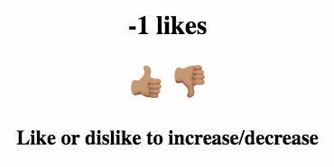
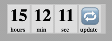
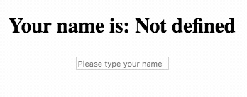
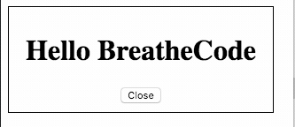

## Por qué hooks?

Los componentes tipo función son sorprendentes porque son simples, tienen un rendimiento rápido y requieren poco código, pero son limitados.

Hooks viene para mejorar tus componentes y darles superpoderes!

### Mis componentes necesitan superpoderes?

En general, usando props es suficiente para crear un componente sorprendente, pero a veces es necesario más, estos son algunos ejemplos realmente útiles para usar hooks:

1. Si tu quieres abrir o cerrar un modal o diálogo (usa el **useState** hook).
2. Si desea obtener algunos datos solo al comienzo de la ejecución del programa (usa el **useEffect** hook).
3. Si quieres compartir información dentro de todos los componentes (usa el **useContext** hook).

A medida que tenga más experiencia, comprenderás mejor cuándo se necesita Hooks, si no crees que los necesitas, ¡NO lo uses! ¡Cuanto menos mejor!

### Todas las aplicaciones necesitan al menos un <strong>useState</strong> y un <strong>useEffect</strong>

Hay muchos hooks, pero siempre usarás al menos estos dos (2):

## El hook `useState`:

El hook más importante, casi inevitable! El <strong>useState</strong> te ayuda a inicializar una variable y cambiar su valor con el tiempo sin la necesidad de componentes primarios, así es como debes usarla:
```jsx
//      Nombre de variable      setter name            valor inicial (cualquier valor)
const [ mySuperVariable, mySuperFunction ] = useState(          null        );
```

Basicamente `mySuperVariable` va a inicializar con `null` y luego tu podrás restablecer su valor llamando `mySuperFunction` de esta forma:

```jsx
// aqui estamos restableciendo el valor de mySuperVariable = 'hello' cuando el uso hace clic en un botón
<button onClick={() => mySuperFunction('hello')}></button>
```

### Posible usos para </strong>el hook ` useState` </strong>

|  |  |  |
| ----------- | ---- |
| 1. Contador: Mostrar el número de Likes en la pantalla y poder aumentar o disminuir cuando el usuario hace click, [haga click aquí para ver el demo](https://codesandbox.io/s/wild-pond-soxu8?fontsize=14) |  |
| 2. Temporizador/Reloj: Tu puedes usar la hora del sistema para mostrar la hora actual en la pantalla, pero la hora cambia todo el tiempo, es por eso que debe almacenarla en una variable de estado, [haga click aquí para ver el demo](https://codesandbox.io/s/hungry-paper-kkh7g?fontsize=14) |  |
| 3. Mostrar una entrada en la pantalla: la mejor práctica para obtener el contenido de cualquier entrada es almacenarlo en una variable de estado, esto se denomina "Entrada controlada", [haga clic aquí para ver un ejemplo de entrada controlada](https://codesandbox.io/s/brave-albattani-irhy7?fontsize=14) |  |
| 4. Apertura/cierre (mostrar / ocultar): un caso de uso típico es tener un diálogo que pide una pregunta o tal vez algún formulario de suscripción al boletín, [haga click aquí para ver el ejemplo](https://codesandbox.io/s/modal-window-component-with-hooks-vb6de?fontsize=14). |  |
| 5. Miles de otras posibles aplicasiones. | |

Vamos a explicar este hook con una pequeña ventana modal de ejemplo, aqui esta el codigo vivo:

<iframe src="https://codesandbox.io/embed/goofy-sutherland-vb6de?fontsize=14" title="Modal with hooks" allow="geolocation; microphone; camera; midi; vr; accelerometer; gyroscope; payment; ambient-light-sensor; encrypted-media; usb" style="width:100%; height:500px; border:0; border-radius: 4px; overflow:hidden;" sandbox="allow-modals allow-forms allow-popups allow-scripts allow-same-origin"></iframe>

Para implementar un "Ventana Modal" nosotros decidimos crear un hook variable llamado `opened` esto es `true` si la ventana modal tiene que mostrarse al usuario.

Si el usuario hace click en "close" nosotros simplificamos el uso de la función hook `setOpened` para cambiar el valor de `opened` a false.

## El hook `useEffect`:


El UseEffect es otro hook increíble que probablemente tendrás que usar en casi todas las aplicaciones de react al menos una vez.

Usalo si deseas ejecutar algún código después de que el componente se procese, por ejemplo:

#### 1) Después de que el componente se procesa por primera vez (como el viejo componentDidMount).
```jsx
const MyComponent = () => {
    useEffect(() =>

        // lo que codifique aquí se ejecutará solo después de la primera vez que el componente se procese

    , []);// <------ PLESE NOTICE THE EMPTY ARRAY


    return <Some HTML>;
}
```
[[info]]
| :point_up: Tenga en cuenta el `[]` como el segundo parámetro de useEffect.

#### 2) Cada momento (o algunas veces) después de que el componente se vuelva a renderizar.
```jsx
const MyComponent = () => {
    useEffect(() =>
        // esto se ejecutará cada vez que el componente se vuelva a renderizar
        if(some_condition){
            //esto solo de ejecutará si some_condition es verdadero
        }
    );// <------ ¡TENGA EN CUENTA QUE EL ARREGLO VACÍO SE HA IDO!

    return <Some HTML>;
}
```
[[info]]
| :point_up: Este useEffect no tiene una matriz vacía `[]` como segundo parámetro.

#### 3) Cuando el componente se desmontará o dejará de renderizarse (como la buena y vieja función componentWillUnmount).
```jsx
const MyComponent = () => {
    useEffect(() =>
        // esto se ejecutará solo la primera vez que el componente se procese.
        return () => {
            // esto se ejecutará justo antes de que el componente se desmonte
        }
    ,[]);// <------ ¡TENGA EN CUENTA EL ARREGLO VACÍO

    return <Some HTML>;
}
```

## Construyendo un Todo's List Usando solo los Hooks `useState` y `useEffect`

<p align="center">
    
</p>

Por ejemplo, digamos que estoy construyendo una lista de Todo, y tengo que cargar la lista de tareas desde una API, tendré que buscar la información justo después de que el componente se procese por primera vez:

```jsx
const Todos = (props) => {
    //inicialice la variable de tareas en una matriz vacía y conéctela a la función setTasks
    const [ tasks, setTasks] = useState([]);

    //Esta función useEffect se ejecutará solo una vez, cuando el componente finalmente se cargue la primera vez.
    useEffect(() =>
        // aquí busco mis todos de la API
        fetch('https://assets.breatheco.de/apis/fake/todos/user/alesanchezr')
            .then(r => r.json())
            .then(data => setTasks(data)) //here it re-set the variable tasks with the incoming data
    , []);

    return <ul>{tasks.map(t => <li>{t.label}</li>)}</ul>;
}
```
[[demo]]
| Revise el código en profundidad y la demostración en vivo [haciendo clic aquí](https://codesandbox.io/s/xenodochial-varahamihira-egh86?fontsize=14)
