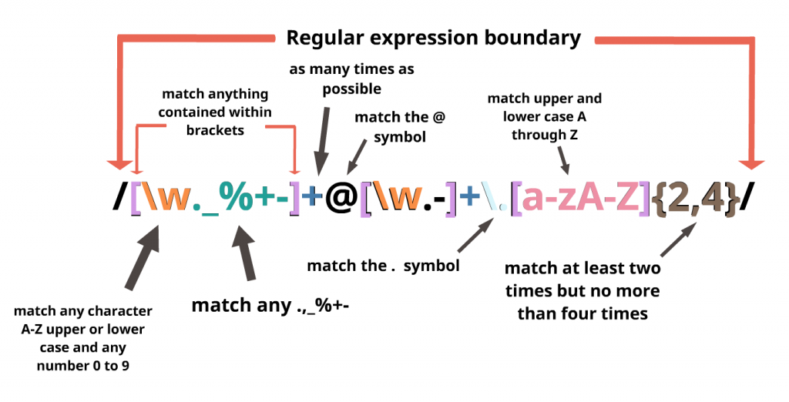

## ¿Qué es una Expresión Regular (Regex)?
***

Básicamente, una expresión regular es un patrón que describe una cierta cantidad de texto. Por ejemplo, sabes que los correos electrónicos son siempre como:

`python>username@domain.extension`

**Si queremos describir el patrón de un correo electrónico, diríamos algo como esto:** Comenzando con un nombre de usuario (una combinación de letras y números), seguido de un símbolo `arroba` **@**, seguido del dominio (otra combinación de letras y números) seguido de la extensión (que comienza con un punto `.` seguido de una combinación de letras solamente).

El proceso de describir el patrón de un correo electrónico es el mismo proceso que seguirá cuando desee crear una expresión regular. La única diferencia será la sintaxis.

## ¿Por qué Usar Regex?
***

Todos los principales lenguajes de programación utilizan expresiones regulares (C ++, PHP, .NET, Java, JavaScript, Python, Ruby y muchos otros). Como desarrollador web, siempre debes trabajar con strings para validar los datos ingresados por el usuario, validar formatos de URL, reemplazar palabras en párrafos, etc. Estos son los usos principales de las expresiones regulares:

+ **Buscar** elementos particulares dentro de un gran texto. Por ejemplo, es posible que desees identificar todas las direcciones de correo electrónico en algún contenido mediante un editor de texto.
+ **Reemplazar** artículos particulares. Por ejemplo, es posible que desees limpiar un poco de HTML con formato deficiente reemplazando todas las etiquetas en mayúsculas con equivalentes en minúsculas en un editor de texto.
+ **Validar** entradas. Por ejemplo, puedes querer verificar que una contraseña cumpla con ciertos criterios, tales como: una combinación de mayúsculas y minúsculas, dígitos, signos de puntuación, etc., en un programa que estés escribiendo.
+ **Coordinar** acciones. Por ejemplo, es posible si quieres procesar ciertos archivos en un directorio, pero solo si cumplen condiciones particulares. En el trabajo lo estás haciendo en la línea de comando.
+ **Reformatear** el texto. Por ejemplo, puedes exportar datos de un programa como un archivo de texto, luego modificar tu diseño para que puedas importarlo en otro programa usando un editor de texto.
+ y más…

## Construyendo y probando expresiones regulares
***

Nunca comiences a crear un Regex sin tener una herramienta de prueba en vivo, ya que puede complicarse con mucha facilidad. La mejor manera es usar la estrategia "divide y vencerás" (otra vez): divide tu Regex en varios Regex más pequeños, y luego combínalos todos.

## La Sintaxis de los Patrones
***

Esta es una expresión regular que busca un patrón de correo electrónico:

```jsx
/[\w._%+-]+@[\w.-]+\.[a-zA-Z]{2,4}/
```

Pero, no te preocupes ... no tienes que entenderlo ahora. La buena noticia es que una expresión regular compleja es simplemente la combinación de varias expresiones regulares muy simples. "¡Divide y vencerás!"

Entonces ... comencemos con las expresiones regulares básicas utilizando los operadores más básicos:


### Caractéres simples

**Un caracter simple es…**

Cualquier sucesión de caracteres es una simple expresión regular. Si usamos la palabra "email" (correo electrónico) como una expresión regular, el sistema buscará cualquier repetición de la palabra "email" dentro del texto dado.

**Usa el contenedor de la derecha para jugar con otras sucesiones simples de caracteres.**

<iframe src="https://assets.breatheco.de/live-demos/js/regex-tester/?e=email" frameborder="0" width="100%" height="400" scrolling="no">
  
</iframe>

<div align="right"><small><a href="https://assets.breatheco.de/live-demos/js/regex-tester/?e=email">Click para abrir demo en una nueva ventana</a></small></div>

### El Caracter `.`

**El caracter `python>.` representa…**

Cualquier caracter o símbolo disponible. Si dices `python> ab.ve`, estás diciendo algo que comienza con` python> ab` y termina con `python> ve`

Puedes usar el `.` tantas veces como quieras; la expresión regular reemplazará el `python> .` con cualquier carácter tantas veces como aparezca el` .`

**Usa el contenedor de la derecha para jugar con otras sucesiones simples de caracteres.**

<iframe style="border:0; overflow:hidden;" frameborder="0" width="100%" height="200px" src="https://assets.breatheco.de/live-demos/js/regex-tester/?encoded=true&amp;e=bC4uZQ%3D%3D&amp;c=TGV0IG1lIGxpdmUgbXkgbGlmZSB5b3UgbCMkZSE%3D"></iframe>

<div align="right"><small><a href="https://assets.breatheco.de/live-demos/js/regex-tester/?encoded=true&amp;e=bC4uZQ%3D%3D&amp;c=TGV0IG1lIGxpdmUgbXkgbGlmZSB5b3UgbCMkZSE%3D">Haz clic aquí para abrir la demo en una nueva ventana</a></small></div>


### El Caracter Rango `[ ]`

**El caracter  `python>[ ]` representa…**

Un grupo de posibles caracteres. A veces, nos gustaría ser un poco más específicos... aquí es donde los **rangos** son útiles. Especificamos un rango de caracteres encerrándolos entre corchetes ([]).

También puede usar el `python> []` para alinear números o letras con un guión intermedio. El guión representa un rango de números o caracteres. Por ejemplo:

+ `python>[0-9]` representa cualquier número entre 0 y 9.
+ `python>[a-z]` representa cualquier letra en minúscula
+ `python>[A-Z]` Representar cualquier letra en mayúsculas.
  
También puedes combinar rangos de caracteres de esta forma:

+ Cualquier letra en mayúsculas o minúsculas: `python>[a-zA-Z]`
+ Números del 1 al 5 y también del 9: `python>[1-59]`
+ Números del 1 al 5, letras de la a la f y también la X mayúscula:`python>[1-5a-fX]`

<iframe style="border:0; overflow:hidden;" frameborder="0" width="100%" height="200px" src="https://assets.breatheco.de/live-demos/js/regex-tester/?encoded=true&amp;e=dCU1QmVvJTVEZA%3D%3D&amp;c=V2hlbiB0b2RheSBpcyBvdmVyIFRlZCB3aWxsIGhhdmUgYSB0ZWRpb3VzIHRpbWUgdGlkeWluZyB1cC4%3D"></iframe>

<div align="right"><small><a href="https://assets.breatheco.de/live-demos/js/regex-tester/?encoded=true&amp;e=dCU1QmVvJTVEZA%3D%3D&amp;c=V2hlbiB0b2RheSBpcyBvdmVyIFRlZCB3aWxsIGhhdmUgYSB0ZWRpb3VzIHRpbWUgdGlkeWluZyB1cC4%3D">Haz clic aquí para abrir la demo en una nueva ventana</p></small></div>

<iframe style="border:0; overflow:hidden;" frameborder="0" width="100%" height="200px" src="https://assets.breatheco.de/live-demos/js/regex-tester/?encoded=true&amp;e=JTVCYS16QS1aJTVE&amp;c=V2hlbiB0b2RheSBpcyBvdmVyIFRlZCB3aWxsIGhhdmUgYSB0ZWRpb3VzIHRpbWUgdGlkeWluZyB1cC4%3D"></iframe>

<div align="right"><small><a href="https://assets.breatheco.de/live-demos/js/regex-tester/?encoded=true&amp;e=JTVCYS16QS1aJTVE&amp;c=V2hlbiB0b2RheSBpcyBvdmVyIFRlZCB3aWxsIGhhdmUgYSB0ZWRpb3VzIHRpbWUgdGlkeWluZyB1cC4%3D">Haz clic aquí para abrir la demo en una nueva ventana</a></small></div>


### El caracter `^` (simbolo de intercalación): Negación o comienzo de un término

**Si colocamos `^` al comienzo de un [rango]:**

Estamos negando el rango. Por ejemplo:

+ Todos los términos que comienzan con `python> li` y terminan con` python> e` pero no tienen `python> i` o` python> v` en el interior: `python> li [^ v] e`
  
**Si colocamos `python> ^` al comienzo de una expresión regular:**

+ Estamos diciendo que solo queremos probar el Regex desde el principio del string (no se evaluarán los substrings - partes más pequeñas de la cadena):

+ Un string que comienza con http: `python>^http`


<iframe style="border:0; overflow:hidden;" frameborder="0" width="100%" height="200px" src="https://assets.breatheco.de/live-demos/js/regex-tester/?encoded=true&amp;e=bGklNUIlNUV2JTVEZQ%3D%3D&amp;c=QSBkZXZlbG9wZXIgbGl2ZXMgbGlrZSBhbiBvbGl2ZSBvaWwsIGFsd2F5cyBhZGRpbmcgZ29vZCB0YXN0ZSB0byB3aGF0IGhlIGRvZXMu"></iframe>

<div align="right"><small><a href="https://assets.breatheco.de/live-demos/js/regex-tester/?encoded=true&amp;e=bGklNUIlNUV2JTVEZQ%3D%3D&amp;c=QSBkZXZlbG9wZXIgbGl2ZXMgbGlrZSBhbiBvbGl2ZSBvaWwsIGFsd2F5cyBhZGRpbmcgZ29vZCB0YXN0ZSB0byB3aGF0IGhlIGRvZXMu">Haz clic aquí para abrir la demo en una nueva ventana</a></small></div>

### Atajos para los dígitos `python> \d` y Palabras `python> \w`

Si lo prefieres, puedes usar estos accesos directos en tus expresiones regulares:

|**Operador**    |**Descripción**    |
|:---------------|:-------------------|
|\w              |Coincide con cualquier caracter de palabra (igual a `python>[a-zA-Z0-9_])`     |
|\W                |Coincide con cualquier otra cosa que no sea una letra, dígito o subrayado     |
|\d             |Coincide con cualquier dígito decimal. Equivalente a `python>[0-9]`       |
|\D             |Coincide con cualquier cosa que no sea un dígito decimal    |

<iframe style="border:0; overflow:hidden;" frameborder="0" width="100%" height="200px" src="https://assets.breatheco.de/live-demos/js/regex-tester/?encoded=true&amp;e=JTVDdyUyMA%3D%3D&amp;c=QSBkZXZlbG9wZXIgbGl2ZXMgbGlrZSBvbGl2ZSBvaWwgJiM4MjExOyBhbHdheXMgYWRkaW5nIGdvb2QgdGFzdGUgdG8gd2hhdCB0aGV5IGRvLg%3D%3D"></iframe>

<div align="right"><small><a href="https://assets.breatheco.de/live-demos/js/regex-tester/?encoded=true&amp;e=JTVDdyUyMA%3D%3D&amp;c=QSBkZXZlbG9wZXIgbGl2ZXMgbGlrZSBvbGl2ZSBvaWwgJiM4MjExOyBhbHdheXMgYWRkaW5nIGdvb2QgdGFzdGUgdG8gd2hhdCB0aGV5IGRvLg%3D%3D">Haz clic aquí para abrir la demo en una nueva ventana</a></small></div>


## Agrupar o encerrar expresiones regulares con `python>()`
***

Siempre hablamos de "divide y vencerás", ¿verdad? Bueno, tu mejor amigo para eso será el operador de paréntesis `python> ()`. Ahora podemos agrupar cualquier patrón como lo hacemos en matemáticas.

Ahora que podemos agrupar, podemos multiplicar (repetir) nuestros patrones, negarlos, etc.

Por ejemplo, este Regex acepta una o muchas repeticiones del string `ab` seguido de una letra `python> c` al final: `python> (ab) * c`

<iframe style="border:0; overflow:hidden;" frameborder="0" width="100%" height="200px" src="https://assets.breatheco.de/live-demos/js/regex-tester/?encoded=true&amp;e=bGklNUIlNUV2JTVEZQ%3D%3D&amp;c=QSBkZXZlbG9wZXIgbGl2ZXMgbGlrZSBvbGl2ZSBvaWwgJiM4MjExOyBhbHdheXMgYWRkaW5nIGdvb2QgdGFzdGUgdG8gd2hhdCB0aGV5IGRvLg%3D%3D"></iframe>

<div align="right"><small><a href="https://assets.breatheco.de/live-demos/js/regex-tester/?encoded=true&amp;e=bGklNUIlNUV2JTVEZQ%3D%3D&amp;c=QSBkZXZlbG9wZXIgbGl2ZXMgbGlrZSBvbGl2ZSBvaWwgJiM4MjExOyBhbHdheXMgYWRkaW5nIGdvb2QgdGFzdGUgdG8gd2hhdCB0aGV5IGRvLg%3D%3D">Haz clic aquí para abrir la demo en una nueva ventana</a></small></div>

## Usando el cuantificador en expresiones regulares
***

A veces, no desea especificar el número de caracteres que puede tener un Regex. Por ejemplo, un nombre de dominio puede tener entre 1 y quizás 100 caracteres ... ¿quién sabe?

El cuantificador nos permite aumentar el número de veces que un caracter puede aparecer en nuestra expresión regular. Aquí está el conjunto básico de multiplicadores:

+ \* – el caracter ocurre cero o más veces.
+ \+ – el caracter ocurre una o más veces.
+ ? – el caracter ocurre cero o una vez.
+ {5} – el caracter ocurre cinco veces.
+ {3,7} – el caracter ocurre entre 3 y 7 veces.
+ {2,} – el caracter aparece al menos 2 veces.

## Usando el cuantificador en  `python>*` `python>+` `python>?`

Podemos colocar el cuantificador después de los patrones de caracteres que queremos repetir. Aquí hay algunos casos y ejemplos:

|**Operador**     |**Descripción**   |
|:----------------|:-----------------|
|+                |Uno o varios Por ejemplo: <br> Términos con la letra `o` al menos una vez; `o +` |
|*                |Cero o muchos <br> Por ejemplo, los términos que comienzan con la letra "a" (en minúsculas) seguidos de **cero o muchos** caracteres de cualquier tipo, excepto el espacio en blanco: `a [^] *`   |
|?                 |Cero o uno. Por ejemplo: Buscar el string de noviembre con o sin el método abreviado: `python> [nN] ov (ember)? ` |


<iframe style="border:0; overflow:hidden;" frameborder="0" width="100%" height="200px" src="https://assets.breatheco.de/live-demos/js/regex-tester/?encoded=true&amp;e=JTVCbk4lNURvdiUyOGVtYmVyJTI5JTNG&amp;c=QSBkZXZlbG9wZXIgbGl2ZXMgbGlrZSBvbGl2ZSBvaWwgJiM4MjExOyBhbHdheXMgYWRkaW5nIGdvb2QgdGFzdGUgdG8gd2hhdCB0aGV5IGRvLiBUaGUgYmVzdCBkYXRlIHRvIGdyb3cgb2xpdmVzIGlzIG9uIE5vdmVtYmVyIHRoZSAyNHRoLCBub3Qgb24gTm92ZW1iZXIgdGhlIDNyZC4%3D"></iframe>

<div align="right"><small><a href="https://assets.breatheco.de/live-demos/js/regex-tester/?encoded=true&amp;e=JTVCbk4lNURvdiUyOGVtYmVyJTI5JTNG&amp;c=QSBkZXZlbG9wZXIgbGl2ZXMgbGlrZSBvbGl2ZSBvaWwgJiM4MjExOyBhbHdheXMgYWRkaW5nIGdvb2QgdGFzdGUgdG8gd2hhdCB0aGV5IGRvLiBUaGUgYmVzdCBkYXRlIHRvIGdyb3cgb2xpdmVzIGlzIG9uIE5vdmVtYmVyIHRoZSAyNHRoLCBub3Qgb24gTm92ZW1iZXIgdGhlIDNyZC4%3D">Haz clic aquí para abrir la demo en una nueva ventana</a></small></div>


[[demo]]
| :point_up: Aquí hay dos herramientas increíbles para construir y probar expresiones regulares. https://regex101.com/ and http://regexr.com/

[[demo]]
| :point_up:Aquí hay un tutorial interactivo para aprender expresiones regulares: https://regexone.com/


## Algunas Expresiones Regulares muy útiles
***

Afrontémoslo: las expresiones regulares son algo que utilizarás de vez en cuando (a menos que te especialices en un área muy particular del mundo del desarrollo web). La sintaxis es fácil de olvidar y es probable que encuentres tu Regex en Internet la mayor parte del tiempo. Lo importante aquí es que los entiendas y que puedas jugar con ellos cuando lo necesites.

Aquí hay algunos Regex pre-hechos:

#### Expresión regular para: validar un correo electrónico



Comenzamos diciéndole al analizador que encuentre el principio de la cadena (^).

Dentro del primer grupo, unimos una o más letras minúsculas, números, guiones bajos, puntos o guiones.

Hemos escapado del punto porque un punto no escapado significa cualquier caracter.

Directamente después de eso, debe haber un signo @.

El siguiente es el nombre de dominio, que debe ser: una o más letras minúsculas, números, guiones bajos, puntos o guiones. Luego otro punto (escapado), con la extensión de dos a seis letras o puntos. Tengo 2 a 6 debido a los TLD específicos del país (.ny.us o .co.uk).

Finalmente, queremos el final de la cadena ($).

<iframe style="border:0; overflow:hidden;" frameborder="0" width="100%" height="400px" src="https://assets.breatheco.de/live-demos/js/regex-tester/?encoded=true&amp;e=JTVCJTVDdy5fJTI1JTJCLSU1RCUyQiU0MCU1QiU1Q3cuLSU1RCUyQiU1Qy4lNUJhLXpBLVolNUQlN0IyJTJDNCU3RA%3D%3D&amp;c=U3RyaW5nIHRoYXQgbWF0Y2hlczo8L3A%2BCjxwPmpvaG5AZG9lLmNvbTxiciAvPgpTdHJpbmcgdGhhdCBkb2VzbiYjODIxNzt0IG1hdGNoOjwvcD4KPHA%2Bam9obkBkb2Uuc29tZXRoaW5nIChUTEQgaXMgdG9vIGxvbmcp"></iframe>

<div align="right"><small><a href="https://assets.breatheco.de/live-demos/js/regex-tester/?encoded=true&amp;e=JTVCJTVDdy5fJTI1JTJCLSU1RCUyQiU0MCU1QiU1Q3cuLSU1RCUyQiU1Qy4lNUJhLXpBLVolNUQlN0IyJTJDNCU3RA%3D%3D&amp;c=U3RyaW5nIHRoYXQgbWF0Y2hlczo8L3A%2BCjxwPmpvaG5AZG9lLmNvbTxiciAvPgpTdHJpbmcgdGhhdCBkb2VzbiYjODIxNzt0IG1hdGNoOjwvcD4KPHA%2Bam9obkBkb2Uuc29tZXRoaW5nIChUTEQgaXMgdG9vIGxvbmcp">Haz clic aquí para abrir la demo en una nueva ventana</a></small></div>


#### Expresión Regular para: coincidir con una URL

Este Regex es casi como tomar la parte final del Regex anterior, colocándolo entre "http: //" y alguna estructura de archivos al final. Suena mucho más simple de lo que realmente es. Para empezar, debemos buscar el comienzo de la línea con el cursor.

El primer grupo de captura es completamente opcional. Permite que la URL comience con "http: //", "https: //", o con ninguno de ellos. Tenemos un signo de interrogación después de la s para permitir las URL que tienen http o https. Para que este grupo completo sea opcional, acabamos de agregar un signo de interrogación al final.

El siguiente es el nombre de dominio: uno o más números, letras, puntos o guiones seguidos de otro punto, luego de dos a seis letras o puntos. La siguiente sección es los archivos y directorios opcionales. Dentro del grupo, queremos hacer coincidir cualquier número de barras diagonales, letras, números, guiones bajos, espacios, puntos o guiones. Entonces diremos que este grupo puede combinarse tantas veces como queramos. Esto permite hacer coincidir varios directorios junto con un archivo al final. Hemos usado la estrella en lugar del signo de interrogación porque la estrella dice cero **o más**, no cero **o uno**. Si se utilizara un signo de interrogación allí, solo se podría hacer coincidir un archivo / directorio.

A continuación, se hace coincidir una barra diagonal, pero es opcional.

Finalmente, terminamos con el final de la línea.

<iframe style="border:0; overflow:hidden;" frameborder="0" width="100%" height="400px" src="https://assets.breatheco.de/live-demos/js/regex-tester/?encoded=true&amp;e=JTI4aHR0cHMlM0YlM0ElNUMlMkYlNUMlMkYlMjklM0YlMjglNUIlNUNkYS16JTVDLi0lNUQlMkIlMjklNUMuJTI4JTVCYS16JTVDLiU1RCU3QjIlMkM2JTdEJTI5JTI4JTVCJTVDJTJGJTVDdyUyMCU1Qy4tJTVEJTJBJTI5JTJBJTVDJTJGJTNG&amp;c=U3RyaW5nIHRoYXQgbWF0Y2hlczo8L3A%2BCjxwPmh0dHA6Ly9uZXQudHV0c3BsdXMuY29tL2Fib3V0PC9wPgo8cD5TdHJpbmcgdGhhdCBkb2VzbiYjODIxNzt0IG1hdGNoOjwvcD4KPHA%2BaHR0cDovL2dvb2dsZS5jb20vc29tZS9maWxlIS5odG1sIChjb250YWlucyBhbiBleGNsYW1hdGlvbiBwb2ludCk%3D"></iframe>

<div align="right"><small><a href="https://assets.breatheco.de/live-demos/js/regex-tester/?encoded=true&amp;e=JTI4aHR0cHMlM0YlM0ElNUMlMkYlNUMlMkYlMjklM0YlMjglNUIlNUNkYS16JTVDLi0lNUQlMkIlMjklNUMuJTI4JTVCYS16JTVDLiU1RCU3QjIlMkM2JTdEJTI5JTI4JTVCJTVDJTJGJTVDdyUyMCU1Qy4tJTVEJTJBJTI5JTJBJTVDJTJGJTNG&amp;c=U3RyaW5nIHRoYXQgbWF0Y2hlczo8L3A%2BCjxwPmh0dHA6Ly9uZXQudHV0c3BsdXMuY29tL2Fib3V0PC9wPgo8cD5TdHJpbmcgdGhhdCBkb2VzbiYjODIxNzt0IG1hdGNoOjwvcD4KPHA%2BaHR0cDovL2dvb2dsZS5jb20vc29tZS9maWxlIS5odG1sIChjb250YWlucyBhbiBleGNsYW1hdGlvbiBwb2ludCk%3D">Haz clic aquí para abrir la demo en una nueva ventana</a></small></div>


