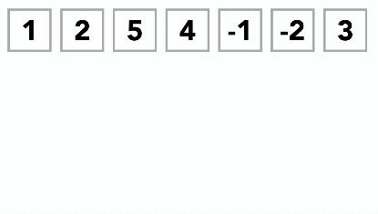

Sorting is an expensive task for the computer CPU, it depends on the amount of data and the way the data is organized initially. This mix of possibilities made developers create several algorithmic solutions that can be apllied to every language.

## Q: I googled and I found a `.sort()`, so why should I do it manually?
A: Sorting algorithms is one of the first lessons in Computer Science because it helps you train your mind to think like a computer. It is a great practice to fully understand the concepts of algorithms and code.

## Q: What types of sorting algorithms are there?
A: There is more than we can count, the top 10 in popularity are:

### Bubble Sorting
It's the simplest of the sorting algorithms. It repeatedly swap adjacent elements to arrange them ascendingly, the algorithm has a "`wall`" that represents the last position to be compared, the wall keeps moving from left to right, shrinking the comparison size until the entire list is sorted.


In Javascript:
```js
const bubbleSort = (arr) => {
    let wall = arr.length - 1; //we start the wall at the end of the array
    while (wall > 0){
        let index = 0;
        while (index < wall) {
          //compare the adjacent positions, if the right one is bigger, we have to swap
          if (arr[index] > arr[index + 1]) { 
            let aux = arr[index]; 
            arr[index] = arr[index + 1];
            arr[index + 1] = aux;
          }
          index++;
        }
        wall--; //decrease the wall for optimization
    }
	return arr;
};
```

[[info]]
| :tv: In this link, you will find [a relly good 2 min video explanation](https://www.youtube.com/watch?v=xli_FI7CuzA).

[[info]]
| :tv: Here is a really [weird group of bulgarian's](https://www.youtube.com/watch?v=lyZQPjUT5B4&t=1s) dancing the bubble-sort algorithm.

### Selection Sorting

`Selection` also has a wall, but in this case, it marks the beginning of the loop, the algorithm then looks for the smallest item and swaps it with the initial one, then it moves the wall one position to the right to avoid looking again that same item.


In javascript
```js
const selectSort = (arr) => {
    let min = 0;
    while (min < arr.length-1){
        for(let i = min+1; i < arr.length-1; i++) {
          if (arr[min] > arr[i]) {
            let aux = arr[min];
            arr[min] = arr[i];
            arr[i] = aux;
          }
        }
        min++;
    }
	return arr;
};
```
[[info]]
| :tv: In this link, you will find [a relly good 3 min video explanation](https://www.youtube.com/watch?v=g-PGLbMth_g) about the selection sort algorithm.

### Cocktail Shaker Sorting

Cocktail Shaker works in both fronts at the same time: It looks for the biggest value scanning from left to right and it also looks for the smallest one when its coming back from right to left. It has 2 walls  (both for each side of the list), and both walls keep shrinking until they hit each other, when that happens the array is fully sorted.


In javascript:
```js
const shakerSort = (arr) => {
  let max = arr.length - 1;
  let min = 0;
  while(min < max){
  	let biggest = min;
    let smallest = max;
    //
  	for (var i = min; i <= max; i++) if(arr[biggest] < arr[i]) biggest = i;
    if(max != biggest){ //swap the items
    	let aux = arr[max]; arr[max] = arr[biggest]; arr[biggest] = aux;
    }
    max--;
    for (var j = max; j >= min; j--) if(arr[smallest] > arr[j]) smallest = j;
    if(min != smallest){ //swap the items
    	let aux2 = arr[min]; arr[min] = arr[smallest]; arr[smallest] = aux2;
    }
    min++;
  }  
  return arr;
}
```
[[info]]
| :tv: In this link, you will find [a relly good 3 min video explanation](https://www.youtube.com/watch?v=Xmx_6YRBaq8&t=18s) about the Cocktail Shaker Sort algorithm.

### Insertion Sort

Insertion sort involves going through a pile, taking one item, comparing it to the first, swapping places if one item is larger than another and continuing this process until the minimum item is in the correct location.


In javascript:
```js
const insertionSort = (arr) => {
    for (let i = 1; i < arr.length; i++) {
	    let key = arr[i];
        let j = i - 1;
        while (j >= 0 && arr[j].num > key.num) {
            arr[j + 1] = arr[j];
            j--;
        }
        arr[j + 1] = key;
    }
    return arr;
};
```

[[info]]
| :tv:** In this link, you will find [a relly good 3 min video explanation](https://www.youtube.com/watch?v=JU767SDMDvA) about the insertion sort algorithm.

### Merge Sort

Merge sort is a more difficult algorithm because it uses [recursivity](https://www.youtube.com/watch?v=KEEKn7Me-ms). It is an example of a divide-and-conquer type sorting-algorithm, it splits the unsorted array into two parts and then recursively applies merge sort to these sub-arrays to further split the arrays until you are left with a bunch of single-element arrays. Then, you compare single-element arrays to one another before recombining them into a two-element, sorted array (and so on). It will end up with a single, sorted array of length n.


[[info]]
| :tv: In this link, you will find [a relly good 4 min video explanation](https://www.youtube.com/watch?v=JU767SDMDvA) about the merge sort algorithm.

### Quick Sort

Uses the same "divide and conquer" strategy to gain the same advantages. It first selects a value, which is called the  **pivot value**. The role of the pivot value is to assist with splitting the list. The actual position where the pivot value belongs in the final sorted list, commonly called the  **split point**, will be used to divide the list for subsequent calls to the quick sort.


Partitioning begins by locating two position markers—let’s call them  `leftmark`  and  `rightmark`—at the beginning and end of the remaining items in the list (positions 1 and 8 in ). The goal of the partition process is to move items that are on the wrong side with respect to the pivot value while also converging on the split point. 


We begin by incrementing  `leftmark`  until we locate a value that is greater than the pivot value. We then decrement  `rightmark`  until we find a value that is less than the pivot value. At this point we have discovered two items that are out of place with respect to the eventual split point. For our example, this occurs at 93 and 20. Now we can exchange these two items and then repeat the process again.

At the point where  `rightmark`  becomes less than  `leftmark`, we stop. The position of  `rightmark`  is now the split point. The pivot value can be exchanged with the contents of the split point and the pivot value is now in place. In addition, all the items to the left of the split point are less than the pivot value, and all the items to the right of the split point are greater than the pivot value. The list can now be divided at the split point and the quick sort can be invoked recursively on the two halves.


The  `quickSort`  function invokes a recursive function,  `quickSortHelper`.  `quickSortHelper`  begins with the same base case as the merge sort. If the length of the list is less than or equal to one, it is already sorted. If it is greater, then it can be partitioned and recursively sorted. The  `partition`  function implements the process described earlier.



[[info]]
| :tv: In this link, you will find [a relly good 4 min video explanation](https://www.youtube.com/watch?v=Hoixgm4-P4M) about the Quick Sort algorithm.

## Aditional Resources

Here is another great visualization with all the most used algorithms:
https://codepen.io/msurguy/pen/fBDJA

Here is a real life benchmark of all the mayor sorting algorithms:
https://codepen.io/villa7/pen/LyLVbj
