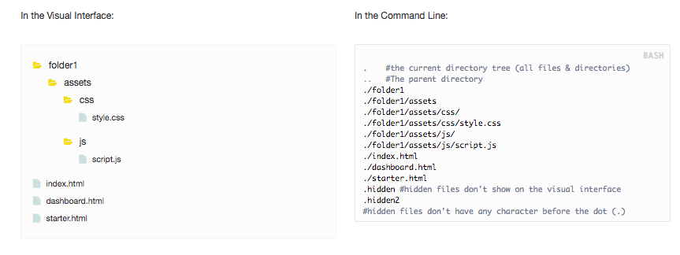
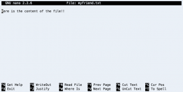

[[warning]]
| :point_up: Los usuarios de Windows no tienen la misma línea de comando. Por favor ve a [Cloud 9](https://aws.amazon.com/es/cloud9/?origin=c9io) y trabaja desde allí.

## ¿Por qué los Desarrolladores aman la Línea de Comando?
***

Al principio, todos odiaban la línea de comando. Tras años de experiencia, se convirtió en un gusto adquirido.

Pero ¿por qué les gusta a los desarrolladores? Bueno, la lista es infinita, pero aquí hay algunas razones importantes:

+ Si no dominas la línea de comandos, no podrás usar ninguno de estos: GIT, MySQL, Webpack, Node.js, Grunt, Vagrant, Babel, React, Angular, Apache, etc.
+ Como desarrollador, es lo único que necesitas tener disponible. Las computadoras no vienen con Atom, Sublime text (o cualquier otro IDE de lujo). A veces - como los servidores de producción - no puedes instalar nada y **el sistema ni siquiera tiene una interfaz visual** - solo la línea de comandos.
+ Es super poderosa. Puedes hacer mucho más en mucho menos tiempo, por ejemplo: eliminar de forma masiva, cambiar el nombre, buscar un archivo, editar un archivo, etc.
+ Te obliga a usar el teclado. Como no puedes usar el mouse, te hace más rápido. Cometes menos errores y el entorno es exactamente el mismo en todas las computadoras.

## ¿Cómo Funciona?
***

La consola es realmente simple: es una pantalla negra que siempre está esperando un * comando *. Después de escribir el comando deseado y de haber presionado la tecla `enter`, la computadora lo ejecuta y muestra algún feedback con el resultado en la pantalla. Una pregunta simple <> Interfaz de respuesta.

Pero, ¿qué es un *comando*?

Es algo así como "imprimir" o "mostrar" o "eliminar", pero abreviado. Por ejemplo, si quieres decirle a la consola que liste todos los archivos en un directorio en particular, tiene que usar el comando `ls` así:

```bash
ls -l /path/to/directory
```

Todos los comandos tienen tres partes: la ** utilidad **, los ** marcadores ** y los ** argumentos **. La utilidad siempre es lo primero. Las otras dos partes tienen reglas diferentes y, dependiendo del comando que estés utilizando, es posible que no tengan que usar ningún marcador o argumento.

En este caso particular, usamos la "marcador" `-l` para especificar que queremos una versión "larga" de la lista de archivos (con más detalles).

Lo último que tenemos que agregar es el "argumento". En este caso, el "argumento" será la ruta del directorio del cual queremos listar los archivos.

## ¿Qué puedes hacer en la terminal?
***

Tu computadora tiene archivos, directorios y aplicaciones. Tu línea de comando es capaz de lidiar con los tres. Usa comandos para moverte dentro de los archivos y directorios (como el comando `cd`). Cada aplicación que instales viene con un conjunto de comandos que están disponibles a partir del momento en que instales la aplicación (como el comando GIT).

## Así es cómo se ve el sistema de archivos en una interfaz visual v/s la terminal:



Hay 4 cosas importantes que notar aquí:

+ Puedes usar un punto `.` para referirte a todos los archivos y carpetas en la jerarquía.
+ También puedes usar dos puntos `..` para referirte al directorio padre.
+ Puede usar la barra diagonal `/` para navegar más hacia abajo en los directorios jerárquicos.
+ Archivos ocultos: por lo general, un archivo tiene un nombre y una extensión *(filename.extension)*. Si un archivo no tiene nombre y sólo una extensión, estará, por defecto, oculto en la interfaz visual.


## Comandos para trabajar con el sistema de archivos:
***

Aquí hay una pequeña selección de los comandos más utilizados por un desarrollador de software.

### El comando `ls` 

**El comando de lista**

El comando ls se usa para listar todos los archivos y directorios que forman la posición actual.

```bash
ls -l ./applications
# muestra los archivos y carpetas dentro de "aplications".
# El -l es para recibir una información más detallada sobre los archivos.
```

### El comando `cd`

**El comando para cambiar de directorio**

Navega entre dos directorios diferentes.

```bash
cd /path/to/directory
```

### El comando `mv`

**¿El comando mover?**

Mueve un archivo a otra carpeta o directorio, como por ejemplo arrastrar un archivo ubicado en el escritorio de una PC a una carpeta almacenada dentro de la carpeta "Documentos".

```bash
mv /path/to/file.txt /math/to/destination/file.txt
```

### El comando `rm`

**El comando eliminar**

Borra archivos (no directorios).

```bash
rm file1.txt file2.txt file3.txt file4.txt
#elimina todos los archivos.

rm -r dbstore/
#elimina todos los archivos y subdirectorios recursivamente dentro del directorio "dbstore".
```

### El comando  `mkdir`

**El comando crear directorio**

Crea un nuevo directorio. Al igual que para crear un nuevo directorio en un escritorio de PC o Mac, el comando mkdir crea nuevos directorios en un entorno Linux.

```bash
mkdir newdirectoryname
#crear newdirectoryname en el directorio actual.

mkdir path/of/new/newdirectoryname 
#crear newdirectoryname dentro de /path/of/new/
```

### El comando  `rmdir` command

**El comando eliminar directorio**

 Elimina un directorio (no archivos).

```bash
rmdir mydirectory
#eliminar mydirectory si está en el directorio actual. 

rmdir path/of/targetdirectory/mydirectory
#eliminar mydirectory de "targetdirectory" 
```


[[warning]]
| :point_up:Sólo eliminará los directorios vacíos, para vaciar todos los archivos del directorio usa el comando rm. Pro-tip: puedes usar `rm`. para borrar todos los archivos dentro de un directorio simultáneamente; utilízalo con precaución.

### El comando  `cp`

**El comando Copiar archivo**

No confundas este comando con la funcionalidad de copiar del portapapeles, no tiene nada que ver con eso.

* cp * copiará un archivo completo y creará uno nuevo con el nombre que decidas que deba tener.

```bash
cp path/to/file.ext path/to/new/file.ext
#Copia file.ext y crea un nuevo file.ext con el mismo contenido.
```

### El comando `find`

**El comando encontrar**

Encuentra un archivo en el directorio dado y con las especificaciones dadas.

```bash
find / -name game
#encuentra todos los archivos que contengan el nombre exacto "game" que se encuentran dentro de la carpeta raíz.

find . -name *.mp3
#encuentra todos los archivos que contengan la extensión "mp3" dentro del directorio actual y en el de su padre.
```

## Consejos y Trucos
***

Esto te ayudará a ahorrar tiempo y a cometer menos errores al escribir:

+ Para cancelar un comando que se está ejecutando, presiona `Control` +` C`
+ Para completar automáticamente el nombre de un archivo o carpeta, usa la tecla `tab`.
+ Para repetir cualquier comando que hayas usado en el pasado, usa la flecha `up`(arriba) y te mostrará cada comando, uno por uno.
+ Para ir a la carpeta principal del usuario, usa la tecla `~`, así: cd ~
+ Usa el comando `clear` para "limpiar" la consola actual (es solo un desplazamiento, pero muy útil)

## Editando archivos en el terminal:
***

Esta es una de las cosas que no puedes evitar hacer en el terminal. Como desarrollador, tendrás que editar archivos en el terminal con más frecuencia de lo que crees. Por eso es mejor que esté preparado para usar la  [VI Aplicación o la Aplicación Nano](https://askubuntu.com/questions/726669/difference-between-nano-and-vim)  Hablaremos sobre Nano y sus comandos (sí, aquí el editor de texto se abre dentro de la línea de comandos y se ejecuta usando comandos).

### El comando  `nano`

**No es realmente un comando, sino una aplicación de edición de texto con el nombre de "Nano".**

Cuando trabajes con la línea de comandos, a veces tendrás que abrir un archivo para revisarlo e incluso para cambiarlo. Para eso, usamos el comando "nano". Nano básicamente abre un editor de texto dentro de la línea de comando.

```bash
nano path/to/the/textfile.txt
#abre un editor de texto para comenzar a editar el contenido de textfile.txt
#Si textfile.txt no existe ¡lo creará!
```
Cuando nano se abra, verás una barra superior con la versión actual de la aplicación nano; el nombre del archivo que se está editando; y, un estado indicándote si los archivos fueron modificados o no.

En la parte inferior, verás los comandos más utilizados para usar nano, tales como: quit, where is, help, etc.



[[demo]]
| :point_up:Este sitio web tiene un montón de pequeños mini desafíos para ayudarte a practicar la línea de comandos: <br>https://cmdchallenge.com/


