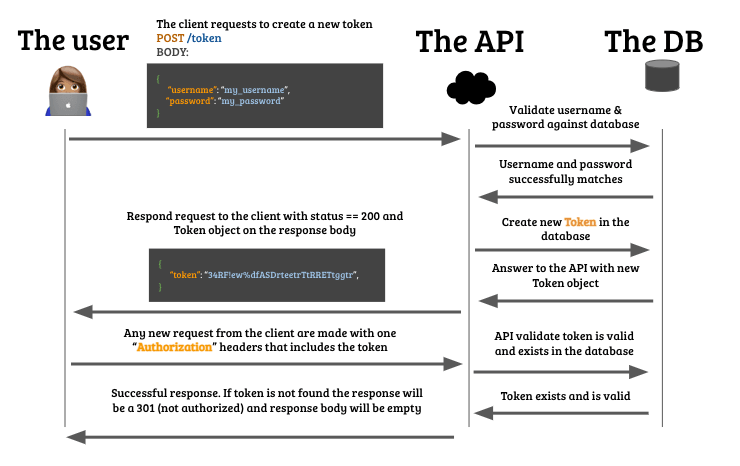

## Por qué implementar la autenticación basada en tokens


Hay varias formas de crear una capa de autenticación en las aplicaciones web pero hoy nos vamos a centrar en la Autenticación Basada en Token o Token Based Authentication por varias razones:

- Es fácil de implementar.
- Proporciona un buen nivel de seguridad (según los estándares de la industria).
- Rápido y eficaz.
- Es la más utilizada en la industria a día de hoy (2021).

## ¿Qué es la autenticación de la API?

Autenticación significa ser capaz de identificar quién está haciendo peticiones a tu API; Normalmente implementas una capa de autenticación en tu aplicación porque quieres:

- Que los usuarios puedan iniciar y cerrar sesión.
- Proteger la privacidad: Restringir el acceso a la información en función del rol del usuario. Por ejemplo: Sólo yo debería poder actualizar mi correo electrónico y mi contraseña, sólo yo debería revisar mi historial médico.
- Limitar los permisos de los usuarios: Restringir el acceso a determinadas funcionalidades, por ejemplo: Que un usuario tenga que pagar para descargarse un libro, o que no pueda comentar en un foro si no inicia sesión, etc.


Para explicar en detalle la "Autenticación de una API basada en tokens" es mejor empezar explicando lo que son los tokens.

## ¿Qué es un token de seguridad?

IA grandes rasgos, un token es un "número que prueba algo", por ejemplo: Cuando terminas de hacer una transferencia bancaria, el banco envía un "token" de confirmación que sirve como prueba para validar que la transacción existe y es válida. Ese número de confirmación podría llamarse también **token de confirmación`**.

Otros ejemplos de tokens cotidianos:

- Tu número de identificación (token) prueba tu historial de crédito.
- El número de la tarjeta de crédito demuestra que tienes una tarjeta de crédito válida.
- Etc.

### Un token de seguridad es más que un número

Los tokens utilizados para la autenticación tienen que ser algo más que números normales, tienen que ser casi imposibles de falsificar, predecir o decodificar.

- No consecutivos: eso los hará muy predecibles, los hackers adivinarán el siguiente.
- Infinitos (casi): ¿Qué ocurrirá si te quedas sin tokens? ¿Te imaginas que MasterCard se quedara sin números de tarjetas de crédito?
- No reutilizables: Hay casos de tokens reutilizables, pero en general, una vez que se genera un token, nadie más debería usarlo que tú.
- Validable: El token debe seguir algún patrón oculto (¿encriptación?) que permita validar el token sin comprometer al propietario o al autor.

### Generando de tokens

Hay varios tipos de tokens que puedes usar para tu sistema de autenticación como Basic, Bearer, o JWT. La mayoría de ellos utilizan algoritmos de criptografía avanzada que no vamos a tratar en esta lección (puedes ver este [increíble vídeo para aprender más](https://www.youtube.com/watch?v=4zahvcJ9glg)). En su lugar, vamos a hablar de hash.

#### ¿Qué es un hash?

Un hash es un número alfanumérico **único** que se genera a partir de una semilla o **valor** específico, por ejemplo:

```javascript
const jwt = require('jsonwebtoken');


const payload = {
    user_email:'hola@4geeks.co',
    rol: 'admin'
}
const unique_hash = jwt.sign(payload,
'secret-key',
{
    expiresIn: '1000'
});
```

Explicación: la función `sign` siempre devolverá exactamente el mismo `unique_hash` si se da el mismo valor, echa un vistazo a esta demostración, empieza a escribir en la entrada:

<iframe src="https://full-stack-assets.breatheco.de/live-demos/security/hashing/" height="300" title="Hashing functions example"></iframe>

Nota: Hay varias funciones de hashing populares: MD5, Sha1, Sha256, Sha256, etc. 

#### ¿Qué es lo que hace que las funciones hash sean tan geniales?


Las funciones hashing se han convertido en la mejor forma de generar tokens en el mundo de la seguridad porque

1. Son consistentes: Siempre devuelven la misma salida a la misma entrada dada.
2. Son "imposibles" de revertir: Si un hacker consigue acceder a un token, nunca podrá saber cuál era el valor original.
3. Tienen el mismo tamaño: Por ejemplo, todos los tokens generados con MD5 tendrán 40 caracteres.
4. Son "rápidos": Los hash se basan en matemáticas avanzadas para generar eficientemente los números alfanuméricos.

Nota: Cada dirección de billetera bitcoin tiene un hash único, cada commit que haces en github tiene un hash único, etc.

## Cómo implementar la autenticación en tu API

La forma más sencilla de implementar la autenticación en tu base de datos y en tu API:

1. Crea una table/model `User` que represente a cada usuario dentro de tu aplicación.
2. Esa tabla User debe contener el correo electrónico y la contraseña de cada usuario.
3. Crea un endpoint api llamado `POST /token` que genere un token sólo si recibe un email y una contraseña que se encuentren en la base de datos.
4. El endpoint `POST /token` devolverá el token al front-end si todo está bien.
5. Luego, en cada uno de los otros endpoints de tu base de datos tendrás que validar si el token existe en el header de la petición y si existe, tendrás que validarlo.



### Every token is a session

### Cada token es una sesión

En el momento en que generas el token puedes decidir si quieres que caduque, de la misma manera que las sesiones web caducan cuando te conectas a tu cuenta bancaria online.

Cuando un cliente se autentique con éxito recibirá ese token único y podrá adjuntarlo a los headers de las peticiones que realice a partir de ese momento, ese token será la "sesión del usuario".

Se recomienda guardar ese token en las cookies o localStorage de tu aplicación front-end.

```js
let myToken = "aDSA45F$%!sd&sdfSDFSDFytrefERF";
localStorage.setItem("token", myToken);


Puedes recuperar el token en cualquier momento, en cualquier lugar de tu aplicación utilizando:
let myToken = localStorage.getItem("token);
```

### Cómo adjuntar el token a los headers de la petición:

Si estás haciendo una petición desde el Front-End esta será una forma ideal de adjuntar el token a tus Authorization headers:

```js
let myToken = localStorage.getItem("token);
fetch('https://myApi.com/path/to/endpoint', {
    method: "POST", //o cualquier otro método
    headers: {
      "Authorization": myToken, // ⬅⬅⬅ authorization header
    },
    body: JSON.stringify(body)
})
    .then(resp => resp.json())
    .then(data => console.log("Success!!", data))
    .catch(error => console.log(error));
    
```

### Paquetes recomendados para la autenticación de la API

#### Si estás usando el Nodejs

Recomiendo el uso de [jsonwebtoken](https://github.com/auth0/node-jsonwebtoken#readme).

