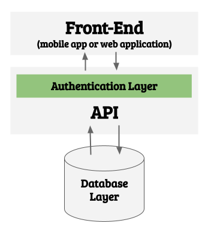
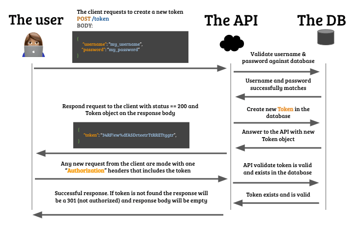

## Why implementing Token Based Authentication



There are several ways to create an authentication layer in web applications but we are going to be focusing today in Token Based Authentication because of several reasons:

- Easy to implement.
- Provides a good level of security (by industry standards).
- Fast and performant.
- The most used in the industry as of today (2021).

## What is API Authentication?

In plain English authentication means being able to identify who is making requests to your API; You normally implement an authentication layer in your application because you want:

- Users to be able to log in and log out.
- Privacy protection: Restrict access to information based on the user role. For example: Only I should be able to update my email and password, only I should review my medical health history.
- Limit user permissions: Restrict access to certain functionalities, for example: A user needs to pay to download a book, or not being able to comment on a forum unless you log in, etc.

To explain in detail "Token Based API Authentication" it's better to start explaining about tokens.

## What is a Security Token?

In a broad way a token is a "number that proves something", for example: When you finish making a bank transfer, the bank sends a confirmation "token" serves as proof to validate that the transaction exists and it's valid. That confirmation number could be also called a **confirmation `token`**.

Other examples for every-day tokens:

- Your social security number (token) proves your credit history.
- Credit Card number proves you have a valid credit card.
- Etc.

### A security token it's more then just a number

Tokens used for authentication need to be more that normal just numbers, they need to be almost impossible to fake, predict or break.

- Non-consecutive, that will make them very predictable, hackers will guess the next one.
- Infinite (almost): What will happen if you run out of tokens? Can you imagine MasterCard running out of credit card numbers?
- Non-reusable: There are cases of re-usable tokens, but in general once a token is generated no one else should every use it but you.
- Validatable: The token must follow some hidden pattern (encryption) that allows validating the token without compromising the owner or author.

### Generating tokens

There are several types of tokens you can use for your Autentication system like Basic, Bearer, or JWT. Most of them use Advance cryptography algorithms that we are not going to address in this lesson (you can watch this [amazing video to learn more](https://www.youtube.com/watch?v=4zahvcJ9glg)). Instead, we are going to talk about hashing.

#### What is a hash?

A hash is a **unique** alphanumeric number that gets generated from a specific seed or **value**, for example:

```py
import hash_function

value = "alex"
unique_hash = hash_function(value)
```

Explanation: the function `hash_function` will always return the exact same `unique_hash` if the same value is given, take a look at this demonstration, start typing on the input:

<iframe src="https://full-stack-assets.breatheco.de/live-demos/security/hashing/" height="300" title="Hashing functions example"></iframe>

Note: There are several popular hashing functions: MD5, Sha1, Sha256, Sha256, etc. 

#### What makes hashing functions so cool?

Hashing functions have become the best way to generate tokens in the security world because:

1. They are consistent: They always return the same output to the same given input.
2. They are "impossible" to reverse: If a hacker gets access to a token, they will never be able to know what was the original value.
3. They have the same size: For example, all the tokens generated using MD5 will have 40 characters.
4. They are "fast": Hashes rely on advanced math to efficiently generate the alphanumeric numbers.

Note: Every bitcoin wallet address has unique a hash, every commit you do in github has a unique hash, etc.

## How to implement authentication in your API

The most simple way to implement autentication in your database and API:

1. Create a `User` table/model that represents every user inside your application.
2. That User table must contain email and password for every user.
3. Create one api endpoint called `POST /token` that generates a token only if it receives an email and password that maches in the database.
4. The `POST /token` endpoint will return the token to the front-end if everything is ok.
5. Then, on every other endpoint in your database you will have to validate if the token exists in the request header and if it does you will have to validate it.



### Every token is a session

The moment you generate the token you can decide if you want it to expire, same way web sessions expire when you log in into your online bank account.

When a client successfully authenticates it will receive that unique token and it will be able to attached to the request headers of every request it makes from that moment on, that token will be the "User session".

It is recomended to save that token in the cookies or localStorage of your front-end application.

```js
let myToken = "aDSA45F$%!sd&sdfSDFSDFytrefERF";
localStorage.setItem("token", myToken);


//You can retrieve the token any moment, anywhere in your application by using:
let myToken = localStorage.getItem("token);
```

### How to attach the token to the request header:

If you are doing a request from the Front-End this will be an ideal way to attach the token to your Authorization headers:

```js
let myToken = localStorage.getItem("token);
fetch('https://myApi.com/path/to/endpoint', {
    method: "POST", //or any other method,
    headers: {
      "Authorization": myToken, // ⬅⬅⬅ authorization header
    },
    body: JSON.stringify(body)
})
    .then(resp => resp.json())
    .then(data => console.log("Success!!", data))
    .catch(error => console.log(error));
    
```

### Recomended packages for API Authentication

#### If you are using Python Flask framework

I strongly recomend using [Flask JWT Extended](https://github.com/vimalloc/flask-jwt-extended).

