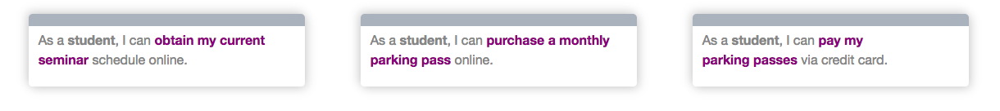
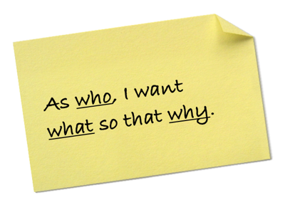
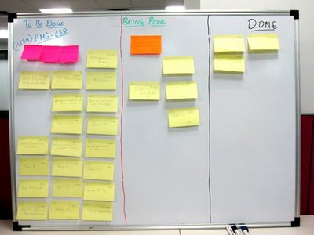

## Que es una Historia de usuario("User Story")?
***

<iframe width="1185" height="667" src="https://www.youtube.com/embed/LGeDZmrWwsw" frameborder="0" allow="accelerometer; autoplay; encrypted-media; gyroscope; picture-in-picture" allowfullscreen></iframe>

<div align="right"><small><a href="https://www.youtube.com/embed/LGeDZmrWwsw">Haz clic aquí para abrir el video en una ventana nueva</a></small></div>

Lo más difícil de hacer en software no es programar, ¡es diseñar el sistema! Y NO estamos hablando de diseño gráfico ... estamos hablando de la arquitectura, modelado de datos, requisitos del cliente, etc. Algunas de esas cosas son más difíciles que otras, pero hacer una lista de requisitos es probablemente una de las artes más difíciles.

**¿Qué es una Característica?** Es una funcionalidad que tiene la aplicación! Por ejemplo: registrarse, votar, comprar, etc.

Describir una característica parece fácil, pero puede ser desafiante: ¿dónde debería comenzar? ¿Qué tan detallado debe ser? ¿Qué tan técnico puedes ser? Pero, no te preocupes ... ¡las "Historias de usuario" han llegado al rescate!

Las historias de usuarios se han vuelto muy populares como estándar de documentación basado en características, se enfoca en lo esencial. Son fáciles de entender por todos los involucrados (no solo los desarrolladores) y fáciles de probar.

### ¿Qué es tan Especial de ellas?
***

Una historia de usuario es como tener una conversación con su futuro usuario. Deben estar escritos en elenguaje no técnico estándar para niños de 12 años con poca capacidad de atención:

+ Alrededor de 100 caracteres cada uno: ¡cuanto menos mejor!
+ Con solo UNA funcionalidad para cada uno - si ves que crece, simplemente divide la historia en 2 historias diferentes.

#### Aquí hay unos Ejemplos:



### ¿Cómo debes escribir las historias de usuario?
***

Es tan simple que se vuelve complicado ... lo más importante es: (1) Mantener un lenguaje simple, (2) Ser breve, y, (3) Ser específico:

+ **Rol:**  ¿Quién es capaz de usar la función?
+ **Característica:** ¿De qué se trata la característica?
+ **Razón:**  ¿Cuál es la razón para hacerlo?

<p align="center"; style= "font-size:30px" > Como <font color="blue">[rol]</font>, Puedo <font color="#ff00ff">[característica]</font> para que <font color="blue">[razón]</font></p>

Veamos otro ejemplo:
```jsx
Como "propietario de una cuenta", puedo "consultar mi saldo en línea" para "mantener un saldo diario las 24 horas del día".
```

Bastante fácil ¿verdad? Sin embargo, en algunos casos, encontramos que el sufijo "para que" es redundante, así que puedes añadirlo opcionalmente.

```jsx
Como "propietario de una cuenta", puedo "consultar mi saldo en línea".
```

Siéntete libre de variaciones del ejemplo:

+ **Como [rol], Yo quiero [característica] porque [razón]**
+ **Como [rol], Yo puedo [característica]**
+ **Como [rol], Yo puedo [característica] para poder [razón]**

### Herramientas para escribir historias de usuario

Hay millones de herramientas; Hemos buscado en Google: [haz clic aquí para acceder. ](http://lmgtfy.com/?q=free+tools+to+write+user+stories)Algunos son gratuitos y otros cuestan dinero, pero a lo largo de los años hemos decidido hacerlos nosotros mismos utilizando fichas o post-it. Si insistes en usar algo digital, deberías usar [este documento](https://docs.google.com/spreadsheets/d/1Lj6NBXGLgAY-dyCHkVQIJdG6IbqrGRw6p6k3q-jb7tE/edit?usp=sharing)que es una plantilla que hemos preparado para ti.

### Un fichas o post-it y un plumón



La teoría es simple - si usas una ficha o post-it más grande que 7 x 13 cm, escribirás demasiado. Del mismo modo, si usa algo más pequeño que un plumón (como un bolígrafo o lapicero), escribirás demasiado.

Se supone que las historias de usuario son cortas y dulces. Se supone que ayudan a una mayor comunicación y que no cuentan toda la larga versión de la historia. Cumplir con estas restricciones físicas te ayudará.

Al final, tendrá una enorme "lista de tareas pendientes", con las historias pasando desde "Tareas pendientes" a "Por Hacer" y, finalmente, a "Hecha". Cada historia se asignará a un desarrollador al comienzo de cada reunión de planificación.



### ¿Cuándo está realmente "hecha" una historia?

Si las historias son cortas y precisas, ¿cómo se supone que debemos conocer todos los diferentes criterios de aceptación? En la parte posterior de cada historia, tendremos que ingresar algunos "criterios de aceptación" que podemos verificar al final cuando el desarrollador piense que la función está terminada.

Para escribir excelentes criterios de aceptación, debemos pensar no sólo en el comportamiento esperado y normal en la aplicación, sino también en también en el caso en que la aplicación falle (por ejemplo: cuando la contraseña es incorrecta, cuando se rechaza su tarjeta de crédito, etc.) 

##### Por Ejemplo:

**Historia de usuario:**
"Como amante de la música, quiero poder pagar mi álbum con mi tarjeta VISA"

**Ejemplos de criterios de aceptación (específicos para esta historia):**

+ Puedo comprar un álbum con mi tarjeta VISA
+ No puedo pagar con una tarjeta VISA que está vencida
+ No puedo pagar con una tarjeta VISA con un número equivocado

## ¡No te obsesiones!
***

Por favor, este es un programa sobre desarrollo web full stack. No tienes que escribir las mejores historias jamás hechas. ¡Inténtalo! Tómate un tiempo para pensar en tus historias, pero no te quedes estancado durante el proceso.

Utilizarás mucho las historias de los usuarios, pero, como desarrollador, no es tu responsabilidad escribirlas. Hay personas certificadas para eso (analistas de requisitos). Tu trabajo es leerlas y seguirlas.


