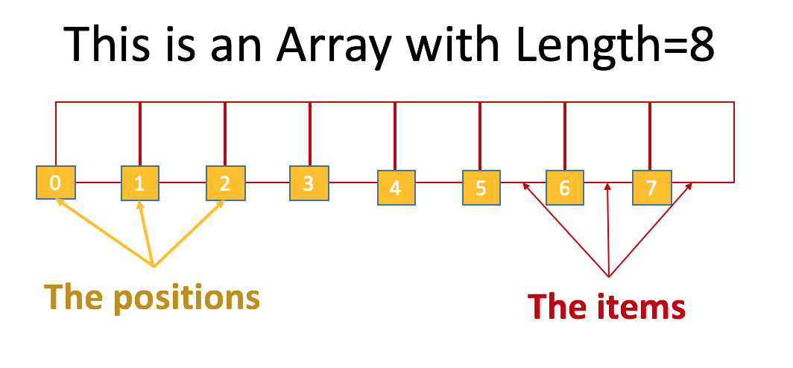
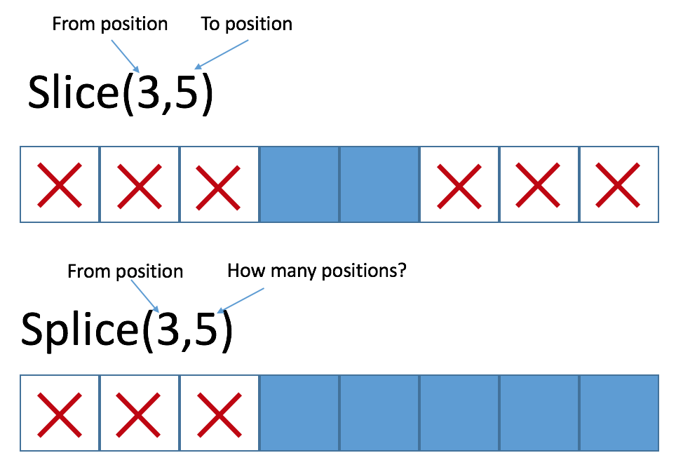

## ¿Por qué están los arrrays en una lección separada?

¡Porque los arrays son impresionantes! ¡Los necesitas! Y debemos enfocarnos mucho en ellos para prepararte para la vida real 🙂

Dominar el uso de los `arrays y bucles` es una de las 5 habilidades fundamentales para construir algoritmos:

1. Variables.
2. Condicionales.
3. `Arrays (Arreglos)`.
4. `Loops (Bucles)`.
5. Funciones.

**No no no…Espera:  ¿Array?  ¿Qué?**

Un array es, normalmente, cualquier lista o colección de valores. Las reglas sobre cómo agregar o eliminar elementos de esa lista pueden cambiar de un lenguaje de programación a otro. Pero - en general - son la única forma en que los desarrolladores pueden crear elementos.
 
Los arrays son la única forma que tenemos para enumerar cosas - independientemente de la aplicación con la que estés trabajando, siempre tendrás cosas que enumerar. Por ejemplo: lista de estudiantes, lista de artistas, lista de transacciones ... ¡cualquier cosa!

Este tipo de datos hace muchas más cosas que los otros. Las listas son la única forma de almacenar más de un tipo de datos en la misma variable.

Cada array tiene los mismos conceptos básicos:

**The items:** Son los valores reales dentro de cada posición del array.

**The length:** es el tamaño o longitud del array (cuántos elementos tiene el array).

**Index:** es la posición del elemento.



> :point_up: Las posiciones de un array comienzan en **cero (0)**; el primer elemento es el elemento en la posición **cero (0)**

## ¿Cómo declarar un array?

Hay muchas formas de declarar un arreglo o lista: 

```javascript
var myArray = []; //lista vacia
var myArray = ["Apple", "Orange", "Donkey"]; //con 3 elementos string por defecto.
var myArray = new Array(1,2,3,4,5); //¡No uses esto! Lea a continuación para saber por qué.
```


> :point_up:  No declares los Arrays con la sintaxis `new Array ()` - no se comportará correctamente [haz clic aquí para conocer los detalles(https://coderwall.com/p/h4xm0w/why-never-use-new-array-in-javascript)

## Acceder a los elementos de un array

Si quieres, puedes restablecer o actualizar cualquier ítem dentro de un array usando el índice o index así:

```javascript
    console.log(myArray[0]);  //Esto imprimirá el 1er elemento en la consola.
var aux = myArray[5];
    console.log(aux); //Esto imprimirá el 6to elemento en la consola.
    console.log(myArray[myArray.length-1]);  //Esto imprimirá el último elemento del arreglo.
```

## Actualizar Elementos en el Arreglo

Si lo deseas, puedes restablecer o actualizar cualquier elemento dentro de un arreglo usando el índice o index así:

```javascript
myArray[5] = 'cualquier valor';
//Esto establecerá el valor 'cualquier valor' en el sexto elemento del array.
```
## Añadiendo elementos (función push)

La única forma de agregar un nuevo elemento es al final de la lista, y deberás usar la función push () para eso.

```javascript
var myArray = ['Pedro','Juan','Maria'];
    myArray.push('Chris');
    console.log(myArray); //esto imprimirá ['Pedro','Juan','Maria','Chris'];
```

Pero… ¿y si quiero agregar a Chris en la segunda posición?

Entonces… necesitas crear un nuevo arreglo vacío y comenzar a empujar los elementos en el orden en que los necesita. En este caso será:

```javascript
var myArray = ['Pedro','Juan','Maria'];
var myNewArray = [];
    myNewArray.push('Pedro');
    myNewArray.push('Chris');
    myNewArray.push('Juan');
    myNewArray.push('Maria');
    console.log(myNewArray); //esto imprimirá  ['Pedro','Chris','Juan','Maria'];

```
## Eliminando Elementos (función pop)

Eliminar un elemento tiene exactamente las mismas limitaciones que al agregar un elemento: solo puedes eliminar un elemento de la última posición con el método pop(). Si deseas eliminar un elemento diferente, deberás crear un nuevo array sin ese elemento en particular.

```javascript
var myArray = ['Pedro','Chris','Juan','Maria'];
    myArray.pop();
    console.log(myArray); //esto imprimirá ['Pedro','Chris','Juan']; 
//Si deseas eliminar 'Chris', necesitas hacer lo siguiente: 
var myNewArray = [];
    myNewArray.push('Pedro');
    myNewArray.push('Juan');
    myNewArray.push('Maria');
    console.log(myNewArray); //esto imprimirá ['Pedro','Juan','Maria'];
```

## Eliminando/Añadiendo desde el Principio

Los métodos shift y unshift son como push y pop con la diferencia de que solo funciona desde al principio de la lista.

```javascript
var myArray = ['Juan','Maria'];
    myArray.unshift('Pedro');
    myArray.unshift('Chris','Bob');
    console.log(myArray); //esto imprimirá ['Chris','Bob','Pedro','Juan','Maria']; 
//Si deseas eliminar 'Chris', necesitas hacer lo siguiente: 
var myArray = ['Chris','Bob','Pedro','Juan','Maria'];
    myArray.shift();
    console.log(myArray); //esto imprimirá ['Bob','Pedro','Juan','Maria'];
```


## Bucle en Arreglo

A veces, cuando trabajes con arrays, tendrás que hacer un bucle. Por ejemplo: ordenándolos manualmente; voltearlos, eliminar un elemento de una posición particular, etc.

Para crear tu bucle, necesitarás usar Array.length para obtener el tamaño actual del array. La mayoría de las veces, los elementos del arreglo cambian durante el tiempo de ejecución. Esta es la razón por la que la única forma de obtener el tamaño del array será usar la función array.length, así:

```javascript
var myArray = [3423,5,4,47889,654,8,867543,23,48,56432,55,23,25,12];
    for (i = 0; i < myArray.length; i++) {
    console.log(myArray[i]); //this prints the value of the item in the position i 
}
```


> 🎥 [En el siguiente enlace](https://www.loom.com/share/bb0aa485cc334afbb8ff6ef1d9c6ac5b) puedes encontrar un video explicando las diferentes maneras de recorrer un arreglo

## For…in… 

Hay una gran adaptación de la  sentencia **for** para iterar listas o arrays, así:

```javascript
var myArray = [3423,5,4,47889,654,8,867543,23,48,56432,55,23,25,12];
    for (var index in myArray) {
    console.log(myArray[index]);
}
//Esto imprime el valor del item en la posición index.
```

## Eliminando de un array 

Las variables pueden tener diferentes tipos de valores. Algunos de ellas están disponibles solo en lenguajes de programación específicos, pero casi todos tienen los siguientes tipos:

### Splice and Slice

Es posible cortar un array en pedazos muy rápido, con las funciones de splice y slice.

#### Slice

Retorna un nuevo array con una versión más pequeña del arreglo original. Debes especificar el índice de inicio y finalización del pedazo que quieres obtener.

#### Splice


Actualiza el array actual dejando todo menos la versión más pequeña que deseas eliminar. Debes especificar los índices de inicio y término del pedazo que quieres eliminar.



<iframe src="https://repl.it/F9V5/0?lite=true" frameborder="0" sandbox="allow-forms allow-pointer-lock allow-popups allow-same-origin allow-scripts allow-modals" width="100%" height="400px" scrolling="no" allowtransparency="true" allowfullscreen="true"></iframe>

<div align="right"><small><a href="https://repl.it/@4GeeksAcademy/Slice-vs-Splice">Haz clic para abrir la demo en una ventana nueva</a></small></div>

> :point_up: Splice puede aceptar tantos parámetros opcionales como se quiera y estos sustituirán la parte del array que ha sido eliminada.  De esta forma el primer parámetro indica el índice desde el cual empieza a borrar, el segundo parámetro cuantos elementos borrarás y del tercero los elementos que se insertan a partir de la posición que se indica en el primer parámetro.

Ejemplo:
```javascript
var y = [14, 3, 3245, 234, 52, 345, 3, 45, 23, 77];
y.splice(2,4,'a');  //returns [3245, 234, 52, 345] 
console.log(y); // [14, 3, 'a', 3, 45, 23, 77]
```
Podemos usar esta función para insertar elementos:
```javascript
var y = [14, 3, 3245, 234, 52, 345, 3, 45, 23, 77];
y.splice(2,0,'a');  //returns [] 
console.log(y); // [14, 3, 'a', 3245, 234, 52, 345, 3, 45, 23, 77]
```

[Consulta la documentación](https://developer.mozilla.org/en-US/docs/Web/JavaScript/Reference/Global_Objects/Array/splice)

## Ordenando arrays

Es muy común la necesidad de ordenar arrays. Por ejemplo: ordenar una lista de estudiantes por nombre. Tienes dos funciones para ordenar en JavaScript:

Sort y Reverse

Ellos hacen lo mismo, excepto que Reverse lo hace al revés. Ambos ordenan usando la lógica de comparación de string, lo que significa que el string "25" es más grande que "100", porque "2" es más grande que "1".

```javascript
var frutas = ["Banana", "Naranja", "Manzana", "Mango"];
    frutas.sort();
    console.log(frutas); //[ 'Manzana', 'Banana', 'Mango', 'Naranja' ] 
    frutas.reverse();
    console.log(frutas); //[ 'Naranja', 'Mango', 'Banana', 'Manzana' ]
```

### Ordenando números

Si quieres ordenar números reales, o si deseas usar cualquier otro tipo de inicio de sesión para ordenar arrays, debes usar una "función de comparación".

Tienes que definir una función que se encargue de las comparaciones. La función sort llamará a tu función en cada comparación y permitirá que tu función decida quién es el primero entre los dos elementos que se comparan.

```javascript
var puntos = [40, 100, 1, 5, 25, 10];
    puntos.sort(function(a, b){return a – b});
    console.log(puntos); //[ 1, 5, 10, 25, 40, 100 ]
```

### Clasificando Objetos

Ahora que conocemos la función de comparación, podemos usarla para indicar a la función sort cómo ordenar nuestros propios objetos especiales, como aquí por ejemplo:

```javascript
var autos = [
    {tipo:"Volvo", año:2016},
    {tipo:"Saab", año:2001},
    {tipo:"BMW", año:2010}];
    autos.sort(function(a, b){return a.year – b.year});
    console.log(autos); //[ { tipo: 'Saab', año: 2001 },{ tipo: 'BMW', año: 2010 },{ tipo: 'Volvo', año: 2016 } ]
```

<iframe src="https://repl.it/F9YZ/1?lite=true" frameborder="0" sandbox="allow-forms allow-pointer-lock allow-popups allow-same-origin allow-scripts allow-modals" width="100%" height="400px" scrolling="no" allowtransparency="true" allowfullscreen="true"></iframe>

<div align="right"><small><a href="https://repl.it/@4GeeksAcademy/Sorting-Arrays">Clic para abrir la demo en una ventana nueva</a></small></div>
