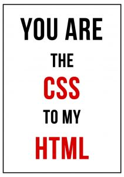
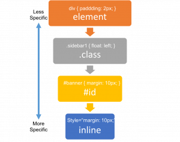

## ¡¡Bienvenido a CSS!!

Luego de sumergirnos en el mundo de HTML todo empieza a parecer feo, rígido y cuadrado. Después de todo hay que recordar que HTML fue hecho por científicos, no estamos diciendo que es feo por eso, seguramente hay científicos que hacen cosas hermosas (además, fueron los mismos científicos que [decubrieron el Bosón de Higgs](https://www.youtube.com/watch?v=0CugLD9HF94) y por eso hay que alabarlos hasta nuestra muerte), pero… definitivamente… es así de feo porque fue hecho por científicos con un propósito muy diferente al que HTML cumple hoy en día.


Peeeero… El internet es mas hermoso que eso. La cosa se puso seria cuando Internet empezó a hacerse más y más popular. Dejó de ser utilizado únicamente por la comunidad científica y el ejército, **¡comenzó a ser adoptado por todo el mundo!**

Irónicamente, los mismos científicos de CERN que crearon HTML, tuvieron que ponerse a pensar en cómo mejorar lo que habían hecho y se dieron a la tarea de embellecerlo. En este momento fue cuando [Håkon Wium Lie](https://en.wikipedia.org/wiki/H%C3%A5kon_Wium_Lie), propuso la primera versión de CSS en 1994, que luego fue adaptado hasta convertirse en CSS1.

## Entonces, ¿qué hace CSS? y ¿para qué sirve?




La principal razón por la que se creó fue para aplicar estilos a los documentos de HTML. La idea es que puedas decirle al navegador cómo debe visualizar un documento HTML: cómo deben verse sus etiquetas, colores, márgenes, tipografía, iconos, bordes, etc. Incluso puedes redefinir a tu antojo los comportamientos originales de esas etiquetas ya existentes. Ej:

```html
Puedes decirle a un <h1> que se vea igualito que un <h2> sin que el usuario
se de cuenta de que, a simple vista, son distintos.
```

> :point_up: Para entender el potencial de CSS, [haz clic aquí para ver un live demo!](http://assets.breatheco.de/live-demos/css/bootstrap/)

¡Puedes imaginar el potencial?  ¡Puedes hacer que casi todo se vea diferente!


## ¿Cómo aplico estilos a un HTML?


Sencillo, Debes escribir tus estilos con una sintaxis especial denominada "CSS" y y guardar el documento con la extensión CSS. Luego, para aplicar los estilos al documento usamos las tags del HTML que estaban relacionadas con CSS: `<style>` y `<link>` .

Vamos a repasar estas tags con más detalle:

|**Nombre**   |**Etiqueta**   |**Descripción**   |
|:----------|:-------------|:------------------|
|Link       |link          |Tiene como finalidad enlazar a la página con hojas de estilos CSS. Para utilizarla debes especificar tres propiedades dentro de la etiqueta `pyton>rel="stylesheet" type="text/css"` y por último `href="with document route css"`<br>`link rel="stylesheet" type="text/css" href="theme.css">`   |
|Style   |style   |Si no queremos o no podemos importar una hoja de estilo CSS, tenemos la posibilidad de definir estilos en el HEAD del documento HTML. Simplemente definimos el tag style y procedemos a escribir los estilos que queremos para las etiquetas.<br>`<style>`<br>`h1 {color:red;}`<br>`p {color:blue;}`<br>`</style>`   |

> :point_up: Asi como los documentos HTML terminan con la extensión .html, los documentos CSS (las hojas de estilo) terminan con la `extensión .css`.

## Sintaxis de CSS


La sintaxis de CSS no tiene absolutamente nada que ver con la sintaxis de HTML, es su propio lenguaje de programación específico. CSS ¡no utiliza etiquetas! Para trabajar un sitio web tienes que cambiar el switch en tu mente a menudo, porque trabajarás con varios lenguajes a la vez y cada uno tiene su propia sintaxis.


Una hoja de estilos CSS es una gran lista de definiciones de estilos para cada elemento HTML. Primero debes especificar a que elemento - o grupo de elementos - le vas a colocar estilos, a eso se le denomina SELECTOR. Luego, colocas una llave `{` para indicar que vas a empezar a definir cada propiedad y su respectivo valor, y finalizas cerrando con otra llave `}`. Siempre debes terminar cada definición de propiedad con un punto y coma `;`.

Revisa la animación para entenderlo mejor.

> :point_up: Los espacios son ignorados, pero puedes utilizarlos para hacer más legible tu código.


El siguiente ejemplo, es una hoja de estilos que define 3 grupos diferentes de estilos (selector1, selector2, selector3); y cada uno de estos grupos se le han aplicado diferentes reglas como: color, tamaño de letra o color de fondo.

Debes hacer coincidir los elementos HTML con los grupos de estilos y usar "selectors" para vincular los elementos HTML a los grupos de reglas CSS.

```css
#selector1 {
   color: red;
   font-size: 12px;
}
.selector2 {
   color: blue;
   background: green;
}
selector3 
{
   font-size: 15px;
}
```
## Pero, ¿qué es un “selector”?


Un selector es una manera de referirse o identificar uno o varios elementos de HTML. Por ejemplo, si quieres cambiar el color de una página web a rojo debes hacerlo de la siguiente manera:

```css
body {
    color: red;
}
```

También puedes cambiar el color de un sólo `<a>`. Para hacer esto, debes definir la propiedad de `clase` o un `id` de la etiqueta HTML que define ese link en particular `<a id="anchor1">`. Las clases se usan más que los IDs debido a que las clases son reutilizables y los IDs se usan más en Javascript. Una vez que esa etiqueta tenga un clase, entonces puedes ir a tu hoja de estilos y definir un `color` de la siguiente manera:

```css
#anchor1{
   color: red;
}
```
La siguiente tabla contiene una lista de todos los posibles selectores disponibles en CSS. Revísala con calma para que entiendas todas las posibilidades que tienes para aplicarle estilos a un documento HTML:

### Selector por ID

|**Selector**   |**Descripción**   |**Ejemplo**   |
|:--------------|:-----------------|:-------------|
|#element_id    |Permite aplicarle estilos a un elemento en particular.   |`#element_id { color: red; }`   |

Asignemos "primer" como ID de la primera celda en la siguiente tabla, y luego con CSS especificaremos que el "primer" ID debe tener un fondo amarillo:

<iframe width="100%" height="300" src="//jsfiddle.net/BreatheCode/1b78wna2/8/embedded/html,css,result/" allowfullscreen="allowfullscreen" allowpaymentrequest frameborder="0"></iframe>

<div align="right"><small><a href="//jsfiddle.net/BreatheCode/1b78wna2/8/embedded/html,css,result/">Haz clic aquí para abrir el demo en una nueva ventana</a></small></div>


### Selector por Clase (class)

|**Selector**   |**Descripción**   |**Ejemplo**   |
|:-------------|:-----------------|:-------------|
|.classname   |Existe un propiedad en HTML que se llama "clase" y permite agrupar diferentes etiquetas en un grupo lógico. En CSS se puede utilizar `.` (punto) para seleccionar todos los elementos que usen esa clase para seleccionar todos los elementos html con el propiedad de esa clase.   |`.classname { color: #BDBDBD; }`   |

En el siguiente ejemplo le estamos aplicando una clase "odd" a las celdas impares de esta tabla, y luego con CSS le asignamos el fondo amarillo a la clase .odd:

<iframe width="100%" height="300" src="//jsfiddle.net/BreatheCode/rdLkmx1t/11/embedded/html,css,result/" allowfullscreen="allowfullscreen" allowpaymentrequest frameborder="0"></iframe>

### Selector por etiqueta (Tag)

|**Selector**   |**Descripción**   |**Ejemplo**   |
|:--------------|:-----------------|:-------------|
|Tipo de Elemento (tag)   |Permite aplicar estilos a los links, títulos, etc. En el siguiente ejemplo cambiaremos el color de texto a todos los tag links `<a>` de la página.   |`a{ color: #BDBDBD; }`   |

En el siguiente ejemplo vamos a colocar fondo verde a todos los td (celdas) de la tabla:

<iframe width="100%" height="300" src="//jsfiddle.net/BreatheCode/y89Lgwb0/11/embedded/html,css,result/" allowfullscreen="allowfullscreen" allowpaymentrequest frameborder="0"></iframe>

### Multiselector

|**Selector**   |**Descripción**   |**Ejemplo**  |
|:--------------|:-----------------|:-------------|
|selector1,selector2   |Si separas varios selectores por coma `,`, puedes asignar múltiples selectores a la vez para ahorrar texto. En el siguiente ejemplo e decimos a todos los h1 y a los elementos de clase .impar que queremos su texto de color rojo.  |`h1, .impar { color: #BDBDBD; }`   |

### Selectores avanzados

Con estas 4 maneras de seleccionar vas a cubrir el 99% de tus necesidades, lo importante es tomarte el tiempo para planificar tus hojas de estilos.

Hay otros selectores más específicos y avanzados. Probablemente lo usarás cuando estés realizando creando algo más desafiante.

## Conflictos y herencia


¿Qué pasa si un elemento de la página está seleccionado por dos selectores y tiene asignado el color de letra verde en una definición y rojo en la otra? Es decir, si le decimos al navegador dos colores diferentes, ¿qué color utilizará al final?



Tienes que entender muy bien la jerarquía de CSS para comprender como los elementos **heredan, sobre escriben y hasta anulan estilos entre ellos.**

El navegador le da prioridad a los selectores más específicos, como al `#id`, que a los selectores generales, como los tags (etiquetas). En el siguiente ejemplo, cambiamos el color de todos los  `<li>`  (los elementos de la lista) a azul, y luego cambiamos el texto del segundo elemento a color rojo. De esta manera demostramos que el selector ID siempre prevalece por encima de los otros elementos, esto se debe a que pertenecen a la misma etiqueta.

## Propiedades


Ya vimos que una hoja de estilos CSS no es más que una lista que define las propiedades que queremos asignar a los diferentes elementos de la página. Ahora veremos cuáles podemos asignar a estos elementos.

Hay cientos - sino miles - de propiedades, pero dependiendo del tipo de elemento/etiqueta que queremos definir, sabremos en cuáles debemos enfocarnos.

#### Editando tipografía
|Propiedad   |Descripción   |Valores   |
|:----------|:-------------|:----------|
|[font-family](http://www.mclibre.org/consultar/htmlcss/css/css-fuente.html#font-family)   |tipo de letra (fuente) | [ name-font \| generic-family ]*   |
|[font-size](http://www.mclibre.org/consultar/htmlcss/css/css-fuente.html#font-size)   |tamaño de letra   | tamaño-absoluto \| tamaño-relativo \| distancia \| porcentaje   |
|[font-style](http://www.mclibre.org/consultar/htmlcss/css/css-fuente.html#font-style)   |inclinación (italics)   |normal \| italic \| oblique   |

#### Editando texto

|Propiedad   |Descripción   |Valores   |
|:----------|:-------------|:-----------|
|[color](http://www.mclibre.org/consultar/htmlcss/css/css-texto.html#color)   |color del texto   |color   |
|[letter-spacing](http://www.mclibre.org/consultar/htmlcss/css/css-texto.html#letter-spacing)   |espacio entre caracteres  |normal \| distance   |
|[line-height](http://www.mclibre.org/consultar/htmlcss/css/css-fuente.html#line-height)   |espacio entre líneas  |normal \| número \| distancia \| porcentaje   |
|[text-align](http://www.mclibre.org/consultar/htmlcss/css/css-texto.html#text-align)   |alineación del texto |center \| justify \| left \| right |
|[text-decoration](http://www.mclibre.org/consultar/htmlcss/css/css-texto.html#text-decoration)   |decoración del texto  |none \| blink \| line-through \| overline \| underline   |
|[text-transform](http://www.mclibre.org/consultar/htmlcss/css/css-texto.html#text-transform)   |mayúsculas / minúsculas   |none \| capitalize \| lowercase \| uppercase   |

#### Editando listas 

|Propiedad   |Descripción   |Valores   |
|:-----------|:-------------|:--------|
|[list-style](http://www.mclibre.org/consultar/htmlcss/css/css-listas.html#list-style)   |propiedad compuesta (suma de toda combinación de propiedades)   |list-style-image\|\| list-style-position \|\| list-style-type   |
|[list-style-image](http://www.mclibre.org/consultar/htmlcss/css/css-listas.html#list-style-image)   |imagen del marcador  |none \| uri   |
|[list-style-position](http://www.mclibre.org/consultar/htmlcss/css/css-listas.html#list-style-position)   |posición del marcador |inside \| outside  |
|[list-style-type](http://www.mclibre.org/consultar/htmlcss/css/css-listas.html#list-style-type)  |tipo de marcador |none \| circle \| disc \| square \| decimal \| decimal-leading-zero \| lower-alpha \| upper-alpha \| lower-greek \| lower-latin \| upper-latin \| lower-roman \| upper-roman \| armenian \| georgian \| hebrew(-) \| cjk-ideographic(-) \| hiragana (-) \| katakana (-) \| hiragana-iroha(-) \| katakana-iroha(-)  |

#### Editando tablas

|Propiedad  |Descripción   |Valores   |
|:----------|:-------------|:-----------|
|[border-collapse](http://www.mclibre.org/consultar/htmlcss/css/css-tablas.html#border-collapse)   |modo de bordes  |collapse \| separate   |
|[border-spacing](http://www.mclibre.org/consultar/htmlcss/css/css-tablas.html#border-spacing)   |separación entre celdas |distance \| distance   |
[caption-side](http://www.mclibre.org/consultar/htmlcss/css/css-tablas.html#caption-side)   |posición de la leyenda   |top \| bottom \| left(-) \| right(-)   |
|[empty-cells](http://www.mclibre.org/consultar/htmlcss/css/css-tablas.html#empty-cells)   |borde de casillas vacías   |	hide \| show   |
|[table-layout](http://www.mclibre.org/consultar/htmlcss/css/css-tablas.html#table-layout)   |algoritmo ancho de tabla   |auto \| fixed   |

#### Editando fondos (background) 

|Propiedad   |Descripción   |Valores   |
|:----------|:-------------|:----------|
|[background-color](http://www.mclibre.org/consultar/htmlcss/css/css-fondos.html#background-color)   |color de fondo   |transparent | color   |
|[background-image](http://www.mclibre.org/consultar/htmlcss/css/css-fondos.html#background-image)   |imagen de fondo  |none \| uri   |
|[background-position](http://www.mclibre.org/consultar/htmlcss/css/css-fondos.html#background-position)   |posición de la imagen de fondo   |\[ \[ left \| center \| right \| distancia \| porcentaje] [ top \| center \| bottom \| distancia \| porcentaje] \]? \| [ [ left \| center \| right ] \|\| [ top \| center \| bottom ] ]   |
|[background-repeat](http://www.mclibre.org/consultar/htmlcss/css/css-fondos.html#background-repeat)  |repetición de la imagen de fondo   |no-repeat \| repeat \| repeat-x \| repeat-y \| space(3) \| round(3)   |
|[background-size(3)](http://www.mclibre.org/consultar/htmlcss/css/css-fondos.html#background-size)   |tamaño de la imagen de fondo   |auto \| [ distance \| percentage ] {2} \| contain \| cover   |

