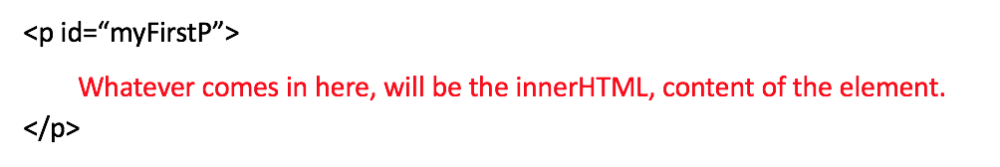

## Beyond the Console!
***

Nobody likes applications that are based on the console... Can you imagine using Uber from the command line???

```javascript
$ "uber" request-trip --from home --to work --pool
```

Thankfully we have the browsers!  They let us render our application in a visual interface that we call a website.

## The Website DOM
***

As you know already, the responsibility of the browser is to transform HTML/CSS code into visual elements.  Those elements are mapped into a hierarchy that is stored in RAM memory and it’s called The DOM.

With JavaScript we can manipulate the DOM (website elements) during runtime (during the application's life cycle).

NOTE:  Please always remember that all the JavaScript code that you write in your HTML document MUST be wrapped inside a `<script>` tag, like this:

```html
<script  type="text/javascript">
     //your code here  
</script>
```

## How to Update your Website DOM
***

There are several ways to manipulate the DOM, but the most simple one is **document.write**.  Every time you create a document.write you will be writing onto the HTML whatever string you decide to pass as a parameter to the write function.

It does not matter where you write the code.  The only thing that matters is that it is wrapped inside a `<script>` tag. For example:

<iframe width="100%" height="300" src="//jsfiddle.net/BreatheCode/ge5k7ufm/6/embedded/html,result/" allowfullscreen="allowfullscreen" allowpaymentrequest frameborder="0"></iframe>

<div align="right"><small><a href="//jsfiddle.net/BreatheCode/ge5k7ufm/6/embedded/html,result/">Click to open demo in a new window</a></small></div>


## The DOM is Spectacular!
***

From the moment a website starts being loaded, the browser creates a hierarchy that is called The DOM.  Each HTML element you coded in your HTML document as a developer has a place in that hierarchy and you can access it using JavaScript anytime you want during the runtime.

+ Every HTML element has an object in the document hierarchy.
+ The DOM is generated during runtime.
+ Every browser tries to replicate the DOM in the exact same way, but there are some differences between them.  That is why some things work in one browser, but not in others.
+ JavaScript is the only language capable of accessing The DOM during runtime.
+ The "Google Inspector" is the best representation of The DOM today.

<iframe width="578" height="325" src="https://www.youtube.com/embed/Ibxagg2ep5g" frameborder="0" allow="accelerometer; autoplay; encrypted-media; gyroscope; picture-in-picture" allowfullscreen></iframe>

<div align="right"><small><a href="https://www.youtube.com/embed/Ibxagg2ep5g">Click here to open video in a new window</a></small></div>

## How do I access any Object in the DOM?
***

Just like we did with CSS, we can select any element in the document.  There are 4 methods that allow us to search for whatever we want:

### document.querySelector("css-element-selector")

Returns an instance of **the first element** found that fits the CSS selector that you specified.

### document.getElementById("elementId")

Returns an instance of the element with the id="elementId" in the HTML document.

### document.getElementsByClassName("exampleClass")

Returns an array of all elements with the class="exampleClass" in their HTML tag property.

### document.getElementsByTagName("p")

Returns an array with all the instances representing each paragraph element in the HTML document.

### **document.getElementsByName*("name_value")***

Returns an array with all the elements that have name="name_value" in the name property of their HTML tag in the HTML document.

```javascript{numberLines: true}
var elem = document.getElementById("xyz");
elem.style.color="red";   // change color to red  

var myList = document.getElementsByTagName("p");
var howManyElements = myList.length;
myList[0].style.color = "red";   // make the first one red  

var myList = document.getElementsByClassName("abc");
myList[0].style.color = "red";   // make the first one red  

var xyz = document.getElementsByName("xyz");
xyz[0].style.color="red";   // make the first one red
```

## Accessing the Element’s Child
***

It is very common to need to change an element’s child.  For example:

+ Update all the `<li>` children of a specific `<ul>` to make their background red.
+ Remove the first `<tr>` row of a `<table>`.
+ Hiding all the children with a specific class.
+ And the list goes on!
  
The best way to retrieve the child elements of any DOM element is by using its childNodes properties – like this:

### element.childNodes

This returns an array with all the element’s children elements.

```javascript{numberLines: true}
var x = document.getElementById("myDIV");
x.querySelector(".random").style.background = "green";
//get the first #myDIV child with the .random class  

var x = document.getElementById("myDIV");
x.querySelector("h3,h2").style.background = "blue";
//get the first #myDIV child with the tag h3 or h2 
 
var tableElm = document.getElementById("people");
var trArray = tableElm.querySelectorAll("tr");
trArray[3].style.background = "red";
//get an array with all of #people's children with tag tr
```

<iframe width="100%" height="300" src="//jsfiddle.net/BreatheCode/a3grunqj/2/embedded/js,html,result/" allowfullscreen="allowfullscreen" allowpaymentrequest frameborder="0"></iframe>

<div align="right"><small><a href="//jsfiddle.net/BreatheCode/a3grunqj/2/embedded/js,html,result/">Click to open demo in a new window</a></small></div>

## The innerHTML
***

As you already know, each element in the HTML document can have some sort of HTML content.  It does not matter if it is a `<P>`, `<DIV>`,`<A>` or any other HTML element; it can have its own innerHTML combined with more HTML content.



The .innerHTML property gives you the ability to retrieve or set the content of whatever element you have in your JavaScript.  For example:

```javascript
document.getElementsByTagName("div")[0].innerHTML = "abc";
// innerHTML can be used to insert plain text content or HTML, this creates a list inside a div element 
```

[[warning]]
| :point_up:You can find other 2 properties on the internet: nodeValue and textContent, but they are not really universally used and they are more limited in functionality.

## Adding Elements to the Document
***

There are 2 functions we can use for that: **appendChild** and **insertBefore.**

Lets say that you have selected a `<div>` with the id=**"myFirstId"** and you want to add a new h1 inside of that div.

**You can use the appendChild function like this:**

```javascript
var divElem = document.getElementById("myFirstDiv");
var myNewHOne = document.createElement("h1");
var t = document.createTextNode("Hello World");
myNewHOne.appendChild(t);  //This adds the text content to the h1  
divElem.appendChild(myNewHOne); //This adds the h1 into the original element
```

Now, let's say that we have a `<ul>` with 2 elements, but we want to insert a new `<li>` at the beginning of that list.

**We can use the function insertBefore for that case – like this:**

```javascript
var newItem = document.createElement("li");
var textnode = document.createTextNode("Water");
newItem.appendChild(textnode);
var list = document.getElementById("myList");
list.insertBefore(newItem, list.childNodes[0]);  //adding the newItem before the FIRST child of the list.
```

## Removing Elements from the Document
***

The **removeChild** function is great to remove an element from the DOM, and, consequentially, from the HTML document as well.  You will have to specify who is the parent of the element that you are trying to delete.

For example, if we want to remove all of the elements from a UL list:

```javascript
// Removing all children from an element  
var element = document.getElementById("myFirstUL");
while (element.firstChild) {
    element.removeChild(element.firstChild);
}
```


[[warning]]
| :point_up:This is the only function supported by all browsers; don’t use .remove() if you care about Explorer.

## Changing the Attributes
***

To change any attribute of any object in the DOM, we need to use the .attribute property just like this:

```javascript
// Changing attributes  
var element = document.getElementById("myElementId");
element.attribute = "whatever";
```

## Changing the Styles
***

You can also change any CSS rule or property applied to the HTML elements by using the **.style** attribute – like this:

```javascript
// Changing styles  
var element = document.getElementById("myElementId");
element.style.color = "red";
element.style.background = "blue";
```


## Further reading
***

For more information about accessing the DOM, see: https://developer.mozilla.org/en-US/docs/Web/API/Document


