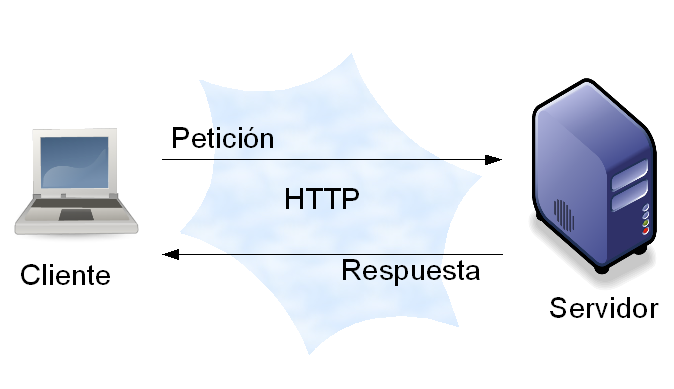

# What is HTTP?

HTTP stands for Hypertext Transfer Protocol. It is a set of communication rules that enables the flow of information over the World Wide Web (WWW).

Basically, it is protocol to transfer text hat operates through requests between a client and a server. HTTP is the term used to describe this simple text-based language. No matter how it is developed, the server's goal will always be to understand and return plain text responses.


  

## How does HTTP work?

This protocol works through requests and responses from the client (e.g., a web browser) and a server (e.g., the computers on which web sites reside). 

The server responds with a structured response and a series of metadata that establishes guidelines for the initiation, development and closure of the communication. These guidelines are called "request methods".

A sequence of these requests is known as an HTTP session.

## Request methods

Every conversation on the web starts with a request. This request is a text message or a set of lines created by a client (browser, app) that specifies the document you are requesting and the *method* you will apply. The client sends this request to a server, and then awaits for the response.

A request in HTTP language would be something like this:

````python
GET / HTTP/1.1 
Host: google.com
Accept: text/html
User-Agent: Chrome/31.0.1650.57 (Macintosh; Intel Mac OS X 10_9_0)
```
In this particular case we are using the GET method. 

This simple message communicates everything necessary about exactly what resource the client is requesting. The first line of an HTTP request is the most important and contains two things:

+ the URI (Uniform Resource Identifier) which is the unique address or location that identifies the resource the client wants.
+ the HTTP method defines what you want to do with the resource and is your request method. The most commonly used are the following:

|**Method** |**Description** |
|:-------------|:--------------|
|GET |It is used to read the server status. Being a **safe** operation, it can be executed several times without risk of data modification or corruption; calling it once has the same effect as calling it ten times.    |
|POST |REST purists use post only for creation. That means that every time you POST something to an API, you are creating a new record in the database for it. Some APIs use POST for all write operations (delete, update and create). They do this because PUT and DELETE are not available in HTML / Forms and that makes those methods more difficult to use.      |
|PUT |This is most commonly used to update state on the server; although it can also be used to create state.     |
|DELETE |This is used for deleting data on the server.


```
python
DELETE /blog/15 HTTP/1.1 
```
In addition to the first line, an HTTP request also has other lines of data called _request headers_, through which it can deliver a wide range of information such as: the name of the server or _host_, the response formats that the client accepts to make the request, the format in which it is sending data in the body of the request (if applicable)...


## Status Codes for the Response


When the server receives the request, it knows exactly what resource the client needs (through the URI) and what it wants to do with that resource (through the HTTP method). 

Translated to HTTP the response would be something like this:

```
python
HTTP/1.1 200 OK
Date: Sun, 01 Dec 2013 18:17:45 GMT
Server: Apache/2.2.22 (Ubuntu)
Content-Type: text/html
```

The response contains the requested resource. The first line is very important and contains the status of the response. In this case it is 200, i.e. everything is OK.
 
HTTP status codes, [you can read more about it here](https://developer.mozilla.org/es/docs/Web/HTTP/Status), provide metadata in the response to the status of the requested resources. They are part of what makes the Web a platform to build
distributed systems. They fall into the following categories:


+ `python>1xx` - Metadata.
+ `python>2xx` - Everything is ok.
+ `python>3xx` - Redirection
+ `python>4xx` - Client did something wrong
+ `python>5xx` - Server did something wrong


