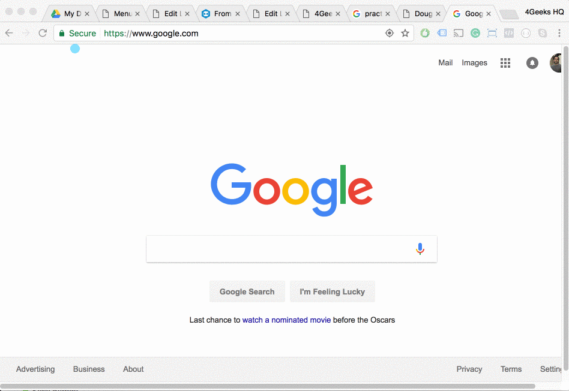

> :point_up: A partir del 1 de enero de 2017, 4Geeks ha decidido dejar de enseñar jQuery porque creemos que ya no es necesario para alguien que se convertirá en un desarrollador front-end. Sin embargo, estamos dejando las lecciones y los ejercicios aquí por si deseas aprenderlas por tu cuenta.

 ## Aprende la biblioteca jQuery

 Hacer más cosas con menos código.

 ### Qué es jQuery?


jQuery es una librería (conjunto de funciones) disponible para los desarrolladores de JavaScript para hacerles la vida más fácil (como el objeto Math que usamos para Math.random). **jQuery NO es otro idioma.** Es lo mismo que JavaScript, y no es necesario que lo uses si no lo deseas.

 ### Por qué jQuery


Cuando jQuery era lo nuevo (hace 10 años), a la gente le encantaba. Hizo mucho más fácil el uso de JS. Nos enseñó algunos trucos nuevos e hizo que AJAX y  animaciones muy simples (¡lo cual fue bastante complicado cuando la mayor parte del mundo estaba en IE6!).

Luego vino La Época de los Smartphone. Esto fue desastre para jQuery. Gracias a las CPU más lentas e inferiores con menos memoria y, a menudo, con menos ancho de banda, los teléfonos inteligentes simplemente no funcionaron para cargar adecuadamente jQuery - especialmente si sólo usaba el 10%.

Hoy, los navegadores han acordado algunas de las cosas que jQuery El Negociador lees había estado ayudando desde el principio. Así que activa y rápidamente recortaron la grasa.

¿Todavía necesitamos jQuery? Tal vez no. El uso de su libbrerí está claramente disminuyendo, pero aún duplica a cualquiera de sus parientes (Angular, React, etc.), ¡y Bootstrap todavía lo usa mucho!

#### Entonces, ¿Por qué es es tan publicitado jQuery?

Query puede hacer 5 cosas realmente bien, y esas 5 cosas llevaron a jQuery al punto de ser utilizando en casi todos los sitios web:

+ **Menos líneas de código:** En términos prácticos, necesita un 50% más de líneas de código para lograr exactamente lo mismo sin jQuery. Revisemos y comparemos las cosas más comunes que normalmente haces como desarrollador cuando juegas con el DOM.
+ **Manejo de eventos más fácil:** Trabajar con eventos es relativamente fácil en Vanilla JS hoy, pero jQuery ayuda mucho al permitirnos agregar oyentes a varios elementos al mismo tiempo usando los selectores jQuery.
+ **Animaciones extremadamente fáciles:** jQuery es realmente increíble para animaciones, fadeIn, fadeOut, bounce, etc. Todos estos movimientos ya están definidos y puedes recrearlos en sólo un par de líneas de código.
+ **AJAX simple:** Hacer solicitudes HTTP en JavaScript todavía es un poco engorroso, pero jQuery lo hace realmente simple con la función $ .ajax.
+ **Plugins:** Hay miles de plugins de jQuery. Enriquecen la funcionalidad web con características muy interesantes; hacer y compartir complementos es probablemente la mejor característica que jQuery puede proporcionar a los desarrolladores web.

### Instalación


Dado que jQuery es una libreria, debe instalarse como una libreria de JavaScript. Todas las librerias de JavaScript se deben importar utilizando la etiqueta `<script>`, como esto:

```html
<script src="myscripts.js"></script>
```

#### ¡Pero espera!

Primero, necesitas el código jQuery real. Tiene dos opciones para eso: (1) Descargar el código fuente de jQuery (recomendado) o (2) Importar el código desde un servidor público (CDN):

##### 1) Descarga desde code.jquery.com

Para descargar jQuery, anda a code.jquery.com y elige la última versión MINIFIED de jQuery disponible. Haz clic derecho en él y "guarda el archivo como ...". Guarda ese archivo en el directorio de tu proyecto.

Luego, usa la etiqueta `<script>` para importar ese archivo a tu sitio web. Coloca la etiqueta `<script>` dentro de la etiqueta `<head>` **antes de cualquier otra etiqueta JavaScript.**



##### 2) Usa un CDN 

Las redes de distribución de contenido son servidores que se utilizan específicamente para almacenar librerías y recursos para ser utilizados por otros sitios web. Por ejemplo, las librerías como Bootstrap y jQuery normalmente están disponibles en varios CDN.

Recomendamos [el CDN de Google:](https://developers.google.com/speed/libraries/) busque jQuery y copie el `<script>` de la última versión de jQuery disponible. Pegue esa etiqueta de secuencia de comandos ** antes de cualquier otra etiqueta de secuencia de comandos de JavaScript dentro de su sitio web ** `<head>`.


```html
<!DOCTYPE html>
<html>
    <head>
    <title>repl.it</title>
    <script src="https://ajax.googleapis.com/ajax/libs/jquery/3.1.1/jquery.min.js"></script>
<!– cualquiier otro script JS que use jQuery se importa luego de jQuery –>
    </head>
<body>
</body>
</html>
```

### La Sintaxis


**¡jQuery es parte de JavaScript!** La sintaxis de jQuery puede ser complicada al principio, pero después de unos días entenderás que **es la misma sintaxis de JavaScript** pero se usa de una manera diferente.

#### El simbolo de Dólar o Peso $

Todas las funcionalidades de jQuery están integradas en un objeto: **El objeto jQuery.** La idea es que todo se haga con ese único símbolo global. Esto se puede usar con el signo de dólar `$` o con ** "jQuery" ** (El dólar $ es solo un atajo para "jQuery"). Puedes usar lo que quieras:

```javascript
$(‘css_selector’)
jQuery(‘selector’)
console.log($ === jQuery);  // "true"
```

#### jQuery utiliza funciones inline

Para evitar sentirse confundido, debes comprender que jQuery es ADICTO a las funciones inline. Por ejemplo, el código a continuación es muy común cuando se utiliza jQuery para escuchar el evento clic. La función handler se declara en la misma línea, como esta:

```javascript
$(element).click(function() { 
  //el código de tu funcion aquí 
});
```

Este código es exactamente el mismo que este otro:

```javascript
var clickHandler = function() {
}
$(element).click(clickHandler);
```

En el ejemplo anterior, estamos agregando un escuchador de eventos para cuando el usuario haga clic en un elemento DOM.

#### Una nueva forma de pasar parámetros (settings object)

Estás acostumbrado a trabajar con parámetros de función como este:

```javascript
functionName(param1, param2, param3);
  //Se llama la función con 3 parámetros
```

Cuando se usa jQuery, la mejor práctica es pasar siempre un "settings object" como parámetro en lugar de pasar varios parámetros separados por comas, como esto:

```javascript
var settingsObj = {
param_key1 : param_value1,
param_key2 : param_value2,
param_key3 : param_value3
}
functionName(settingsObj);
  //Se llama la función con 3 parámetros dentro de settingsObj 
```

> :point_up: Si usa jQuery, debe sentirse cómodo utilizando parámetros como el "Settings Object."

### Evento Ready


Tenemos una sección que habla solo de eventos, pero es una buena idea hablar sobre el "evento ready" en este momento porque es una de las primeras líneas de código escritas en casi todos los sitios web que usan jQuery.

El flujo de tu sitio web comienza en el evento "ready". Ese evento se llama cuando el sitio web y todos sus elementos han terminado de cargarse. Como desarrollador, necesitarás agregar un escuchador de eventos para el evento ready:

```javascript
$( document ).ready(function() {  
    // Controlador para llamar .ready(). Tu codigo aquí
});
```

### Trabajando con los Elementos DOM


jQuery realmente ayuda cuando se trabaja con clases porque la única forma de actualizar una clase con vanilla JS es usando el atributo .className del elemento DOM (que es un string).

Por ejemplo, si deseas eliminar una clase específica de un elemento, primero tendrás que obtener el valor del atributo de clase como un string. A continuación, cree un nuevo string - como el primero - pero sin esa clase en particular.

&nbsp;
&nbsp;
#### Selecciona Elementos del DOM

#####  Con vanilla JavaScript

```javascript
var elm = document.getElementById(‘elementId’);
var elmArray = document.getElementsByClassName(‘elementId’);
```

#####  Con jQuery

```javascript
var elem = $(‘#elementId’);
var elemArray = $(‘.elm_class’);
```

&nbsp;
&nbsp;
#### Crear un nuevo elemento DOM

#####  Con vanilla JavaScript


```javascript
var myAnchor = document.createElement("A");
myAnchor.href="http://google.com";
myAnchor.target="_blank";
```

#####  Con jQuery

```javascript
var attributesObj = {
href: ‘http://google.com’,
parent: ‘_blank’
}
$(‘<a>’,attributesObj);  //el attributesObj es opcional
```
&nbsp;
&nbsp;
#### Append Child

#####  Con vanilla JavaScript


```javascript
parent.appendChild(el);
```

#####  Con jQuery

```javascript
$(parent).append(el);
```

&nbsp;
&nbsp;
#### Eliminar Elemento

Vanilla JS no tiene una función remove (). Tendrás que llamar a una función removeChild desde el elemento padre del elemento.

#####  Con vanilla JavaScript


```javascript
elm.parentNode.removeChild(elm);
```

#####  Con jQuery

```javascript
$( ".hello" ).remove(); //Elimina todos los elementos con la clase clase hello 
$( ".hello" ).empty(); //Elimina todos los hijos de los elementos de la clase hello 
var elements = $( ".hello" ).detach(); //Elimina los elementos del DOM pero los retorna en una variable 
```
&nbsp;
&nbsp;
#### Reemplazar Elemento

#####  Con vanilla JavaScript


```javascript
elm.parentNode.replaceChild(myNewHeading, elm); //being myNewHeding a DOM element
```

#####  Con jQuery

```javascript
$( "#div1" ).replaceWith( "<h1>This is a new heding</h1>" );
```

&nbsp;
&nbsp;
#### Traverse childs

#####  Con vanilla JavaScript


```javascript
var parent = document.querySelector(css_elector);
var childs = parent.querySelectorAll(css_elector);
childs.forEach(function(elm, index){

});
```

#####  Con jQuery

```javascript
$(css_selector).find(selector).each(function(index, elm){

});
```

&nbsp;
&nbsp;
#### Obtener/Establecer atributo

#####  Con vanilla JavaScript


```javascript
el.getAttribute(‘tabindex’);
el.setAttribute(‘tabindex’, 3);
```

#####  Con jQuery

```javascript
$(el).attr(‘tabindex’);
$(el).attr(‘tabindex’, 3);
```


> :point_up:  Estas son las funciones más utilizadas cuando se trabaja con el DOM. Ten en cuenta que hay MUCHAS más funciones disponibles y que es una buena idea revisarlas todas. Además, se están creando nuevas funciones a medida que JavaScript continúa evolucionando.

### Trabajando con Estilos


jQuery realmente ayuda cuando se trabaja con clases porque la única forma de actualizar una clase con vanilla JS es mediante el uso del atributo .className del elemento DOM (que es un string).

Por ejemplo, si deseas eliminar una clase específica de un elemento, tendrás que obtener el valor del atributo de clase como un string y luego crear una nuevo string - como el primero - pero sin esa clase en particular.


&nbsp;
&nbsp;
#### Añadir/Eliminar clase CSS

#####  Con vanilla JavaScript


```javascript
el.className += ‘ ‘ + className; //añadir 
el.className = el.className.replace("classname", ""); //eliminar
```

#####  Con jQuery

```javascript
$(el).addClass(className);
$(el).removeClass(className);
```
&nbsp;
&nbsp;
#### Obtener/Establecer reglas de estilo CSS

#####  Con vanilla JavaScript


```javascript
el.style.borderWidth = ’20px’;
getComputedStyle(el)[ruleName];
```

#####  Con jQuery

```javascript
$(el).css(‘border-width’, ’20px’);
$(el).css(ruleName);
```

&nbsp;
&nbsp;
#### Toggle Class

#####  Con vanilla JavaScript


```javascript
var classes = el.className.split(‘ ‘);
  var existingIndex = classes.indexOf(className);

  if (existingIndex >= 0)
    classes.splice(existingIndex, 1);
  else
    classes.push(className);

  el.className = classes.join(‘ ‘);
  ```

  #####  With jQuery

  ```javascript
  $(el).toggleClass(className);
  ```

> :point_up:  Estas son las funciones más utilizadas para trabajar con estilos, hay muchas más funciones y es una buena idea revisar el resto de ellas.

### Trabajando con eventos


Ya sabes mucho acerca de los eventos porque pasamos por la lección de Eventos de JavaScript anteriormente durante este curso.

jQuery no agrega mucho valor al trabajar con eventos, tenemos los mismos conceptos: nombres de eventos, listeners y controladores.  jQuery puede escuchar exactamente los mismos eventos (clic, hover, etc.) y tu tienes la misma información del evento pasada como parámetro en la función handler.


#### Añadir un Evento Listener

La única gran ventaja cuando se trabaja con eventos jQuery es el selector jQuery, ya que ahora puede adjuntar un listener a varios objetos al mismo tiempo sin tener que recorrerlos todos. Por ejemplo, intentemos agregar un listener de sonido al evento de clic en todos los elementos con la clase ".btn"

#####  Con vanilla JavaScript


```javascript
var myElementsArray = document.querySelectorAll(‘.btn’);
myElementsArray.forEach(function(elm,index){
elm.addEventListener("click",function(){
alert(‘s’);
});
});
```

#####  Con jQuery

```javascript
$(‘.btn’).on( "click", function(){
  //your code here 
});
```

> :link: Para continuar leyendo sobre eventos recomendamos [esta lectura.](https://learn.jquery.com/events/event-basics/)

### Trabajando con Ajax


jQuery realmente ayuda cuando se trabaja con clases porque la única forma de actualizar una clase con vanilla JS es usando el atributo .className del elemento DOM (que es una cadena).

Por ejemplo, si deseas eliminar una clase específica de un elemento, tendrás que obtener el valor del atributo de clase como un string y luego crear una nuevo string - como el primero - pero sin esa clase en particular.

> :point_up:  AJAX se cubrirá en profundidad en otra lección, aquí solo presentaremos la sintaxis de la función ajax.

#### Solicitud GET

#####  Con vanilla JavaScript


```javascript
var request = new XMLHttpRequest();
request.open(‘GET’, ‘/my/url’, true);
request.onload = function() {
if (request.status >= 200 && request.status < 400) {
  // Success! 
var data = JSON.parse(request.responseText);
} else {
  // Alcanzamos nuestro servidor de destino, pero devolvió un error.
}
};
request.onerror = function() {
  // Hubo un error de conexión de algún tipo.
};
request.send();
```

#####  Con jQuery

```javascript
$.ajax({
  type: ‘GET’,
  url: ‘/my/url’,
  success: function(resp) {

  },
  error: function() {

  }
});
```
&nbsp;
&nbsp;
#### Solicitud POST

#####  Con vanilla JavaScript


```javascript
var http = new XMLHttpRequest();
var url = "/my/url";
var params = "lorem=ipsum&name=binny";
http.open("POST", url, true);
//Send the proper header information along with the request 
http.setRequestHeader("Content-type", "application/x-www-form-urlencoded");
http.onreadystatechange = function() { //Call a function when the state changes. 
if(http.readyState == 4 && http.status == 200) {
alert(http.responseText);
}
}
http.send(params);
```

#####  Con jQuery

```javascript
$.ajax({
  type: ‘POST’,
  url: ‘/my/url’,
data: {var1: value1, var2: value2 }
  success: function(resp) {

  },
  error: function() {

  }
});
```


