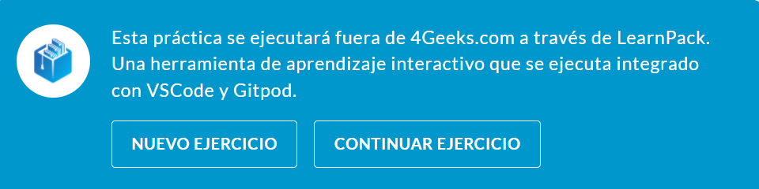
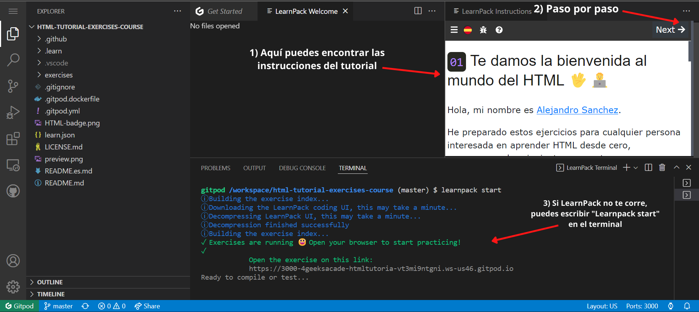

A lo largo de este curso vas a ver aquí y allá la palabra "LearnPack"; usarás LearnPack BASTANTE para practicar tutoriales de codificación y pequeños ejercicios. Este artículo es un intento de explicar qué es y cómo usarlo para que puedas ejecutar todos los tutoriales sin problemas.

## ¿Qué es LearnPack?

LearnPack es un administrador de paquetes (package manager) para tutoriales y ejercicios interactivos. Es como `Coursera.com` pero solo para codificar.

### ¿Qué hace que LearnPack sea tan único?

En lugar de mirar un video o leer un artículo, LearnPack presentará pequeños desafíos de forma incremental; cada uno se calificará automáticamente para obtener comentarios instantáneos y una solución de tutorial en video (algunas veces).

> Esta es la mejor manera de aprender habilidades relacionadas con la codificación.

## Cómo usar LearnPack

La mayoría de los tutoriales de LearnPack vienen con un botón etiquetado: "Nuevo ejercicio" o "Continuar ejercicio"



Luego de darle clic en "Nuevo ejercicio" una nueva computadora de Gitpod se abrirá, y LearnPack va a empezar a correr inmediatamente.  

Todos los tutoriales de LearnPack  vienen en pasos; vas a encontrar las instrucciones del lado derecho y un botón para continuar al siguiente paso " `next ->`"



## Reiniciando LearnPack

Si no puedes encontrar las instrucciones a la derecha, puedes empezar los ejercicios de nuevo escribiendo `LearnPack start` en el terminal.

```
$ learnpack start
```

> Nota: Si eso no funciona, intenta con `ctrl` + `shift` + `p` para abrir la paleta de comandos de VSCode y teclea/busca "Abrir instrucciones" para volver a abrir la barra lateral derecha.
