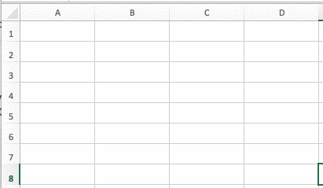
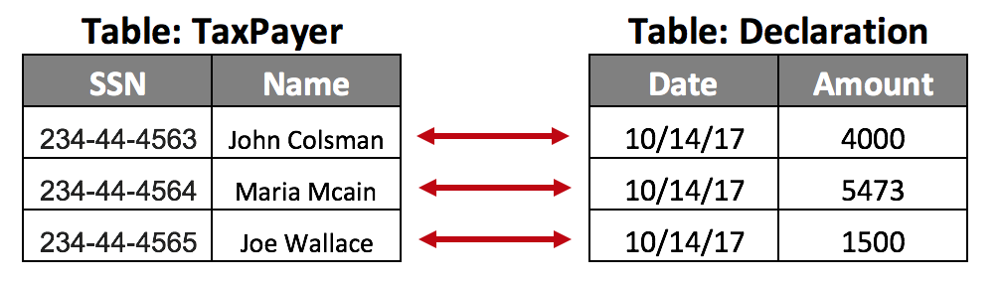
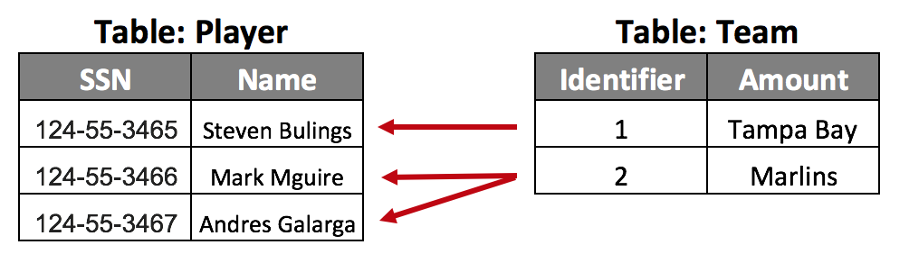
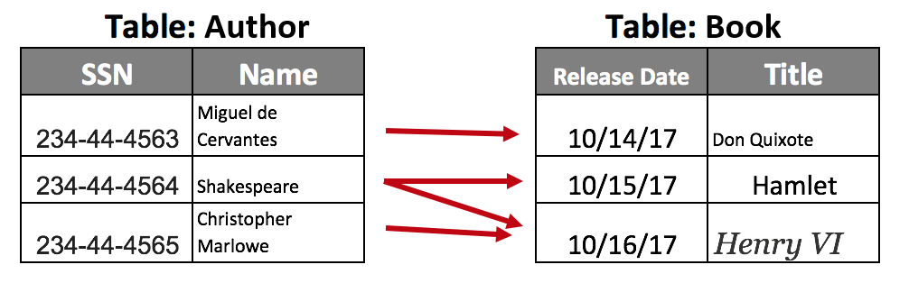

## ¿Por qué son importantes las bases de datos?
***

Las bases de datos son la mejor manera de almacenar datos, y ¡cada día hay más y más datos!  Los próximos serán años de data-mining, machine learning y mucha automatización.  La única forma de lograrlo es dominando las bases de datos.

Al principio, la información se guardaba en archivos más simples como .csv (separados por comas).  Esto era muy desorganizado – los datos eran fáciles de corromper y de difícil acceso (imagina tener que buscar archivos separados por comas).


En algún momento, nuestro amigo [Edgar](https://en.wikipedia.org/wiki/Edgar_F._Codd) decidió rediseñar esos archivos y creó una forma estándar de almacenar datos en archivos centrados en el rendimiento y la integridad.  Se asoció con el señor [Donald](https://en.wikipedia.org/wiki/Donald_D._Chamberlin) y juntos crearon un lenguaje llamado SQL –  que fue diseñado para trabajar con datos de una manera muy amigable.

## ¿Qué es SQL?
***

SQL es el lenguaje más utilizado cuando se desea hablar directamente con una base de datos.  Significa: Structured Query Language (Lenguaje de Consulta Estructurada) y es un lenguaje informático para almacenar, manipular y recuperar datos que se almacenan en [bases de datos relacionales](https://en.wikipedia.org/wiki/Base_de_datos_relacional).

La sintaxis de consulta SQL se ve como esto:

```sql
SELECT username FROM user WHERE email='info@breatheco.de'
```

En este ejemplo, solicitamos a la base de datos todos los usuarios con el correo electrónico igual a "info@breatheco.de"

[[warning]]
| :point_up: Si deseas ganarte el respeto de un desarrollador, necesitas sentirte cómodo con SQL.  Lo usarás MUCHO cuando trabajes con datos.

## Definiendo tu Base de Datos 
***

Las bases de datos son similares en apariencia a las hojas de cálculo: todo se almacena en tablas con filas y columnas. Cada columna representa atributos comunes en las filas en las que intersectan, que son instancias de datos.

####  ¿Qué es una tabla?

Cada tabla es una entidad de información con “Personas”, “Autos”, “Eventos”, etc.  Las filas contienen la información actual del asunto - así que si tenemos una tabla llamada "Personas", puede contener columnas para "Nombre", "Apellido" y para un "id". Una fila tendría los valores correspondientes a la columna, como "Luis", "Perez" y "42".  La tabla es la **única estructura** capaz de almacenar datos via SQL.

####  ¿Qué es una columna/campo?

Las tablas tienen columnas (como excel).  Una tabla llamada Persona puede tener 4 columnas: Nombre, apellido, fecha de nacimiento y peso.  Una tabla puede tener tantas columnas como tú quieras y tendrán un tipo de valor específico (string, entero, boolean, etc.) Las columnas describen la tabla de una forma similar a como las propiedades describen una clase en la programación orientada a objetos.

####  ¿Qué es una fila?

Si una tabla es llamada Personas y tiene esas 4 columnas (nombre, apellido, fecha de cumpleaños y peso) entonces las filas serán cada persona en específico que has almacenado en tu base de datos.



&nbsp;
&nbsp;
&nbsp;

### Relaciones entre tablas

Una base de datos es una colección de tablas interconectadas.  La conexión entre dos tablas se denomina "relación" y puede ser una de las siguientes:

**Una a una:**

El ejemplo perfecto es la base de datos de seguridad social, probablemente esta base de datos tiene una tabla llamada Contribuyente que contiene toda la información acerca de cada persona con un número de seguridad social y otra tabla con las Declaraciones De Impuestos del año en curso:  **Una persona puede tener sólo una declaración y sólo una declaración puede ser hecha por una persona.**



**Una a muchos:**

La base de datos de las Grandes Ligas en Baseball probablemente tiene una tabla llamada Jugadores (con la lista de todos los jugadores activos) y otra tabla llamada Equipos con la lista de todos los equipos activos. Ambas mesas están conectadas porque **un equipo tiene muchos jugadores, pero un jugador puede estar en un solo equipo.**



**Muchos a Muchos:**

Una base de datos de la Biblioteca Pública probablemente tenga una tabla llamada Autor (que contiene la información de todos los autores con libros publicados), y también otra tabla con TODOS los libros que se han publicado. Ambas tablas están relacionadas porque **un autor puede tener muchos libros y un libro puede tener muchos autores.**



&nbsp;
&nbsp;
&nbsp;
## La Sintaxis de  SQL: Trabajando con Tablas
***

Hay 3 operaciones principales que se pueden hacer en una tabla: Crear, actualizar o eliminar una tabla. En SQL, esas operaciones se llaman Create, Alter y Dro. Recuerda que estas operaciones se utilizan para manipular la estructura de la base de datos, no la información que contiene.

#### CREATE:

Crea una nueva tabla, una vista de una tabla u otro objeto en la base de datos.

```sql
CREATE TABLE IF NOT EXISTS `chat_group` (
  `chat_group_id` int(10) UNSIGNED NOT NULL,
  `name` varchar(20) NOT NULL,
  `create_date` timestamp NOT NULL DEFAULT CURRENT_TIMESTAMP
  PRIMARY KEY('chat_group_id')
) ENGINE=InnoDB DEFAULT CHARSET=latin1;
```

#### ALTER:

Modifica un objeto de base de datos existente, como una tabla.

```sql
ALTER TABLE table_name MODIFY column_name datatype NOT NULL;
```

#### DROP:

Elimina una tabla completa, una vista de una tabla u otro objeto en la base de datos.

```sql
DROP TABLE CUSTOMERS;
```

## La Sintaxis SQL: Manipulando Datos
***

Cuando usas SQL, tienes 4 comandos principales para manipular datos: SELECT, INSERT, UPDATE y DELETE.

Todos esos comandos están diseñados para manipular UNO o VARIOS registros/filas de la base de datos al mismo tiempo. Pero, solo puede ejecutar UN comando a la vez.

#### SELECT:

Esta es la operación más utilizada. Es la única forma de recuperar cualquier fila/registro específico de datos desde una base de datos. Puedes especificar qué filas desea recuperar solicitando un grupo de condiciones que esas filas deben cumplir.

```sql
SELECT column1, column2... columnN FROM table1 WHERE column1 = 3;

//Select a particular user by his Social Security Number 
SELECT ssn, username, email FROM USER WHERE ssn = '233-34-3453';
```

#### INSERT:

Crea una nueva fila/registro en la tabla. Se agregará al final.

```sql
INSERT INTO table_name (column1,column2,...columnN) VALUES (value1,value2,...valueN);

//Insert a particular user 
INSERT INTO USER (ssn,username,email) VALUES ('234-45-3342','alesanchezr','a@breatheco.de');
```

#### UPDATE:

Actualiza un registro o una fila de una tabla específica. Debes proporcionar una o varias condiciones para identificar las filas específicas que desea actualizar

```sql
UPDATE table_name SET column1 = value1 WHERE [condition]

//updating the email of a user 
UPDATE USER SET email = 'new@breatheco.de' WHERE ssn = '333-44-5534'
```

#### DELETE:

Funciona de manera muy similar a update, pero, en lugar de pasar los nuevos valores de las nuevas columnas que deseas actualizar, solo necesitas especificar qué filas deseas eliminar solicitando un grupo de condiciones.

```sql
DELETE FROM table_name WHERE [condition]

//delete all users (the condition is optional 
DELETE FROM user;

//delete a specific user 
DELETE FROM user WHERE ssn = '342-45-6732'
```

## Mantener la Integridad de los Datos
***

¡Mantener la integridad de los datos es difícil! Las bases de datos con muchas actividades y usuarios normalmente luchan por mantener la integridad de los datos. ¡A veces los datos son tan delicados y sensibles que agregar un cero a un entero simplemente podría terminar haciendo millonario a alguien!

Nosotros podemos clasificar los problemas de integridad en 4 tipos:

+ **Integridad de la entidad:** No hay filas duplicadas en una tabla.
+ **Integridad del dominio**: Aplica entradas válidas para una columna dada al restringir el tipo, el formato o el rango de valores.
+ **Integridad referencial:** Las filas que utilizan otros registros no se pueden eliminar.
+ **Integridad definida por el usuario:** Aplica algunas reglas comerciales específicas que no se incluyen en la entidad, dominio o integridad referencial.
  
#### ¿Cómo podemos Mantener la Integridad?

+ **Columnas únicas de usuario:** Esto evitará tener usuarios con el mismo correo electrónico, con el mismo número de seguridad social, países con el mismo nombre, etc.
+ **Usar claves foráneas** (restricciones): Esto evitará tener un jugador de béisbol en un equipo que no existe
+ Especifique **valores predeterminados** y qué columnas pueden ser **NULL** 
+ **Utilice enumeraciones:** Son excelentes para establecer los valores posibles de una columna "status", o para una columna "tipo", etc.
+ **Usar transacciones (commit y rollback):** Hablaremos de eso a continuación; Las transacciones son una buena manera de retroceder en el tiempo si algo sale mal.

## Transacciones SQL
***

Una transacción de una o más operaciones SQL (insertar, eliminar, actualizar, crear, etc.).

Una transacción agrupa varias operaciones en una porque todas dependen unas de otras. Debe tener la garantía de que si una de esas operaciones falla, la base de datos "deshacerá" todo lo que hizo dentro de la misma transacción.

Por ejemplo, supongamos que un Cliente del Banco está transfiriendo dinero de una cuenta a otra. Esta transacción implica dos operaciones:

 + Eliminar de una cuenta.
 + Insertar en otra cuenta.

¿Qué pasa si la primera operación fue exitosa pero la segunda falló? Debe "deshacer" la primera o el usuario perderá el dinero para siempre

## Cada transacción debería ser:
***

Las transacciones tienen las siguientes cuatro propiedades estándar, generalmente referidas por el acrónimo ACID:

+ **Atomicity:**  asegura que todas las operaciones dentro de la unidad de trabajo se completen con éxito. De lo contrario, la transacción se cancela en el punto de falla y las operaciones anteriores se revierten a su estado anterior.
+ **Consistency:**  garantiza que la base de datos cambie correctamente los estados tras una transacción confirmada con éxito.
+ **Isolation:**  permite que las transacciones operen de manera independiente y transparente entre sí.
+ **Durability:**  garantiza que el resultado o efecto de una transacción confirmada persista en caso de falla del sistema.
  
## Controlado las Transacciones SQL
***

Estos son los comandos utilizados para controlar las transacciones:

+ **COMMIT**:  para guardar los cambios.
+ **ROLLBACK:** para revertir los cambios.
+ **SAVEPOINT:**  crea puntos dentro de grupos de transacciones desde donde poder devolverse (ROLLBACK).
+ **SET TRANSACTION:** Coloca un nombre a una transacción.
  
Los comandos de control transaccional solo se usan con los comandos DML INSERT, UPDATE y DELETE. No se pueden usar al crear tablas o eliminarlas porque estas operaciones se confirman automáticamente en la base de datos.

### COMMIT;

El comando COMMIT es el comando transaccional utilizado para guardar los cambios invocados por una transacción en la base de datos.

El comando COMMIT guarda todas las transacciones en la base de datos desde el último comando COMMIT o ROLLBACK.

La sintaxis para el comando COMMIT es la siguiente:

```sql
//operation one... 

//operation two... 

//operation three... 

COMMIT;
```

### ROLLBACK;

El comando ROLLBACK es el comando transaccional utilizado para deshacer transacciones que aún no se han guardado en la base de datos.

El comando ROLLBACK solo se puede usar para deshacer transacciones desde que se emitió el último comando COMMIT o ROLLBACK.

La sintaxis para el comando ROLLBACK es la siguiente:

```SQL
//any operation before the rollback 
INSERT INTO client_account SET (amount) VALUES (1000)

//now we rollback the transaction, the insert never happened 
ROLLBACK;
```

### SAVEPOINT o Punto de Guardado [savepoint name];

Un SAVEPOINT es un punto en una transacción cuando puede revertir la transacción a un cierto punto sin revertir toda la transacción.

La sintaxis para el comando SAVEPOINT es la siguiente:

```SQL
SAVEPOINT SAVEPOINT_NAME;
```

Este comando sólo sirve en la creación de un SAVEPOINT entre declaraciones transaccionales. El comando ROLLBACK se usa para deshacer un grupo de transacciones.

La sintaxis para volver a una SAVEPOINT es la siguiente:

```SQL
ROLLBACK TO SAVEPOINT_NAME;
```

El comando RELEASE SAVEPOINT se usa para eliminar un SAVEPOINT que ha creado.

La sintaxis para RELEASE SAVEPOINT es la siguiente:

```sql
RELEASE SAVEPOINT SAVEPOINT_NAME;
```

El comando SET TRANSACTION se puede usar para iniciar una transacción de base de datos. Este comando se utiliza para especificar características para la transacción siguiente.

Por ejemplo, puede especificar que una transacción sea de sólo lectura o de lectura y escritura.

La sintaxis para SET TRANSACTION es la siguiente:

```sql
SET TRANSACTION [ READ WRITE | READ ONLY ];
```

[[info]]
|:link:https://www.tutorialspoint.com/sql/sql-syntax.html


