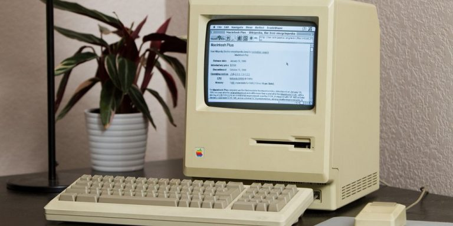
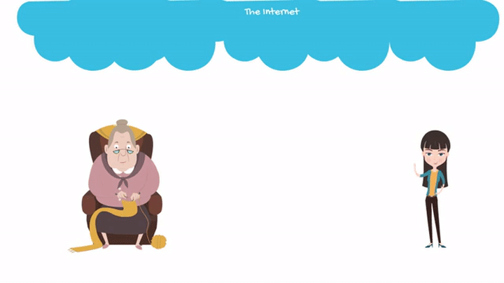
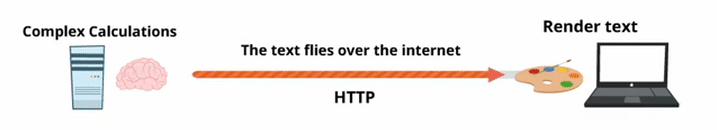

## It all makes sense when we go back in time…

If everything is a text document, how is it possible to have websites so amazing like Facebook, Youtube, etc?

Today’s websites are very different than before; they don’t have the same elements, but if we go back a bit in the past and explore the beginning of the Internet, it will all make sense.

The Internet was created for exchanging information.  Its founders were looking for ways to share documents without having to rely on a complex infrastructure.  They needed a framework and technology so that each person who wished to share a document could publish it independently and invite others to read it.

The scientific community started using it for the famous [“Peer Reviews”](https://www.elsevier.com/reviewers/what-is-peer-review), which required 3 colleagues to review and approve publications before they were accepted and published for all of the community to see.

For this reason, they worked on something as similar as possible to a Microsoft Word document or any other word processor.

> :link: If you wish to find out more about the history of the Internet, we recommend [this super cool 3 min video;](https://www.youtube.com/watch?v=h8K49dD52WA)] if you would rather read about it, [click on this link.](https://www.internetsociety.org/internet/history-internet/brief-history-internet/)

>To summarize:
>
>The easiest way to think of the Internet is as a network of shared documents that were once rigid, formal scientific publications and, nowadays, are interactive, exciting and spectacular.

## Everything is Text (HTTP)

As it is to be expected, if you wish to share documents, all you need is text.  When you build web pages, everything runs under the HTTP protocol (The Hypertext Transfer Protocol) which is a specialist in text transmission.

What this means is that: everything is text.  For example, if you wish to send a photograph to your grandmother through an email, this is more or less what happens:

+ The picture becomes text (at this point, it's text that you won't be able to understand).
+ It gets transmitted through the Internet as text.  If a hacker intercepts this, what they would see is a bunch of symbols/letters/numbers one after the other.
+ That long sequence of characters arrives at your grandmother’s computer.
+ Your grandmother double clicks the photo and the program she uses to see the photo transforms the text back into an image understandable to a human.

  
<small style="color:grey">Image 1: The 4 steps needed to send images over the internet: first it turns to text, then it travels, then it arrives at grandma's computer, grandma opens the picture and the picture shows… lastly, grandma is happy looking at her grandson's photo!</small>

## But How Do Pictures (and stuff) Travel?

Everything is connected.  The best way to understand this is by comparing it to the postal service:

+ The highways and streets are the network cables on your walls (or the transmission antennas on the roofs).
+ The vehicles that transport the mail are the traveling information packages.
+ The houses, buildings and stores are the web pages/online shopping sites – parks would be social networks, etc.
+ The street address is the famous domain name (.com, .net, etc.)
+ The building lots are the servers where the web pages are hosted.

<iframe width="807" height="453" src="https://www.youtube.com/embed/UiBT3Kj8KBM" frameborder="0" allow="accelerometer; autoplay; encrypted-media; gyroscope; picture-in-picture" allowfullscreen></iframe>

<small>
<strong>Video:</strong> 2 min video explaining how the internet works.
</small>

## The Web Browser

Remember how we said servers are the building lots?  Well, to host a website, servers must meet all the requirements necessary so that the web pages won’t crash (just like the building lots).

Websites reside on servers.  When users want to visit websites, they must enter the URL address in their browser.  This will take them to the lobby or entrance of the web page (which is called the “index.html”).

Imagine that browsers are vehicles able to drive through the highways of the Internet, taking you anywhere!

If you’ve been reading and have understood everything so far, you must be wondering:

### If the Internet is all text… then, when I’m navigating, Am I going to see only text???  How horrible!!!

Well, browsers are equipped with "magical" windows. If you see through those windows you will see the world as it is: No Text!!  The browser must perform all the functions that all other applications in your computer will accomplish. Like representing images, videos, text, sounds, etc., the browser is so great that there are even computers – like the Google Chromecast – that only come with a browser.

> :tv: [Click here](https://www.youtube.com/watch?v=83Y4jEgnaAA) to access a video that explains how a Google ChromeBook works.

## The Client and The Server

As you browse the Internet, the browser must translate every text it finds along the way while transforming the text into web pages with titles, subtitles, text, images, etc.

As a developer, you need to code everything the browser is going to need to visualize the text. We call it “the client side” because the browser is installed on the computer of the user. Likewise, all code on the client side will be processed by that computer.

The server has no idea of what the browser does! (Or at least it didn’t at the beginning (several years ago), and actually, it still doesn’t really know).

So, what does the server do?

Well, it does a lot! The server is responsible for preparing the text that will be read by the browser. The three major challenges for the server are:

+ **Speed:** for each server, there are thousands of clients. The server must be very fast in order to answer each client as quickly as possible.
+ **Concurrence:** not only there are thousands of clients, each client requests text at the same time as many others. The server must be able to respond to many demands simultaneously.
+ **Efficiency:** at times, clients have demands that are very hard to resolve – even if it is only one client.  Imagine for a second that you are using Google Maps to figure out how long it takes to travel from Mexico City to Santiago de Chile.  The server has to check traffic data, routes, accidents and run some sort of algorithm to obtain the route and estimated time of arrival (ETA). Even if the result is a simple chain of characters like “two days, 2 hours and 30 minutes,” the server had to make thousands of calculations to arrive to that conclusion.

So… lets summarize:

 
| The Server   |      The Client       |
|----------|:-------------:|
|The server’s mission is to deliver all the text/information the client needs to render the website properly. It has a close relationship with the database (which manages and processes the data). It handles a high volume of information and is prepared to answer thousands of clients requests at the same time.  The most frequent languages used are PHP, Python, Ruby and Java.  Little by little, the server has come to delegate part of its load. It handles fewer things nowadays than before, but the ones it still handles are repeated many times. There are even services like Parse.com or Firebase.com that have created tools that allow developers to create web apps without even using their own server.  All the code that runs on the side of the server is called “The Back-End.”  Back-End developers must strengthen their knowledge in databases, Big Data, Data Mining, Security, Web Sockets, Web Services, API’s, etc. |The client includes all code that runs on the computer or device of the client. The most frequent languages are: HTML5, CSS3, JavaScript.  Originally, the code that resided in the client didn’t do much because the documents were very simple. But things have changed; technology has given more relevance to the client to a point in which today there are thousands of apps that have more code on the client’s side than on the server side.  Running the code on the client side frees load off the server. After all, there is ONLY ONE server per THOUSANDS of clients.  All code on the side of the client is called “The Front-End.”  Front End developers are mostly dedicated to JavaScript, and maybe diagramming websites with HTML5 or CSS3 (designers may also do this last part).  This means that they must integrate multiple API’s, manage almost all the data processing on the client side (to avoid having too many interactions with the server), graph data, 3D modeling, games, jQuery plugins, AJAX, etc. |

    
